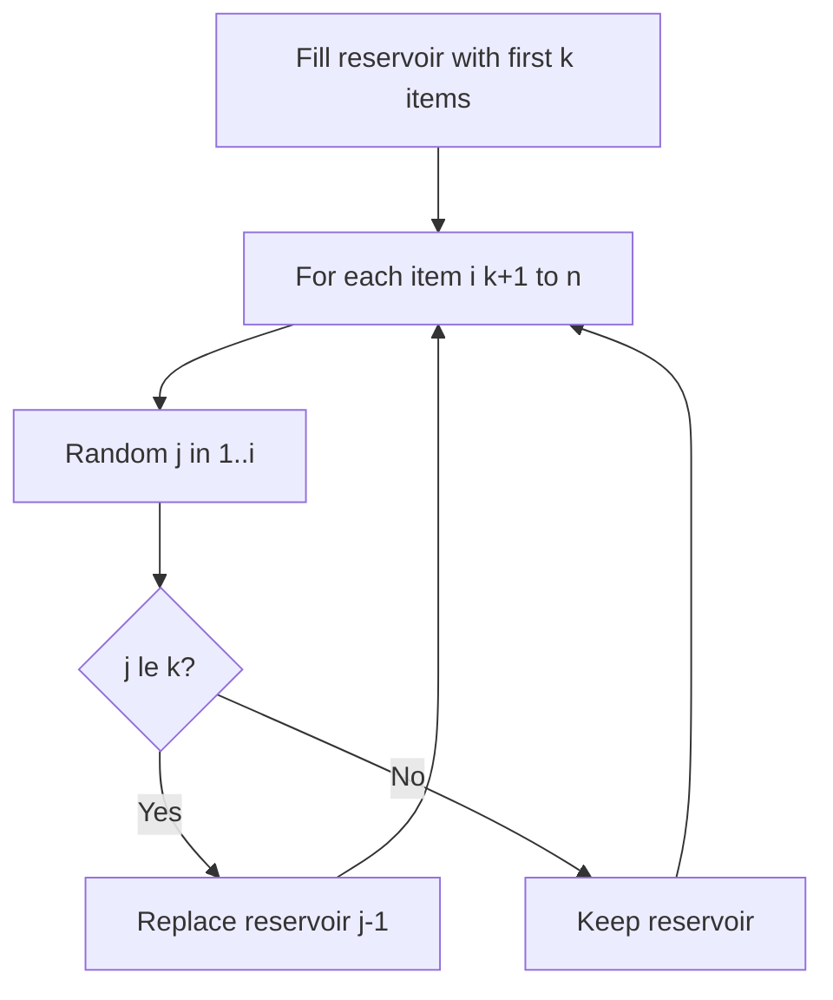
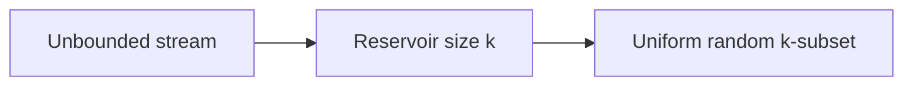
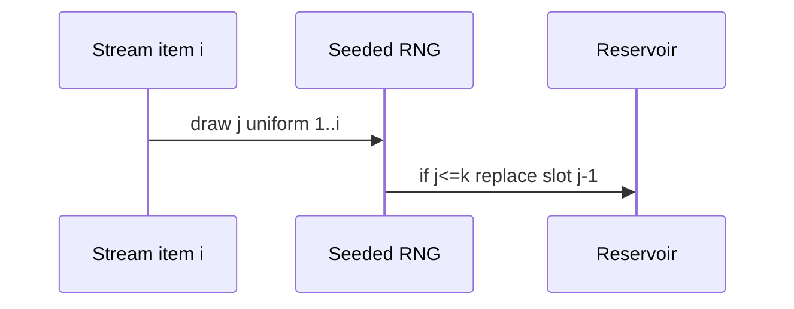

# Reservoir Sampling

## Overview

**Reservoir sampling** selects **k** items uniformly at random from a **stream of unknown length** using **O(k)** memory in one pass. After processing `n` elements, each element seen so far has equal probability `k/n` of being in the reservoir (or inclusion in final sample when stream ends). Algorithm R (simple) and Algorithm L (optimized) are standard variants.

Handoff: distributed stream processing → [[09-System-Design/README|System Design]]; this note covers in-memory single-process contracts.

## Learning Objectives

- Implement Algorithm R with correct inclusion probabilities
- Prove unbiasedness via induction on stream length
- Integrate seeded PRNG for reproducible stream tests
- Compare reservoir vs batch shuffle when `n` known
- Apply to log sampling, metric subsampling, and ML mini-batches

## Prerequisites

- [[05-Algorithms/12-Randomized-Approximation-and-Online/Randomized Algorithms and Reproducible RNG|Randomized Algorithms and Reproducible RNG]]
- [[05-Algorithms/02-Searching-and-Selection/Order Statistics Median and Top-K Trade-offs|Order Statistics Median and Top-K Trade-offs]]

## Difficulty

`intermediate`

## Estimated Time

- Reading: 1 hour
- Exercises: 2.5 hours
- Mini project: 3 hours

## History

Jeffrey Vitter analyzed reservoir algorithms in 1985. The technique remains essential for telemetry pipelines where storing full streams is infeasible.

## Problem It Solves

**1% trace sampling** without knowing request volume upfront. **Holdout evaluation** on infinite event stream. **Wrong approach**: store all IDs then shuffle—memory blowup; or take first k—biased toward early events.

## Internal Implementation

### Algorithm R (k=1 intuition)

For item `i` (1-indexed): replace current sample with probability `1/i`.

### General k

Fill reservoir with first `k` items. For item `i > k`, replace random slot with probability `k/i`.



## Mermaid Diagrams

### Structure: fixed-size reservoir



### Sequence: item i arrives



## Examples

### Minimal Example — Algorithm R

```typescript
function reservoirSample<T>(stream: Iterable<T>, k: number, rng: () => number): T[] {
  const reservoir: T[] = [];
  let i = 0;
  for (const item of stream) {
    i++;
    if (i <= k) {
      reservoir.push(item);
    } else {
      const j = Math.floor(rng() * i) + 1; // 1..i
      if (j <= k) reservoir[j - 1] = item;
    }
  }
  return reservoir;
}
```

```python
def reservoir_sample(stream, k: int, rng) -> list:
    reservoir: list = []
    for i, item in enumerate(stream, start=1):
        if i <= k:
            reservoir.append(item)
        else:
            j = rng.randint(1, i)
            if j <= k:
                reservoir[j - 1] = item
    return reservoir
```

### Production-Shaped Example

**Distributed tracing**: each ingestion node runs reservoir `k=1000` per service per minute with seeded PRNG keyed by `{service, minute}` for replay debugging. Aggregate layer must not double-sample same events—use consistent hashing partition before reservoir ([[09-System-Design/README|System Design]] boundary). Emit sample rate metrics to detect bias drift.

## Correctness

**Inductive invariant**: after `i` items, each of first `i` elements is in reservoir with probability exactly `k/i` (for `i ≥ k`, each specific set of k items equally likely among subsets when using uniform replacement).

**Proof sketch (k=1)**: item `t` selected iff chosen at step `t` and not replaced later—product telescopes to `1/n`.

**Requires**: RNG uniform on `{1..i}` each step; stream order fixed; independent of item content unless stratified sampling (different contract).

## Complexity

| Resource | Bound |
| --- | --- |
| Time | `O(n)` one RNG draw per item after fill |
| Space | `O(k)` |
| RNG calls | `O(n)` Algorithm R; optimized variants reduce |

## Trade-offs

| Dimension | Reservoir | Store-all shuffle |
| --- | --- | --- |
| Memory | `O(k)` | `O(n)` |
| Passes | One | Two if stream replayable |
| Unbiased | Yes (correct R) | Yes |
| Weighted items | Needs A-Reservoir ext | Easier offline |

### When to Use

- Unknown or huge stream length
- Fixed memory budget for random subset
- Online analytics sampling

### When Not to Use

- Need exact top-k by key → heap ([[05-Algorithms/02-Searching-and-Selection/Order Statistics Median and Top-K Trade-offs|Order Statistics]])
- Stratified quotas per category without extension
- `n` small and known—shuffle simpler

## Exercises

1. Simulate k=1 on n=5; compute each item selection frequency over 10⁵ runs.
2. Prove replacement probability for item first seen at step `t`.
3. Implement weighted reservoir sketch (research extension).
4. Show first-k-only sampling bias with math.
5. Combine seed `{streamId}` for reproducible subsample in tests.

## Mini Project

Deterministic reservoir sampling in algorithm labs with chi-square bias test.

## Portfolio Project

Trace sampler library: reservoir + metrics + seeded replay CLI.

## Interview Questions

1. Sample k from stream of unknown length—how?
2. Memory complexity?
3. Why replace with probability k/i?
4. Difference vs taking first k?
5. How seed for reproducible tests?

### Stretch / Staff-Level

1. Algorithm L: optimize expected RNG calls—when worth complexity?

## Common Mistakes

- Off-by-one on index range (`0..i-1` vs `1..i`)
- Using mod bias from `rng() % i`
- Parallel workers sampling same stream without partition
- Claiming uniform sample without proof on custom heuristics

## Best Practices

- Use uniform integer draw `1..i` without modulo bias
- Fix PRNG seed per stream in tests
- Monitor inclusion histograms in staging
- Document k and sampling contract in observability docs

## Summary

Reservoir sampling maintains an uniform random k-subset of a stream in one pass and O(k) memory by replacing entries with carefully chosen probabilities. Correctness is an induction on stream length; production use demands unbiased RNG draws, seeded tests, and clear boundaries with distributed aggregation.

## Further Reading

- [[05-Algorithms/12-Randomized-Approximation-and-Online/Online Streaming and Competitive Trade-offs|Online Streaming and Competitive Trade-offs]]
- [[05-Algorithms/02-Searching-and-Selection/Order Statistics Median and Top-K Trade-offs|Order Statistics Median and Top-K Trade-offs]]

## Related Notes

- [[05-Algorithms/12-Randomized-Approximation-and-Online/Randomized Algorithms and Reproducible RNG|Randomized Algorithms and Reproducible RNG]]
- [[05-Algorithms/12-Randomized-Approximation-and-Online/Online Streaming and Competitive Trade-offs|Online Streaming and Competitive Trade-offs]]
- [[05-Algorithms/02-Searching-and-Selection/Order Statistics Median and Top-K Trade-offs|Order Statistics Median and Top-K Trade-offs]]
- [[05-Algorithms/README|Algorithms]]

## Progress Checklist

- [ ] Explained from first principles
- [ ] Drew at least one Mermaid diagram
- [ ] Implemented a minimal version
- [ ] Documented trade-offs and non-goals
- [ ] Completed exercises
- [ ] Practiced interview questions aloud
- [ ] Linked prerequisites and dependents
