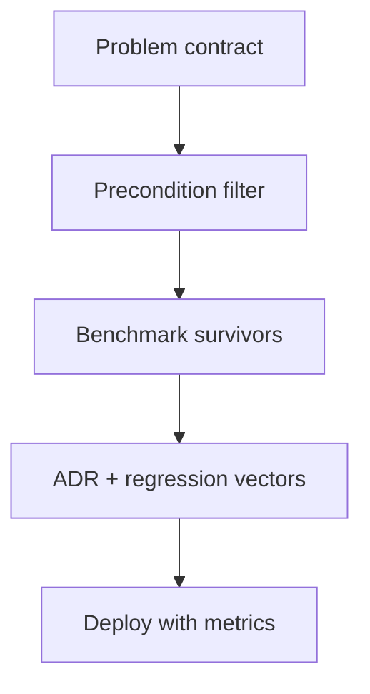
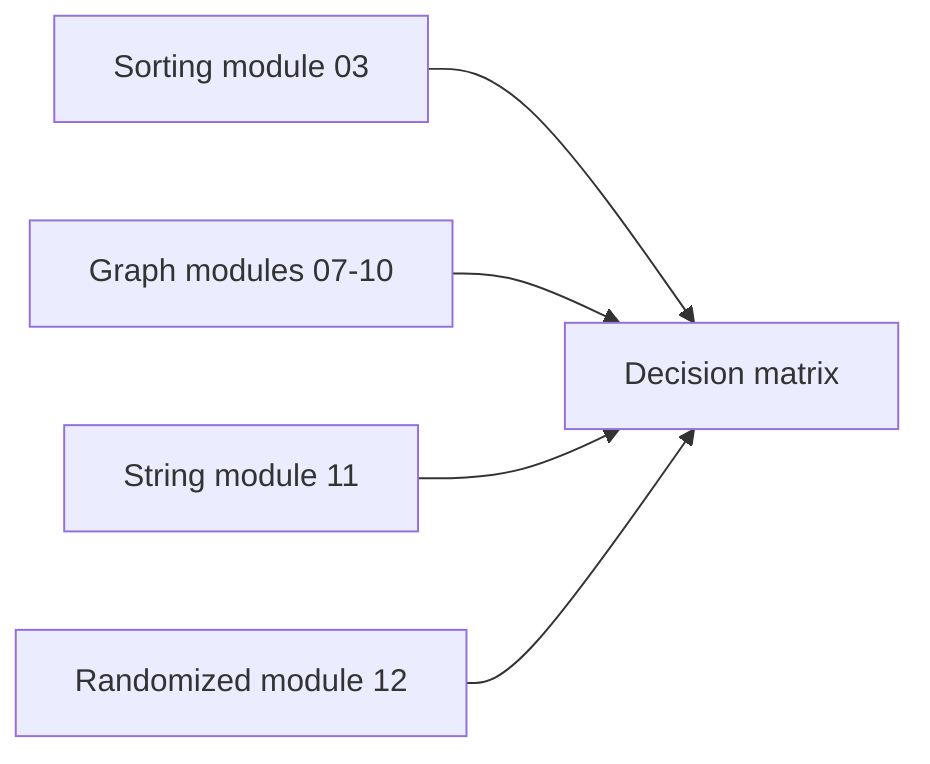
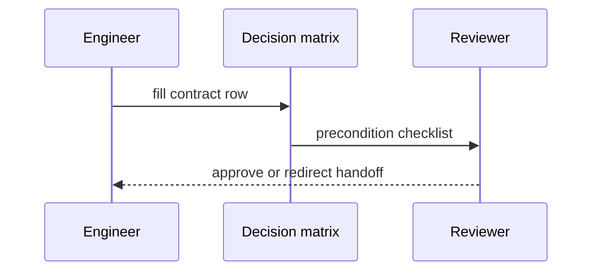

# Algorithm Selection Decision Matrix

## Overview

The **algorithm selection decision matrix** is a structured method to map **problem contracts** (input size, query pattern, weight constraints, memory, latency SLA, adversarial risk) to **algorithm families** before writing code. It synthesizes modules 00–12 into actionable rows—not a substitute for proofs, but a production gate preventing wrong-family incidents.

Distributed placement, consensus, and multi-region caching → [[09-System-Design/04-Partitioning-Sharding-and-Placement/Partition Keys Hotspots and Skew|Partition Keys Hotspots and Skew]], [[09-System-Design/08-Coordination-Consensus-and-Locks/Consensus Intuition Raft and Paxos for Designers|Consensus Intuition]], and [[09-System-Design/05-Caching-at-Product-Scale/Cache Hierarchies CDN Edge Regional App|Cache Hierarchies]]. Query planning and disk-resident sorts → [[08-Databases/04-Query-Processing-and-Planning/Parse Bind Plan Execute Pipeline|Parse Bind Plan Execute Pipeline]].

## Learning Objectives

- Build a decision matrix row: contract → candidates → preconditions → complexity → fallback
- Eliminate algorithms violating preconditions before benchmarking
- Document non-goals and handoff boundaries explicitly
- Reuse libraries vs reinvent using [[05-Algorithms/00-Foundations-and-Correctness/Algorithm Engineering and Reuse vs Reinvention|Algorithm Engineering]] criteria
- Align matrix with observability and regression gates

## Prerequisites

- [[05-Algorithms/01-Complexity-and-Analysis/Cost Models and Input Size|Cost Models and Input Size]]
- [[05-Algorithms/10-Advanced-Graph-Algorithms/Graph Algorithm Selection and Scaling Boundaries|Graph Algorithm Selection and Scaling Boundaries]]
- [[05-Algorithms/00-Foundations-and-Correctness/Algorithm Engineering and Reuse vs Reinvention|Algorithm Engineering and Reuse vs Reinvention]]

## Difficulty

`advanced`

## Estimated Time

- Reading: 2 hours
- Exercises: 3 hours
- Mini project: 4 hours

## History

Production outages from "wrong algorithm" predated cloud scale; formal matrices appear in internal platform docs at large tech companies. This note codifies that practice for the Algorithms track capstone.

## Problem It Solves

**Review paralysis**: team debates Redis vs custom index without stating query contract. **Interview-to-prod gap**: candidate knows Dijkstra name but not negative-weight check. Matrix forces **precondition-first** selection.

## Internal Implementation

### Matrix columns

| Column | Question |
| --- | --- |
| Problem | What is optimized/found? |
| Input bounds | `n`, `m`, memory |
| Constraints | Weights, DAG, online, adversarial |
| Candidates | 2–3 families max |
| Preconditions | Must hold or exclude |
| Complexity | Time/space with model |
| Fallback | Safer slower option |
| Handoff | DS / SD / DB track |

### Workflow

1. Write contract
2. Filter candidates by preconditions
3. Benchmark survivors on production-shaped data ([[05-Algorithms/01-Complexity-and-Analysis/Practical Constants Locality and Benchmark Design|Practical Constants]])
4. Lock choice in ADR with regression vectors



## Mermaid Diagrams

### Structure: matrix families



### Sequence: selection review



## Examples

### Minimal Example — matrix rows (excerpt)

```typescript
type MatrixRow = {
  problem: string;
  bounds: string;
  constraints: string[];
  candidates: string[];
  preconditions: string[];
  fallback: string;
  handoff?: string;
};

const rows: MatrixRow[] = [
  {
    problem: "SSSP non-negative",
    bounds: "V<=1e6, sparse E",
    constraints: ["non-negative weights"],
    candidates: ["Dijkstra indexed heap", "0-1 BFS if weights in {0,1}"],
    preconditions: ["w >= 0"],
    fallback: "Bellman-Ford if any negative edge possible",
  },
  {
    problem: "Static substring index",
    bounds: "n<=1e8 text, many queries",
    constraints: ["text rarely changes"],
    candidates: ["Suffix array + LCP", "Rabin-Karp streaming"],
    preconditions: ["offline rebuild acceptable"],
    fallback: "KMP single pass if one query",
    handoff: "DS track for trie storage",
  },
];
```

```python
def choose_sort(key_type: str, n: int, stable: bool, memory_tight: bool) -> str:
    if key_type == "integer_bounded":
        return "counting/radix O(n+k)"
    if n < 50:
        return "insertion sort low constant"
    if stable and not memory_tight:
        return "merge sort O(n log n) stable"
    if not stable:
        return "quicksort/introsort expected O(n log n)"
    return "heapsort O(n log n) in-place unstable"
```

### Production-Shaped Example

**Feature store nearest neighbor**: not graph Dijkstra—handoff to vector index ([[09-System-Design/README|System Design]]). **Audit log sort**: stable merge sort or timsort via stdlib; document `O(n log n)` and stability ([[05-Algorithms/03-Sorting/Sorting Contracts Stability and Adaptivity|Sorting Contracts]]). Matrix row prevents using Floyd–Warshall because "it's graph code."

## Correctness

Matrix correctness means **every deployed row satisfies preconditions** of chosen algorithm. Review checklist:

- Preconditions verified in code (assertions/tests)
- Fallback path if input violates assumption
- Handoff when problem leaves Algorithms track scope

Selection matrix does not prove algorithm internals—that remains in family notes.

## Complexity

Matrix itself is `O(1)` human process; value is avoiding `O(wrong)` runtime classes:

| Mis-selection | Typical cost |
| --- | --- |
| Dijkstra on negative edges | Wrong answers |
| Floyd on sparse million-node | `O(V³)` timeout |
| Naive string match periodic | `O(nm)` SLA miss |
| Exact TSP n=500 | Exponential hang |

## Trade-offs

| Dimension | Heavy matrix process | Ad hoc choice |
| --- | --- | --- |
| Upfront time | Higher | Lower |
| Incident rate | Lower | Higher |
| Onboarding | Faster with template | Tribal knowledge |
| Flexibility | Must update rows | Informal |

### When to Use

- New service choosing core algorithm
- Performance incident postmortem action item
- Architecture review gate

### When Not to Use

- Trivial n<100 with obvious scan
- Problem clearly owned by another track—handoff immediately
- Replacing matrix with benchmark-only without precondition check

## Exercises

1. Fill matrix row for "top-k elements streaming" linking reservoir and heap notes.
2. Write row that hands off B-tree range query to Databases track.
3. Given negative edge possibility, eliminate Dijkstra with justification.
4. Create ADR snippet from matrix row for stable sort requirement.
5. Audit open-source PR: identify precondition violation in graph code.

## Mini Project

Publish `decision-matrix.json` consumed by Algorithm Workbench linter.

## Portfolio Project

Internal wiki template: Algorithm Selection ADR with matrix + benchmark appendix.

## Interview Questions

1. How choose between merge sort and quicksort in production?
2. Decision process for SSSP with possible negative edges?
3. When suffix array vs KMP?
4. What belongs in preconditions column?
5. When hand off to System Design instead?

### Stretch / Staff-Level

1. Design org-wide lint rules mapping API names to required precondition tests.

## Common Mistakes

- Benchmarking before precondition filter
- Single candidate column—no fallback
- Ignoring stability/adversarial/online columns
- Matrix rows never updated after algorithm change

## Best Practices

- Pair matrix with shared test vectors in code labs
- Version matrix rows with service ADRs
- Include explicit **non-goals**
- Link [[05-Algorithms/13-Production-Selection-and-Interview-Patterns/Profiling Correctness and Regression Gates|Regression Gates]]

## Summary

The algorithm selection decision matrix forces contract-first choice: preconditions filter candidates before benchmarks, each row documents complexity, fallback, and track handoffs. It synthesizes the Algorithms curriculum into production discipline—preventing correct-looking code with wrong algorithmic family.

## Further Reading

- [[05-Algorithms/10-Advanced-Graph-Algorithms/Graph Algorithm Selection and Scaling Boundaries|Graph Algorithm Selection and Scaling Boundaries]]
- [[05-Algorithms/13-Production-Selection-and-Interview-Patterns/From In-Memory Algorithms to Production Systems|From In-Memory Algorithms to Production Systems]]

## Related Notes

- [[05-Algorithms/00-Foundations-and-Correctness/Algorithm Engineering and Reuse vs Reinvention|Algorithm Engineering and Reuse vs Reinvention]]
- [[05-Algorithms/01-Complexity-and-Analysis/Practical Constants Locality and Benchmark Design|Practical Constants Locality and Benchmark Design]]
- [[05-Algorithms/03-Sorting/External Sorting Concepts and Production Selection|External Sorting Concepts and Production Selection]]
- [[05-Algorithms/13-Production-Selection-and-Interview-Patterns/Profiling Correctness and Regression Gates|Profiling Correctness and Regression Gates]]
- [[05-Algorithms/README|Algorithms]]

## Progress Checklist

- [ ] Explained from first principles
- [ ] Drew at least one Mermaid diagram
- [ ] Implemented a minimal version
- [ ] Documented trade-offs and non-goals
- [ ] Completed exercises
- [ ] Practiced interview questions aloud
- [ ] Linked prerequisites and dependents
