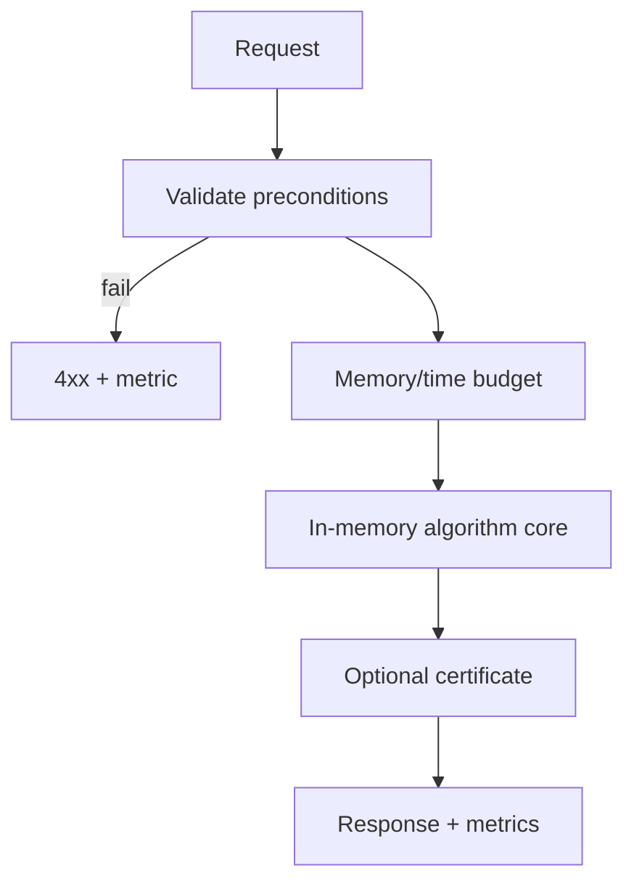
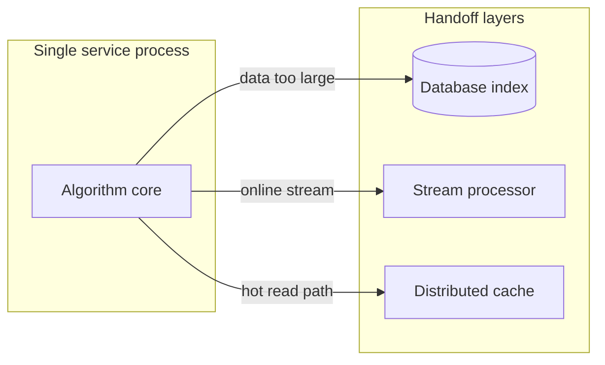
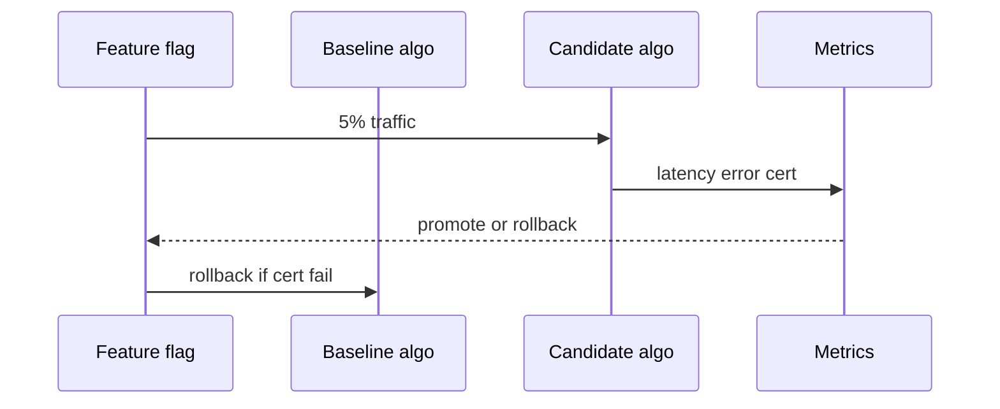

# From In-Memory Algorithms to Production Systems

## Overview

Algorithms track implementations assume **single-process RAM**, explicit preconditions, and paired TS/Python vectors. **Production systems** add persistence, concurrency, partial failure, skewed inputs, deployment rollouts, and organizational boundaries. This capstone note maps **what stays algorithmic** vs **what hands off** to Backend, Databases, and System Design—closing module 13 without duplicating those tracks.

## Learning Objectives

- Identify when in-memory algorithm suffices vs external index or distributed compute
- Wrap algorithm cores with timeouts, memory caps, and input validation
- Design observability: latency histograms, correctness counters, precondition violation metrics
- Plan rollout: canary, feature flag, fallback algorithm path
- Document handoff artifacts (API contract, ADR, regression vectors)

## Prerequisites

- [[05-Algorithms/13-Production-Selection-and-Interview-Patterns/Algorithm Selection Decision Matrix|Algorithm Selection Decision Matrix]]
- [[05-Algorithms/13-Production-Selection-and-Interview-Patterns/Profiling Correctness and Regression Gates|Profiling Correctness and Regression Gates]]
- [[05-Algorithms/00-Foundations-and-Correctness/Algorithm Engineering and Reuse vs Reinvention|Algorithm Engineering and Reuse vs Reinvention]]

## Difficulty

`advanced`

## Estimated Time

- Reading: 2.5 hours
- Exercises: 4 hours
- Mini project: 8 hours (production-shaped wrapper)

## History

Many outages come not from missing Big-O knowledge but from running textbook algorithms on unbounded streams, unvalidated graphs, or multi-tenant data without isolation. Platform teams extracted "algorithm cores" into libraries with gates—this note teaches that layering.

## Problem It Solves

**Pathfinding microservice OOM**: implicit graph expanded without cap. **Sort in API**: multi-GB payload sorted in RAM. **Cache stampede** mistaken for graph algorithm issue. Production wrapper enforces **budgets** and **handoffs** before algorithm runs.

## Internal Implementation

### Layer model

```text
[Validation] → [Budget check] → [Algorithm core] → [Certificate emit] → [Metrics]
```

| Layer | Algorithms track | Other tracks |
| --- | --- | --- |
| Core loop | Yes | — |
| Adjacency storage | Uses DS ADT | [[04-Data-Structures/README\|Data Structures]] |
| HTTP API, auth | — | [[07-Backend/README\|Backend]] |
| Disk index, WAL | — | [[08-Databases/03-Indexing-on-Disk/B-Plus Trees as Page Structures\|B-Plus Trees as Page Structures]], [[08-Databases/02-WAL-Durability-and-Recovery/Write-Ahead Logging Protocol\|Write-Ahead Logging Protocol]] |
| Sharding, consensus | — | [[09-System-Design/04-Partitioning-Sharding-and-Placement/Partition Keys Hotspots and Skew\|Partition Keys Hotspots and Skew]] / [[09-System-Design/08-Coordination-Consensus-and-Locks/Consensus Intuition Raft and Paxos for Designers\|Consensus Intuition]] |

### Production controls

- **Input caps**: `maxV`, `maxE`, `maxPatternLen`
- **Timeouts**: wall clock per request
- **Fallback**: simpler algorithm or cached result
- **Determinism**: seeded RNG metadata ([[05-Algorithms/12-Randomized-Approximation-and-Online/Randomized Algorithms and Reproducible RNG|Reproducible RNG]])



## Mermaid Diagrams

### Structure: deployment context



### Sequence: canary rollout



## Examples

### Minimal Example — production wrapper

```typescript
type GraphInput = { n: number; edges: [number, number, number][]; source: number };
const MAX_V = 100_000;
const MAX_E = 500_000;
const TIMEOUT_MS = 500;

async function ssspProduction(
  input: GraphInput,
  dijkstra: (g: GraphInput) => number[],
): Promise<{ dist: number[]; algo: string }> {
  if (input.n > MAX_V || input.edges.length > MAX_E) {
    throw new Error("INPUT_TOO_LARGE: hand off to batch pipeline");
  }
  for (const [, , w] of input.edges) {
    if (w < 0) throw new Error("NEGATIVE_WEIGHT: use Bellman-Ford branch");
  }
  const job = Promise.resolve(dijkstra(input));
  const dist = await Promise.race([
    job,
    new Promise<number[]>((_, rej) => setTimeout(() => rej(new Error("TIMEOUT")), TIMEOUT_MS)),
  ]);
  return { dist, algo: "dijkstra-indexed-heap-v1" };
}
```

```python
MAX_V = 100_000
MAX_E = 500_000
TIMEOUT_S = 0.5


def sssp_production(input_graph: dict, dijkstra_fn):
    n = input_graph["n"]
    edges = input_graph["edges"]
    if n > MAX_V or len(edges) > MAX_E:
        raise ValueError("INPUT_TOO_LARGE: batch/offline pipeline")
    if any(w < 0 for _u, _v, w in edges):
        raise ValueError("NEGATIVE_WEIGHT: Bellman-Ford branch")
    # timeout wrapper omitted for brevity; use signal or executor in production
    dist = dijkstra_fn(input_graph)
    return {"dist": dist, "algo": "dijkstra-indexed-heap-v1"}
```

### Production-Shaped Example

**Text search API**: in-memory KMP for `pattern.len ≤ 1e4`, `text chunk ≤ 1MB`; larger corpus queries hit suffix-array index service rebuilt offline ([[05-Algorithms/11-String-and-Sequence-Algorithms/Suffix Arrays and LCP Concepts|Suffix Arrays]]). **Ride routing**: in-process Dijkstra for city subgraph; cross-region queries call precomputed hub labels (System Design). Metrics: `precondition_violation_total`, `algo_timeout_total`, `p95_latency_ms`.

## Correctness

**Production correctness** = algorithm postconditions + **operational guards**:

- Reject or reroute inputs violating preconditions (never silent wrong family)
- Certificates when cheap (flow=cut, sorted check on sample)
- Dual-path canary: candidate output equals baseline on shadow traffic

**Partial failure**: return explicit error, not partial dist array without flag.

## Complexity

Operational complexity adds:

| Overhead | Impact |
| --- | --- |
| Validation | `O(n)` input scan |
| Serialization | Dominates small n |
| Cold cache | First request slower |
| GC pauses | Tail latency |

State **effective** complexity only after input caps—`n` bounded by `MAX_V`.

## Trade-offs

| Dimension | In-memory core | External index / distributed |
| --- | --- | --- |
| Latency | Low local | Network + staleness |
| Freshness | Immediate | Rebuild lag |
| Ops burden | Process memory | Index jobs, sharding |
| Correctness surface | Smaller | Larger |

### When to Use

- Bounded input fits SLA and RAM
- Algorithm core already gated by vectors
- Latency-sensitive hot path with known limits

### When Not to Use

- Data exceeds single-machine RAM → Databases external sort ([[05-Algorithms/03-Sorting/External Sorting Concepts and Production Selection|External Sorting]])
- Global strongly consistent coordination → System Design consensus
- Product REST concerns dominate → Backend layer first

## Exercises

1. Design input caps for max-flow solver; define error codes.
2. Write ADR handoff: when suffix index service replaces in-process KMP.
3. Canary plan comparing old/new Dijkstra heap with shadow metrics.
4. List three metrics for graph algorithm microservice.
5. Map one algorithm to Backend vs Databases vs System Design boundary.

## Mini Project

Wrap two algorithm cores with validation, timeout, metrics stub in Algorithm Workbench.

## Portfolio Project

Production-readiness checklist doc for Algorithm Workbench portfolio.

## Interview Questions

1. When in-memory Dijkstra insufficient at Uber scale?
2. What validate before running max-flow?
3. How roll out new string matcher safely?
4. Difference algorithm track vs System Design track ownership?
5. Timeout vs incorrect partial result—which choose?

### Stretch / Staff-Level

1. Design multi-tenant isolation preventing cross-customer graph injection in shared solver.

## Common Mistakes

- Unbounded graph from user JSON
- Algorithm in request path without timeout
- Skipping canary on "same Big-O" change
- Reimplementing DB index in application layer
- No metric on precondition violations

## Best Practices

- Enforce caps at API gateway and service entry
- Keep pure algorithm core testable with vectors
- Feature-flag algorithm version + automatic rollback
- Link decision matrix row in service README

## Summary

Production algorithm deployment wraps in-memory cores with validation, budgets, observability, and rollout discipline. The Algorithms track owns the core loop and correctness arguments; scale, persistence, and distribution hand off to Data Structures, Backend, Databases, and System Design with explicit boundaries and ADRs.

## Further Reading

- [[05-Algorithms/13-Production-Selection-and-Interview-Patterns/Algorithm Selection Decision Matrix|Algorithm Selection Decision Matrix]]
- [[05-Algorithms/03-Sorting/External Sorting Concepts and Production Selection|External Sorting Concepts and Production Selection]]
- [[09-System-Design/README|System Design]]

## Related Notes

- [[05-Algorithms/13-Production-Selection-and-Interview-Patterns/Algorithm Selection Decision Matrix|Algorithm Selection Decision Matrix]]
- [[05-Algorithms/13-Production-Selection-and-Interview-Patterns/Profiling Correctness and Regression Gates|Profiling Correctness and Regression Gates]]
- [[05-Algorithms/13-Production-Selection-and-Interview-Patterns/Interview Pattern Catalog and Complexity Communication|Interview Pattern Catalog and Complexity Communication]]
- [[05-Algorithms/10-Advanced-Graph-Algorithms/Graph Algorithm Selection and Scaling Boundaries|Graph Algorithm Selection and Scaling Boundaries]]
- [[07-Backend/README|Backend]]
- [[08-Databases/README|Databases]]
- [[09-System-Design/README|System Design]]
- [[05-Algorithms/README|Algorithms]]

## Progress Checklist

- [ ] Explained from first principles
- [ ] Drew at least one Mermaid diagram
- [ ] Implemented a minimal version
- [ ] Documented trade-offs and non-goals
- [ ] Completed exercises
- [ ] Practiced interview questions aloud
- [ ] Linked prerequisites and dependents
