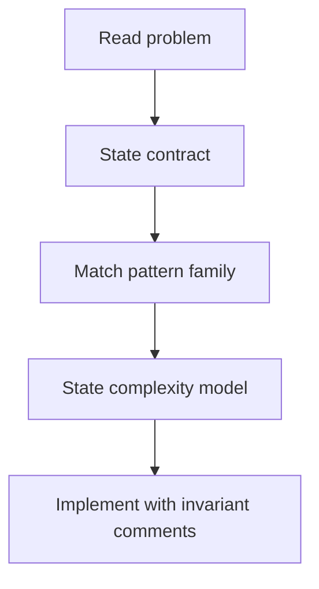
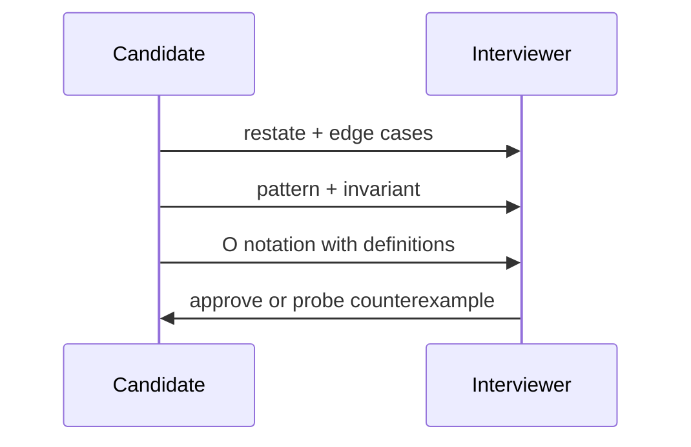

# Interview Pattern Catalog and Complexity Communication

## Overview

Technical interviews test **pattern recognition** mapped to **correct contracts** and **clear complexity speech**. This catalog links recurring problem shapes—two pointers, sliding window, binary search on answer, BFS/DFS, greedy exchange, DP state—to Algorithms track notes. **Complexity communication** means stating **model assumptions** (input size, memory, amortized vs worst) aloud before coding.

Career framing and behavioral prep → [[Career/README|Career]]; this note owns algorithmic pattern vocabulary and proof sketches.

## Learning Objectives

- Map problem statements to pattern families with prerequisite checks
- Communicate time/space complexity with explicit variables (`n`, `m`, `k`)
- Give 30-second approach outline before implementation
- Identify when pattern fails (greedy counterexample, negative edges)
- Connect interview solutions to production constraints briefly

## Prerequisites

- [[05-Algorithms/06-Dynamic-Programming/Optimal Substructure and Overlapping Subproblems|Optimal Substructure and Overlapping Subproblems]]
- [[05-Algorithms/04-Divide-Conquer-and-Backtracking/Backtracking State Spaces and Pruning|Backtracking State Spaces and Pruning]]
- [[05-Algorithms/02-Searching-and-Selection/Binary Search on Monotone Answers|Binary Search on Monotone Answers]]

## Difficulty

`intermediate`

## Estimated Time

- Reading: 2 hours
- Exercises: 6 hours (practice aloud)
- Mini project: 8 hours pattern drill set

## History

Interview pattern catalogs proliferated with coding platforms; strong candidates distinguish memorized templates from **invariant-based** reasoning taught in this repository's foundations modules.

## Problem It Solves

**False pattern match**: apply sliding window where DP needed. **Silent complexity**: say "O(n log n)" without defining `n`. **No contract check**: Dijkstra on negative weights in graph interview. Catalog + communication script reduces these failures.

## Internal Implementation

### Pattern catalog (selected)

| Pattern | Signal phrases | Track anchor | Typical complexity |
| --- | --- | --- | --- |
| Two pointers | Sorted array pair sum | [[05-Algorithms/02-Searching-and-Selection/Binary Search and Boundary Variants\|Binary Search]] | `O(n)` |
| Sliding window | Subarray sum ≤ K max length | Greedy + deque | `O(n)` |
| Binary search on answer | Minimize max load feasible | [[05-Algorithms/02-Searching-and-Selection/Binary Search on Monotone Answers\|Monotone Answers]] | `O(n log R)` |
| BFS/DFS | Shortest steps, components | [[05-Algorithms/07-Graph-Traversal-and-DAGs/BFS\|BFS]] | `O(V+E)` |
| Topological sort | Dependencies | [[05-Algorithms/07-Graph-Traversal-and-DAGs/Topological Sorting and Dependency Resolution\|Topological Sorting]] | `O(V+E)` |
| Greedy exchange | Interval scheduling | [[05-Algorithms/05-Greedy-Algorithms/Interval Scheduling\|Interval Scheduling]] | `O(n log n)` |
| DP | Optimal substructure overlap | [[05-Algorithms/06-Dynamic-Programming/State Design and Transition Invariants\|State Design]] | varies |
| Backtracking | Assignments, permutations | [[05-Algorithms/04-Divide-Conquer-and-Backtracking/Backtracking State Spaces and Pruning\|Backtracking]] | exponential |
| Union-find | Dynamic connectivity | [[04-Data-Structures/09-Disjoint-Set/Union-Find Structure\|Union-Find]] | `O(α(n))` |
| Heap | Top-k streaming | [[05-Algorithms/02-Searching-and-Selection/Order Statistics Median and Top-K Trade-offs\|Top-K]] | `O(n log k)` |

### Communication script

1. Restate problem + edge cases
2. Name pattern + why it applies ( invariant )
3. Complexity with variables
4. Trade-off / alternative (e.g., DP if greedy fails)
5. Code



## Mermaid Diagrams

### Structure: pattern → module


### Sequence: interview minute 0-3



## Examples

### Minimal Example — pattern classifier sketch

```typescript
type Pattern =
  | "two_pointers"
  | "sliding_window"
  | "binary_search_answer"
  | "bfs_dfs"
  | "dp"
  | "greedy"
  | "backtracking";

function suggestPattern(text: string): Pattern[] {
  const t = text.toLowerCase();
  const out: Pattern[] = [];
  if (t.includes("shortest path") || t.includes("connected")) out.push("bfs_dfs");
  if (t.includes("maximum subarray") && t.includes("at most")) out.push("sliding_window");
  if (t.includes("minimize the maximum") || t.includes("feasible capacity"))
    out.push("binary_search_answer");
  if (t.includes("schedule") || t.includes("interval")) out.push("greedy");
  if (t.includes("number of ways") || t.includes("longest subsequence")) out.push("dp");
  return out;
}
```

```python
def complexity_script(pattern: str, n: int, m: int | None = None) -> str:
    m = m or n
    scripts = {
        "bfs_dfs": f"O(V+E) with V~{n}, E~{m}; adjacency list memory O(V+E)",
        "dp": f"O(n*states); state table size dominates space",
        "binary_search_answer": f"O(n log R) search over answer range R",
        "greedy": f"O(n log n) if sort needed else O(n)",
    }
    return scripts.get(pattern, "Define variables before stating Big-O")
```

### Production-Shaped Example

Interview answer for "route with non-negative times" should mention Dijkstra preconditions and indexed heap ([[05-Algorithms/08-Shortest-Paths/Dijkstra with Indexed Heaps|Dijkstra]]), then note production uses contraction hierarchies at scale ([[09-System-Design/README|System Design]] handoff)—shows depth beyond LeetCode template.

## Correctness

Interview **correctness** = invariant + edge cases + complexity honesty:

- State loop invariant or DP recurrence meaning
- Handle empty input, duplicates, overflow
- Acknowledge when pattern is heuristic not proven optimal

Verbal proof sketch beats silent coding for senior loops.

## Complexity

Communication must define symbols:

| Phrase | Require definition |
| --- | --- |
| `O(n)` | `n` = array length |
| `O(E log V)` | sparse graph edges `E`, vertices `V` |
| `O(n log R)` | answer range `R` |
| Amortized | operation sequence + expensive rare steps |

Wrong: "linear because one loop" when inner while makes amortized analysis needed.

## Trade-offs

| Dimension | Pattern template | First-principles derivation |
| --- | --- | --- |
| Speed in interview | Fast | Slower |
| Robustness | Fails on twists | Adapts |
| Senior signal | Low if only template | High |
| Learning path | Catalog entry point | Module notes depth |

### When to Use

- Timed interview preparation with module cross-links
- Standup technical screen explaining approach before PR
- Teaching juniors pattern → invariant mapping

### When Not to Use

- Substituting patterns for precondition checks
- Claiming production readiness without gates ([[05-Algorithms/13-Production-Selection-and-Interview-Patterns/Profiling Correctness and Regression Gates|Profiling Gates]])

## Exercises

1. For 5 LeetCode mediums, fill pattern + track link + complexity script.
2. Give greedy counterexample where DP required—explain in 60 seconds.
3. Practice BFS vs DFS choice with invariant statement aloud.
4. Binary search on answer: define monotone predicate in words.
5. Record yourself; eliminate undefined `n` from explanation.

## Mini Project

Flashcard deck: problem statement → pattern → module note link.

## Portfolio Project

Blog post: "From pattern to production gate" tracing one problem end-to-end.

## Interview Questions

1. Explain two pointers precondition on sorted input.
2. When sliding window fails?
3. Template for binary search on answer?
4. How discuss amortized complexity in dynamic array append?
5. Graph problem: first questions before coding?

### Stretch / Staff-Level

1. Derive DP for edit distance; explain space optimization ([[05-Algorithms/06-Dynamic-Programming/Longest Common Subsequence and Edit Distance|Edit Distance]]).

## Common Mistakes

- Naming pattern without invariant
- Omitting edge cases (empty, single element)
- Complexity without variable definitions
- Dijkstra/BFS confusion on weighted graphs
- Never mentioning brute force baseline

## Best Practices

- Always restate problem in own words
- Write invariant comment before loop body
- Mention one counterexample or failure mode
- Link to production handoff when relevant

## Summary

The interview pattern catalog maps common problem shapes to Algorithms track notes—but success requires communicating contracts, invariants, and complexity with defined variables. Patterns accelerate recognition; first-principles links prevent misapplied templates and demonstrate senior-level reasoning.

## Further Reading

- [[05-Algorithms/_interview/README|Algorithms Interview Questions]]
- [[Career/README|Career]]

## Related Notes

- [[05-Algorithms/02-Searching-and-Selection/Binary Search on Monotone Answers|Binary Search on Monotone Answers]]
- [[05-Algorithms/06-Dynamic-Programming/State Design and Transition Invariants|State Design and Transition Invariants]]
- [[05-Algorithms/07-Graph-Traversal-and-DAGs/BFS|BFS]]
- [[05-Algorithms/13-Production-Selection-and-Interview-Patterns/Algorithm Selection Decision Matrix|Algorithm Selection Decision Matrix]]
- [[05-Algorithms/README|Algorithms]]

## Progress Checklist

- [ ] Explained from first principles
- [ ] Drew at least one Mermaid diagram
- [ ] Implemented a minimal version
- [ ] Documented trade-offs and non-goals
- [ ] Completed exercises
- [ ] Practiced interview questions aloud
- [ ] Linked prerequisites and dependents
