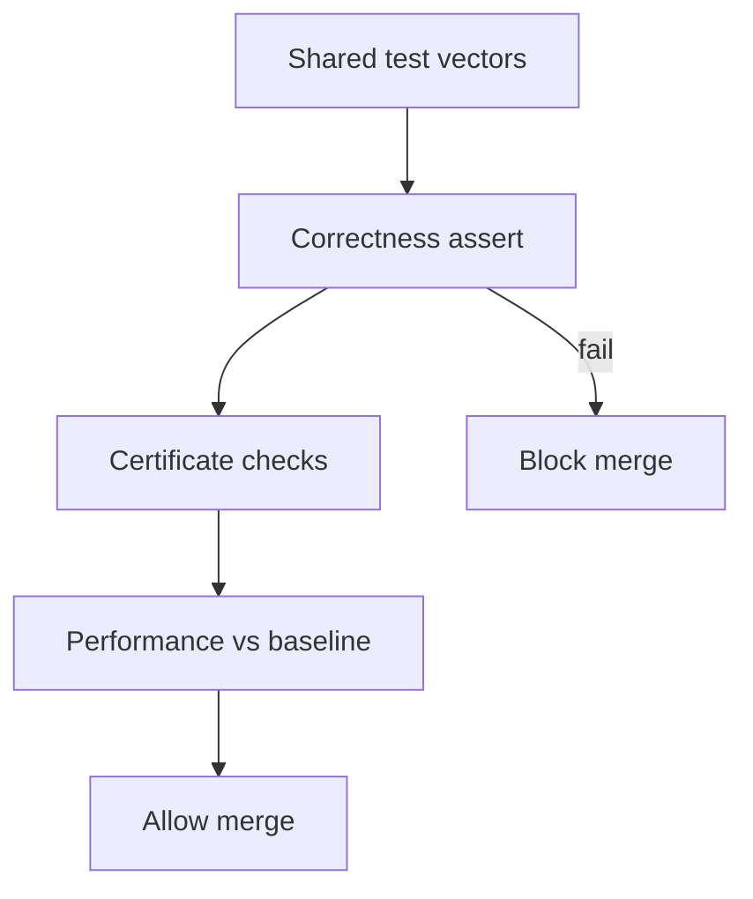
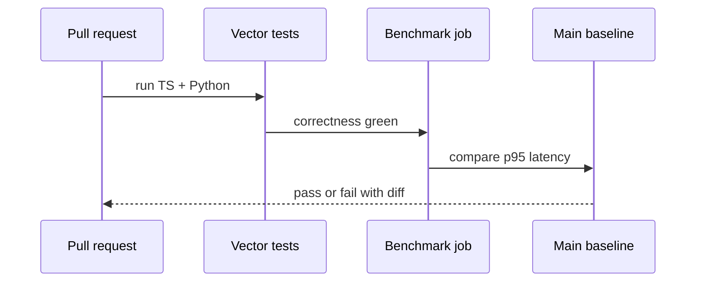

# Profiling Correctness and Regression Gates

## Overview

**Profiling** measures time and memory on representative inputs; **correctness gates** assert postconditions and certificates before trusting speedups. **Regression gates** block merges when outputs diverge from shared vectors or latency exceeds budgets vs baseline. Fast wrong algorithms are production incidents—this note integrates measurement with invariant testing from foundations modules.

Product APM and infra monitoring → [[09-System-Design/README|System Design]]; this note covers algorithm-lab and service-local gates.

## Learning Objectives

- Design shared JSON test vectors with expected outputs and certificates
- Separate microbench (isolated) from integration profile (realistic I/O)
- Gate on correctness first, performance second
- Track seeded RNG metadata for randomized algorithms
- Detect precondition violations via adversarial vectors

## Prerequisites

- [[05-Algorithms/01-Complexity-and-Analysis/Practical Constants Locality and Benchmark Design|Practical Constants Locality and Benchmark Design]]
- [[05-Algorithms/00-Foundations-and-Correctness/Problem Specifications Preconditions and Postconditions|Problem Specifications Preconditions and Postconditions]]
- [[05-Algorithms/13-Production-Selection-and-Interview-Patterns/Algorithm Selection Decision Matrix|Algorithm Selection Decision Matrix]]

## Difficulty

`advanced`

## Estimated Time

- Reading: 2 hours
- Exercises: 4 hours
- Mini project: 6 hours

## History

Benchmark culture shifted from naive loop timing to controlled harnesses (Google Benchmark, criterion.rs). Production regressions increasingly tied to golden files after incidents from "optimized" broken sorts and pathfinders.

## Problem It Solves

**Perf PR broke correctness**: quicksort pivot change skipped duplicates. **Flaky bench**: laptop thermal throttle. **Unreproducible RNG**: reservoir sample tests fail intermittently. Gates enforce **dual-language parity** (TS/Python) on same vectors per Algorithms track contract.

## Internal Implementation

### Gate pipeline

1. **Correctness**: all vectors pass postconditions
2. **Certificate**: optional (negative-cycle flag, cut value = flow)
3. **Performance**: p50/p95 vs baseline on pinned hardware or normalized score
4. **Metadata**: `{seed, input_hash, algo_version}`



## Mermaid Diagrams

### Structure: bench layers


### Sequence: CI regression gate



## Examples

### Minimal Example — vector schema + gate

```typescript
type Vector = {
  id: string;
  input: unknown;
  expected: unknown;
  cert?: Record<string, unknown>;
};

function gateDijkstra(vectors: Vector[], run: (input: unknown) => unknown): void {
  for (const v of vectors) {
    const out = run(v.input);
    if (JSON.stringify(out) !== JSON.stringify(v.expected)) {
      throw new Error(`correctness fail ${v.id}`);
    }
  }
}

function bench(fn: () => void, warmup = 3, iters = 10): number {
  for (let i = 0; i < warmup; i++) fn();
  const t0 = performance.now();
  for (let i = 0; i < iters; i++) fn();
  return (performance.now() - t0) / iters;
}
```

```python
import json
import time
from typing import Any, Callable


def gate_vectors(vectors: list[dict], run: Callable[[Any], Any]) -> None:
    for v in vectors:
        out = run(v["input"])
        if out != v["expected"]:
            raise AssertionError(f"correctness fail {v['id']}")
        cert = v.get("cert")
        if cert and not cert.get("skip"):
            if cert.get("flow_equals_cut") and out.get("flow") != out.get("cut_capacity"):
                raise AssertionError(f"certificate fail {v['id']}")


def bench(fn: Callable[[], None], warmup: int = 3, iters: int = 10) -> float:
    for _ in range(warmup):
        fn()
    t0 = time.perf_counter()
    for _ in range(iters):
        fn()
    return (time.perf_counter() - t0) / iters
```

### Production-Shaped Example

**Pathfinding service**: correctness vectors include negative-edge graph expecting Bellman-Ford branch; Dijkstra path must fail CI. Performance gate: p95 within +10% of main on grid + road snapshots. Log `{cpu_model, node_version, seed}` in bench artifact. Link to [[05-Algorithms/projects/Algorithm Workbench/README|Algorithm Workbench]] shared JSON.

## Correctness

**Gate soundness**: if all vectors satisfy stated preconditions and impl passes, confidence proportional to vector coverage—not formal proof.

**Certificate examples**:

- Max-flow: `flowValue === minCutCapacity`
- Sort: output sorted + stability permutation check
- Bellman-Ford: report negative cycle reachable bit

**Performance gate**: statistical; use sufficient iterations and reject outliers from GC noise ([[05-Algorithms/01-Complexity-and-Analysis/Practical Constants Locality and Benchmark Design|Practical Constants]]).

## Complexity

| Activity | Cost | Purpose |
| --- | --- | --- |
| Vector test suite | `O(sum vector runtime))` | Correctness |
| Microbench | Controlled iterations | Regression signal |
| Full integration | Higher | End-to-end SLA |

CI time trade-off: smoke vectors on every commit; large benches nightly.

## Trade-offs

| Dimension | Strict gates | Loose gates |
| --- | --- | --- |
| Incident rate | Lower | Higher |
| CI time | Longer | Shorter |
| Flakiness risk | Needs pinned env | Hidden variance |
| Innovation friction | Higher | Lower |

### When to Use

- Any optimized algorithm path in production
- Dual TS/Python implementations
- Randomized algorithms with seeded vectors

### When Not to Use

- Prototype throwaway scripts
- Performance work on non-algorithmic I/O bound endpoints without isolation

## Exercises

1. Author vector breaking Dijkstra with one negative edge.
2. Design stability certificate for merge sort on keyed records.
3. Write bench harness warming JVM/Node before timing.
4. Set p95 regression threshold with justification.
5. Add RNG seed to vector metadata schema.

## Mini Project

Implement shared vector loader in Algorithm Workbench for two algorithms.

## Portfolio Project

CI job publishing bench dashboard + correctness coverage report.

## Interview Questions

1. Correctness vs performance priority in CI?
2. What certificates for max-flow tests?
3. Why shared vectors across languages?
4. Microbench pitfalls on managed runtimes?
5. How handle flaky randomized tests?

### Stretch / Staff-Level

1. Design canary deploy comparing production latency to bench baseline safely.

## Common Mistakes

- Benchmark before unit vectors green
- Single timing call without warmup
- Compare benches across different hardware silently
- Performance gate without correctness oracle (naive impl)

## Best Practices

- Naive/gold implementation as oracle for optimized code
- Pin seeds; log environment metadata
- Separate smoke vs nightly bench tiers
- Fail closed on certificate mismatch

## Summary

Profiling without correctness gates optimizes broken code. Regression gates enforce shared vectors, optional certificates, and bounded performance drift before merge. Production algorithm engineering treats measurement and invariants as one pipeline—not a post-hoc load test.

## Further Reading

- [[05-Algorithms/01-Complexity-and-Analysis/Practical Constants Locality and Benchmark Design|Practical Constants Locality and Benchmark Design]]
- [[05-Algorithms/12-Randomized-Approximation-and-Online/Randomized Algorithms and Reproducible RNG|Randomized Algorithms and Reproducible RNG]]

## Related Notes

- [[05-Algorithms/00-Foundations-and-Correctness/Problem Specifications Preconditions and Postconditions|Problem Specifications Preconditions and Postconditions]]
- [[05-Algorithms/13-Production-Selection-and-Interview-Patterns/Algorithm Selection Decision Matrix|Algorithm Selection Decision Matrix]]
- [[05-Algorithms/13-Production-Selection-and-Interview-Patterns/From In-Memory Algorithms to Production Systems|From In-Memory Algorithms to Production Systems]]
- [[05-Algorithms/projects/Algorithm Workbench/README|Algorithm Workbench]]
- [[05-Algorithms/README|Algorithms]]

## Progress Checklist

- [ ] Explained from first principles
- [ ] Drew at least one Mermaid diagram
- [ ] Implemented a minimal version
- [ ] Documented trade-offs and non-goals
- [ ] Completed exercises
- [ ] Practiced interview questions aloud
- [ ] Linked prerequisites and dependents
