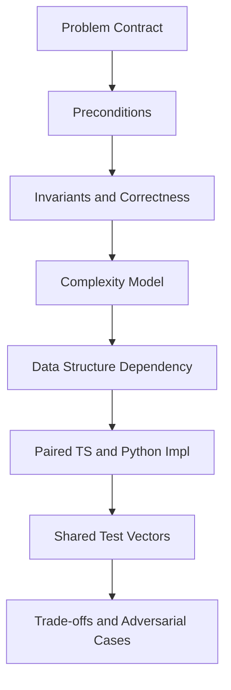
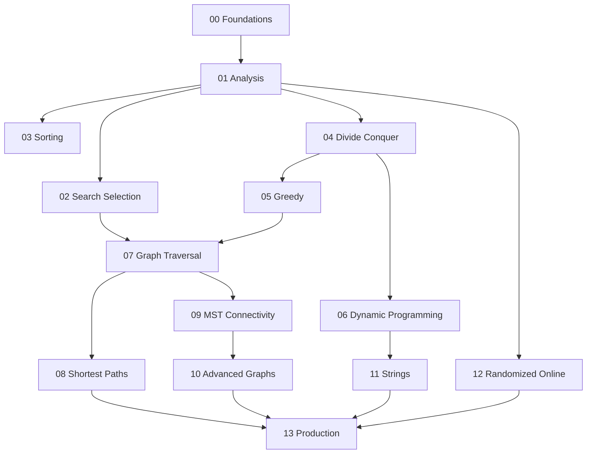

# 05 Algorithms

A first-principles track for **algorithm design and engineering**: problem contracts, correctness arguments, complexity models, data-structure dependencies, paired TypeScript/Python implementations against shared vectors, and production selection under latency, memory, and adversarial constraints.

## Objectives

- Specify problems with preconditions, postconditions, and certificates
- Prove or sketch correctness via loop invariants and exchange/optimal-substructure arguments
- Analyze worst-case, average, expected, and amortized complexity with explicit models
- Implement core algorithm families from scratch in TypeScript and Python against shared test vectors
- Choose algorithms under latency, memory, numeric, and adversarial constraints
- Hand off representation to Data Structures and distributed/system concerns to later tracks

## Why This Track Matters

Production incidents often come from the *wrong algorithm* for the contract: unstable sorts in audit logs, Dijkstra on negative weights, greedy where exchange fails, DP with broken state design, or BFS on an implicit graph that explodes. Libraries hide names; they do not hide wrong assumptions. This track teaches the contracts underneath `sort`, `shortest_path`, and interview pattern catalogs.

## Teaching Contract

Every topic note follows:

## Scope Boundaries

| This track owns | Handoff |
| --- | --- |
| Sorting, selection, searching variants | — |
| Divide-and-conquer, greedy, DP, backtracking | — |
| Graph *algorithms* (BFS/DFS, shortest paths, MST, flow, matching) | Graph *storage* → [[04-Data-Structures/README\|Data Structures]] |
| String matching (KMP, Z, rolling hash) | Tries as structures → DS |
| Complexity techniques beyond the CS primer | Vocabulary primer → [[01-Computer-Science/08-Languages-and-Computation/Computational Complexity Primer\|Computational Complexity Primer]] |
| Interview pattern catalogs and complexity storytelling | Career practice framing → [[Career/README\|Career]] |
| In-memory algorithmic choice and measurement | Distributed consensus → [[09-System-Design/README\|System Design]] |
| — | Query planners, WAL, disk sorts at engine scale → [[08-Databases/README\|Databases]] |
| — | HTTP APIs, product caches → [[07-Backend/README\|Backend]] |

## Prerequisites

- [[01-Computer-Science/08-Languages-and-Computation/Computational Complexity Primer|Computational Complexity Primer]]
- [[01-Computer-Science/09-Correctness-and-Reliability/Invariants Assertions and Contracts|Invariants Assertions and Contracts]]
- [[04-Data-Structures/00-Orientation-and-Contracts/Abstract Data Types vs Concrete Structures|Abstract Data Types vs Concrete Structures]]
- [[04-Data-Structures/06-Heaps-and-Priority-Queues/Priority Queue ADT|Priority Queue ADT]]
- [[04-Data-Structures/08-Graphs-as-Representation/Graph ADT Vertices Edges and Labels|Graph ADT Vertices Edges and Labels]]
- [[04-Data-Structures/09-Disjoint-Set/Union-Find Structure|Union-Find Structure]]

## Roadmap

## Topics

### 00 — Foundations and Correctness

- [[05-Algorithms/00-Foundations-and-Correctness/Why Algorithms Exist|Why Algorithms Exist]]
- [[05-Algorithms/00-Foundations-and-Correctness/Problem Specifications Preconditions and Postconditions|Problem Specifications Preconditions and Postconditions]]
- [[05-Algorithms/00-Foundations-and-Correctness/Loop Invariants and Correctness Proofs|Loop Invariants and Correctness Proofs]]
- [[05-Algorithms/00-Foundations-and-Correctness/Termination Partial and Total Correctness|Termination Partial and Total Correctness]]
- [[05-Algorithms/00-Foundations-and-Correctness/Algorithm Engineering and Reuse vs Reinvention|Algorithm Engineering and Reuse vs Reinvention]]

### 01 — Complexity and Analysis

- [[05-Algorithms/01-Complexity-and-Analysis/Cost Models and Input Size|Cost Models and Input Size]]
- [[05-Algorithms/01-Complexity-and-Analysis/Worst Average Expected and Amortized Cases|Worst Average Expected and Amortized Cases]]
- [[05-Algorithms/01-Complexity-and-Analysis/Recurrences Recursion Trees and Master Theorem|Recurrences Recursion Trees and Master Theorem]]
- [[05-Algorithms/01-Complexity-and-Analysis/Lower Bounds Decision Trees and Adversaries|Lower Bounds Decision Trees and Adversaries]]
- [[05-Algorithms/01-Complexity-and-Analysis/Practical Constants Locality and Benchmark Design|Practical Constants Locality and Benchmark Design]]

### 02 — Searching and Selection

- [[05-Algorithms/02-Searching-and-Selection/Linear Search and Sentinels|Linear Search and Sentinels]]
- [[05-Algorithms/02-Searching-and-Selection/Binary Search and Boundary Variants|Binary Search and Boundary Variants]]
- [[05-Algorithms/02-Searching-and-Selection/Binary Search on Monotone Answers|Binary Search on Monotone Answers]]
- [[05-Algorithms/02-Searching-and-Selection/Quickselect and Partition-Based Selection|Quickselect and Partition-Based Selection]]
- [[05-Algorithms/02-Searching-and-Selection/Order Statistics Median and Top-K Trade-offs|Order Statistics Median and Top-K Trade-offs]]

### 03 — Sorting

- [[05-Algorithms/03-Sorting/Sorting Contracts Stability and Adaptivity|Sorting Contracts Stability and Adaptivity]]
- [[05-Algorithms/03-Sorting/Insertion and Selection Sort|Insertion and Selection Sort]]
- [[05-Algorithms/03-Sorting/Merge Sort|Merge Sort]]
- [[05-Algorithms/03-Sorting/Quicksort Partitioning and Introspective Fallbacks|Quicksort Partitioning and Introspective Fallbacks]]
- [[05-Algorithms/03-Sorting/Heapsort|Heapsort]]
- [[05-Algorithms/03-Sorting/Counting Radix and Bucket Sort|Counting Radix and Bucket Sort]]
- [[05-Algorithms/03-Sorting/External Sorting Concepts and Production Selection|External Sorting Concepts and Production Selection]]

### 04 — Divide Conquer and Backtracking

- [[05-Algorithms/04-Divide-Conquer-and-Backtracking/Divide-and-Conquer Design|Divide-and-Conquer Design]]
- [[05-Algorithms/04-Divide-Conquer-and-Backtracking/Backtracking State Spaces and Pruning|Backtracking State Spaces and Pruning]]
- [[05-Algorithms/04-Divide-Conquer-and-Backtracking/Meet-in-the-Middle|Meet-in-the-Middle]]
- [[05-Algorithms/04-Divide-Conquer-and-Backtracking/Branch-and-Bound Concepts|Branch-and-Bound Concepts]]

### 05 — Greedy Algorithms

- [[05-Algorithms/05-Greedy-Algorithms/Greedy Choice and Exchange Arguments|Greedy Choice and Exchange Arguments]]
- [[05-Algorithms/05-Greedy-Algorithms/Interval Scheduling|Interval Scheduling]]
- [[05-Algorithms/05-Greedy-Algorithms/Huffman Coding|Huffman Coding]]
- [[05-Algorithms/05-Greedy-Algorithms/Fractional Knapsack and Scheduling|Fractional Knapsack and Scheduling]]
- [[05-Algorithms/05-Greedy-Algorithms/When Greedy Fails|When Greedy Fails]]

### 06 — Dynamic Programming

- [[05-Algorithms/06-Dynamic-Programming/Optimal Substructure and Overlapping Subproblems|Optimal Substructure and Overlapping Subproblems]]
- [[05-Algorithms/06-Dynamic-Programming/Memoization vs Tabulation|Memoization vs Tabulation]]
- [[05-Algorithms/06-Dynamic-Programming/State Design and Transition Invariants|State Design and Transition Invariants]]
- [[05-Algorithms/06-Dynamic-Programming/Knapsack and Subset Families|Knapsack and Subset Families]]
- [[05-Algorithms/06-Dynamic-Programming/Longest Common Subsequence and Edit Distance|Longest Common Subsequence and Edit Distance]]
- [[05-Algorithms/06-Dynamic-Programming/DAG Dynamic Programming and Space Optimization|DAG Dynamic Programming and Space Optimization]]

### 07 — Graph Traversal and DAGs

- [[05-Algorithms/07-Graph-Traversal-and-DAGs/BFS|BFS]]
- [[05-Algorithms/07-Graph-Traversal-and-DAGs/DFS|DFS]]
- [[05-Algorithms/07-Graph-Traversal-and-DAGs/Connected Components and Bipartite Testing|Connected Components and Bipartite Testing]]
- [[05-Algorithms/07-Graph-Traversal-and-DAGs/Cycle Detection|Cycle Detection]]
- [[05-Algorithms/07-Graph-Traversal-and-DAGs/Topological Sorting and Dependency Resolution|Topological Sorting and Dependency Resolution]]
- [[05-Algorithms/07-Graph-Traversal-and-DAGs/Strongly Connected Components|Strongly Connected Components]]

### 08 — Shortest Paths

- [[05-Algorithms/08-Shortest-Paths/Shortest-Path Contracts and Relaxation|Shortest-Path Contracts and Relaxation]]
- [[05-Algorithms/08-Shortest-Paths/Dijkstra with Indexed Heaps|Dijkstra with Indexed Heaps]]
- [[05-Algorithms/08-Shortest-Paths/Bellman-Ford and Negative Cycles|Bellman-Ford and Negative Cycles]]
- [[05-Algorithms/08-Shortest-Paths/Zero-One BFS and Specialized Weights|Zero-One BFS and Specialized Weights]]
- [[05-Algorithms/08-Shortest-Paths/Floyd-Warshall and All-Pairs Trade-offs|Floyd-Warshall and All-Pairs Trade-offs]]

### 09 — MST and Connectivity

- [[05-Algorithms/09-MST-and-Connectivity/Minimum Spanning Tree Contracts and Cut Property|Minimum Spanning Tree Contracts and Cut Property]]
- [[05-Algorithms/09-MST-and-Connectivity/Kruskal with Union-Find|Kruskal with Union-Find]]
- [[05-Algorithms/09-MST-and-Connectivity/Prim with Priority Queues|Prim with Priority Queues]]
- [[05-Algorithms/09-MST-and-Connectivity/Bridges Articulation Points and Connectivity Failure|Bridges Articulation Points and Connectivity Failure]]

### 10 — Advanced Graph Algorithms

- [[05-Algorithms/10-Advanced-Graph-Algorithms/Maximum Flow and Residual Networks|Maximum Flow and Residual Networks]]
- [[05-Algorithms/10-Advanced-Graph-Algorithms/Min-Cut Duality|Min-Cut Duality]]
- [[05-Algorithms/10-Advanced-Graph-Algorithms/Bipartite Matching|Bipartite Matching]]
- [[05-Algorithms/10-Advanced-Graph-Algorithms/Eulerian and Hamiltonian Distinctions|Eulerian and Hamiltonian Distinctions]]
- [[05-Algorithms/10-Advanced-Graph-Algorithms/Graph Algorithm Selection and Scaling Boundaries|Graph Algorithm Selection and Scaling Boundaries]]

### 11 — String and Sequence Algorithms

- [[05-Algorithms/11-String-and-Sequence-Algorithms/Naive Matching and Prefix Structure|Naive Matching and Prefix Structure]]
- [[05-Algorithms/11-String-and-Sequence-Algorithms/KMP Prefix Function|KMP Prefix Function]]
- [[05-Algorithms/11-String-and-Sequence-Algorithms/Z Algorithm|Z Algorithm]]
- [[05-Algorithms/11-String-and-Sequence-Algorithms/Rabin-Karp and Rolling Hash|Rabin-Karp and Rolling Hash]]
- [[05-Algorithms/11-String-and-Sequence-Algorithms/Suffix Arrays and LCP Concepts|Suffix Arrays and LCP Concepts]]

### 12 — Randomized Approximation and Online

- [[05-Algorithms/12-Randomized-Approximation-and-Online/Randomized Algorithms and Reproducible RNG|Randomized Algorithms and Reproducible RNG]]
- [[05-Algorithms/12-Randomized-Approximation-and-Online/Reservoir Sampling|Reservoir Sampling]]
- [[05-Algorithms/12-Randomized-Approximation-and-Online/Approximation Ratios and Heuristics|Approximation Ratios and Heuristics]]
- [[05-Algorithms/12-Randomized-Approximation-and-Online/Online Streaming and Competitive Trade-offs|Online Streaming and Competitive Trade-offs]]

### 13 — Production Selection and Interview Patterns

- [[05-Algorithms/13-Production-Selection-and-Interview-Patterns/Algorithm Selection Decision Matrix|Algorithm Selection Decision Matrix]]
- [[05-Algorithms/13-Production-Selection-and-Interview-Patterns/Profiling Correctness and Regression Gates|Profiling Correctness and Regression Gates]]
- [[05-Algorithms/13-Production-Selection-and-Interview-Patterns/Interview Pattern Catalog and Complexity Communication|Interview Pattern Catalog and Complexity Communication]]
- [[05-Algorithms/13-Production-Selection-and-Interview-Patterns/From In-Memory Algorithms to Production Systems|From In-Memory Algorithms to Production Systems]]

## Suggested Study Order

1. Foundations (00) and Analysis (01) before implementing anything non-trivial
2. Searching/Selection (02) and Sorting (03) before interview pattern catalogs
3. Divide-and-Conquer / Greedy / DP (04–06) as design paradigms
4. Graph traversal (07) before shortest paths and MST (08–09)
5. Advanced graphs and strings (10–11) after core graph algorithms
6. Randomized/online (12) with explicit reproducibility discipline
7. Production selection (13) and portfolio as synthesis

## Mini Projects

- [[05-Algorithms/projects/Sorting and Selection Bake-Off/README|Sorting and Selection Bake-Off]]
- [[05-Algorithms/projects/Dependency Planner/README|Dependency Planner]]
- [[05-Algorithms/projects/Pathfinding Lab/README|Pathfinding Lab]]
- [[05-Algorithms/projects/Network Connectivity and MST Lab/README|Network Connectivity and MST Lab]]
- [[05-Algorithms/projects/Text Search Toolkit/README|Text Search Toolkit]]

## Portfolio Project

- [[05-Algorithms/projects/Algorithm Workbench/README|Algorithm Workbench]]

## Exercises

Module sets live under [[05-Algorithms/_exercises/README|Algorithms Exercises]].

## Interview Questions

Module sets live under [[05-Algorithms/_interview/README|Algorithms Interview Questions]].

## Implementation Checklist

- [x] Shared JSON vectors + schema
- [x] Binary search variants + quickselect / top-k
- [x] Comparison sorts + counting/radix sorts
- [x] Interval scheduling + Huffman
- [x] Representative DP solvers (knapsack, LCS/edit distance)
- [x] BFS / DFS / components / bipartite / cycle / topological / SCC
- [x] Dijkstra / Bellman-Ford / 0-1 BFS / Floyd-Warshall
- [x] Kruskal / Prim / bridges
- [x] Max-flow + bipartite matching
- [x] KMP / Z / Rabin-Karp
- [x] Deterministic reservoir sampling
- [x] Five mini projects + Algorithm Workbench

## Code Labs

See [[05-Algorithms/code/README|Algorithms code labs]].

## References

- [[00-References/Algorithms/README|Algorithms References]]

## Related Tracks

- [[01-Computer-Science/README|Computer Science]]
- [[04-Data-Structures/README|Data Structures]]
- [[02-JavaScript/README|JavaScript]]
- [[03-Python/README|Python]]
- [[07-Backend/README|Backend]]
- [[08-Databases/README|Databases]]
- [[09-System-Design/README|System Design]]
- [[Career/README|Career]]

## Stage Gate Checklist

- [ ] Can state problem contracts, invariants, and complexity assumptions for each core family
- [ ] Can explain when greedy/DP/graph algorithms apply and when they fail
- [ ] Dual-language labs green against shared vectors with certificates where applicable
- [ ] Can choose algorithms under latency, memory, and adversarial constraints
- [ ] At least three mini projects and portfolio docs completed
- [ ] Interview sets practiced with diagrams and production failure modes
