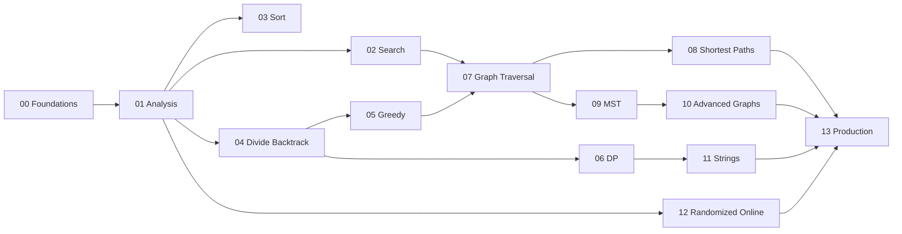

# Algorithms Exercises

Fourteen module sets move from problem contracts and correctness proofs through paired TypeScript/Python implementations, complexity defense, debugging, and production algorithm selection.

## Learning Path

## Exercise Sets

1. [[05-Algorithms/_exercises/Foundations and Correctness Exercises.md|Foundations and Correctness Exercises]] — Specify algorithm contracts, invariants, and termination before writing code or invoking libraries.
2. [[05-Algorithms/_exercises/Complexity and Analysis Exercises.md|Complexity and Analysis Exercises]] — Build cost models, solve recurrences, and defend complexity claims with explicit assumptions and benchmarks.
3. [[05-Algorithms/_exercises/Searching and Selection Exercises.md|Searching and Selection Exercises]] — Master linear search, binary search variants, monotone answer search, and partition-based selection.
4. [[05-Algorithms/_exercises/Sorting Exercises.md|Sorting Exercises]] — Implement and defend comparison and integer sorts under stability, adaptivity, and external constraints.
5. [[05-Algorithms/_exercises/Divide Conquer and Backtracking Exercises.md|Divide Conquer and Backtracking Exercises]] — Design divide-and-conquer reductions, backtracking with pruning, meet-in-the-middle, and branch-and-bound.
6. [[05-Algorithms/_exercises/Greedy Algorithms Exercises.md|Greedy Algorithms Exercises]] — Apply exchange arguments, interval scheduling, Huffman coding, and recognize greedy failure modes.
7. [[05-Algorithms/_exercises/Dynamic Programming Exercises.md|Dynamic Programming Exercises]] — Design DP state, prove optimal substructure, choose memoization vs tabulation, and optimize space.
8. [[05-Algorithms/_exercises/Graph Traversal and DAGs Exercises.md|Graph Traversal and DAGs Exercises]] — Implement BFS/DFS, components, bipartite testing, cycle detection, topological sort, and SCC.
9. [[05-Algorithms/_exercises/Shortest Paths Exercises.md|Shortest Paths Exercises]] — Implement relaxation-based shortest paths: Dijkstra, Bellman-Ford, 0-1 BFS, and Floyd-Warshall trade-offs.
10. [[05-Algorithms/_exercises/MST and Connectivity Exercises.md|MST and Connectivity Exercises]] — Build Kruskal and Prim MSTs, apply cut/cycle properties, and detect bridges and articulation points.
11. [[05-Algorithms/_exercises/Advanced Graph Algorithms Exercises.md|Advanced Graph Algorithms Exercises]] — Implement max-flow, min-cut reasoning, bipartite matching, and distinguish Eulerian vs Hamiltonian problems.
12. [[05-Algorithms/_exercises/String and Sequence Algorithms Exercises.md|String and Sequence Algorithms Exercises]] — Implement KMP, Z-algorithm, Rabin-Karp rolling hash, and suffix-array concepts with collision discipline.
13. [[05-Algorithms/_exercises/Randomized Approximation and Online Exercises.md|Randomized Approximation and Online Exercises]] — Engineer reproducible RNG, reservoir sampling, approximation ratios, and online competitive trade-offs.
14. [[05-Algorithms/_exercises/Production Selection and Interview Patterns Exercises.md|Production Selection and Interview Patterns Exercises]] — Synthesize algorithm selection matrices, profiling gates, interview pattern catalogs, and system handoffs.

## Completion Standard

- State problem contracts, certificates, and complexity assumptions before coding.
- Prove or sketch correctness via invariants, exchange arguments, or optimal substructure.
- Implement against shared JSON vectors in [[05-Algorithms/code/README|code labs]] with TS/Python parity.
- Measure before optimizing; preserve a correctness oracle and document input assumptions.
- Debug drills formalize minimal repro, broken invariants, and regression vectors.
- Production scenarios include telemetry, phased migration, rollback, and system handoffs.

## Related Notes

- [[05-Algorithms/README|Algorithms]]
- [[05-Algorithms/code/README|code labs]]
- [[05-Algorithms/_interview/README|Algorithms Interview Questions]]
- [[Career/README|Career]]
