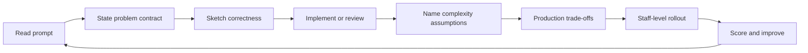

# Algorithms Interview Questions

Fourteen interview sets assess problem contracts, correctness arguments, implementation mechanics, complexity assumptions, production judgment, and staff-level algorithm selection.

## Practice Loop

## Interview Sets

1. [[05-Algorithms/_interview/Foundations and Correctness Interview.md|Foundations and Correctness Interview]]
2. [[05-Algorithms/_interview/Complexity and Analysis Interview.md|Complexity and Analysis Interview]]
3. [[05-Algorithms/_interview/Searching and Selection Interview.md|Searching and Selection Interview]]
4. [[05-Algorithms/_interview/Sorting Interview.md|Sorting Interview]]
5. [[05-Algorithms/_interview/Divide Conquer and Backtracking Interview.md|Divide Conquer and Backtracking Interview]]
6. [[05-Algorithms/_interview/Greedy Algorithms Interview.md|Greedy Algorithms Interview]]
7. [[05-Algorithms/_interview/Dynamic Programming Interview.md|Dynamic Programming Interview]]
8. [[05-Algorithms/_interview/Graph Traversal and DAGs Interview.md|Graph Traversal and DAGs Interview]]
9. [[05-Algorithms/_interview/Shortest Paths Interview.md|Shortest Paths Interview]]
10. [[05-Algorithms/_interview/MST and Connectivity Interview.md|MST and Connectivity Interview]]
11. [[05-Algorithms/_interview/Advanced Graph Algorithms Interview.md|Advanced Graph Algorithms Interview]]
12. [[05-Algorithms/_interview/String and Sequence Algorithms Interview.md|String and Sequence Algorithms Interview]]
13. [[05-Algorithms/_interview/Randomized Approximation and Online Interview.md|Randomized Approximation and Online Interview]]
14. [[05-Algorithms/_interview/Production Selection and Interview Patterns Interview.md|Production Selection and Interview Patterns Interview]]

## Evaluation Standard

- Contract answers define inputs, outputs, preconditions, postconditions, and certificates.
- Correctness answers use invariants, exchange arguments, or DP structure—not samples alone.
- Coding answers cover edge cases, shared vectors, and debug checks.
- Complexity answers label worst, average, expected, amortized, and assumptions.
- Production answers include wrong-algorithm incidents, telemetry, and migration.
- Staff-level answers connect standards, evidence, and phased deprecation.

## Related Notes

- [[Career/README|Career]]
- [[05-Algorithms/_exercises/README|Algorithms Exercises]]
- [[05-Algorithms/code/README|code labs]]
- [[05-Algorithms/README|Algorithms]]
