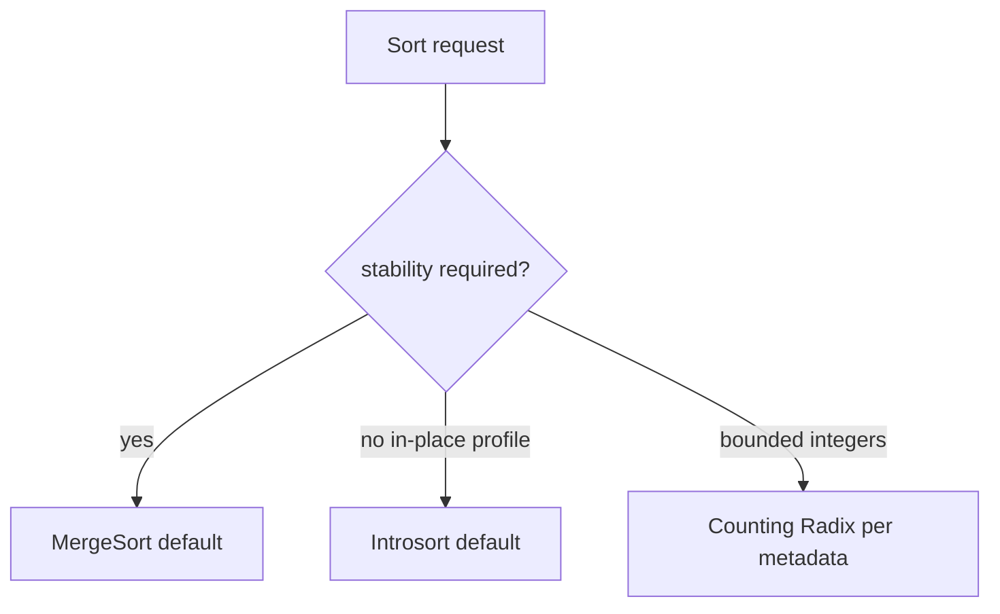

# ADR-001: Sorting Default

## Status

Accepted on 2026-07-21.

## Context

[[05-Algorithms/projects/Sorting and Selection Bake-Off/README|Sorting and Selection Bake-Off]] compares many sort implementations. Workbench needs one **default comparison sort** for vectors, advisor examples, and teaching demos so benchmarks remain comparable across TypeScript and Python.

## Decision

Use **stable merge sort** as the default general-purpose comparison sort in Workbench when stability is required or unspecified.

For **in-place** teaching profiles where stability is explicitly waived, document **introspective quicksort** (quicksort + heapsort fallback) as the alternate default—not raw unguarded quicksort.

Integer sorts (`CountingSort`, `RadixSort`) apply only when vector metadata declares bounded integer keys.

## Alternatives Considered

| Option | Pros | Cons |
| --- | --- | --- |
| Stable merge sort | Predictable O(n log n); stability | O(n) extra memory |
| Introsort | In-place; guarded worst case | Unstable |
| Heapsort default | O(n log n) worst in-place | Poor locality; unstable |
| Stdlib delegate | Fastest to ship | Hides teaching implementations |

## Consequences

- Shared vectors tagged `stable: true` expect merge sort (or any stable algorithm)—not heapsort.
- Advisor cites merge sort when audit/stability dimension selected.
- Bake-off benchmarks label algorithm explicitly; default only applies when unspecified.
- Amortized analysis notes reference merge unless vector tags `inPlace: true`.

## Follow-ups

- Add vector cases asserting stability via satellite index tags.
- Document crossover to insertion sort for small n in quicksort module—not Workbench default.

## Related Documents

- [[05-Algorithms/03-Sorting/Sorting Contracts Stability and Adaptivity|Sorting Contracts Stability and Adaptivity]]
- [[05-Algorithms/projects/Sorting and Selection Bake-Off/Architecture|Sorting Bake-Off Architecture]]
- [[05-Algorithms/projects/Algorithm Workbench/Architecture|Architecture]]
