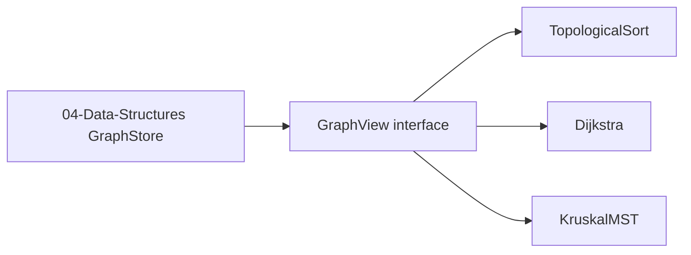

# ADR-002: Graph Representation Boundary

## Status

Accepted on 2026-07-21.

## Context

Graph **algorithms** in the Algorithms track need adjacency access, but graph **storage** belongs to [[04-Data-Structures/README|Data Structures]]. Without a boundary, Dependency Planner, Pathfinding Lab, and MST Lab duplicate `GraphStore` logic and drift from DS vectors.

## Decision

Algorithms Workbench **imports** graph views from Data Structures:

- `AdjListGraph` / `GraphStore` for sparse directed and undirected workloads
- `AdjMatrixGraph` only when vector metadata tags `dense: true` and V ≤ matrix cap
- `UnionFind`, `BinaryHeap`, `IndexedHeap` from DS modules—never reimplemented in Algorithms track

Algorithm modules accept a **`GraphView` interface**: `vertices()`, `neighbors(v)`, optional `weight(u,v)`, `isDirected()`.

JSON graph fixtures in `05-Algorithms/code/shared/vectors/` convert to GraphView at runner boundary—algorithms do not parse JSON directly.

## Alternatives Considered

| Option | Pros | Cons |
| --- | --- | --- |
| Import DS GraphStore | Single source of truth | Cross-track dependency |
| Duplicate adjacency list | Apparent independence | Double maintenance |
| Always adjacency matrix | Simple API | O(V²) memory on sparse graphs |
| External graph DB | Realistic | Out of scope |

## Consequences

- [[05-Algorithms/projects/Dependency Planner/README|Dependency Planner]], [[05-Algorithms/projects/Pathfinding Lab/README|Pathfinding Lab]], and [[05-Algorithms/projects/Network Connectivity and MST Lab/README|MST Lab]] document GraphView consumption—not internal edge lists.
- Matrix graphs rejected when V exceeds `MATRIX_V_CAP` in Security docs.
- Data Structures owns storage ADT bugs; Algorithms owns traversal correctness.

## Follow-ups

- Publish GraphView TypeScript/Python type definitions in `code/shared/schema/`.
- Add adapter tests proving DS GraphStore satisfies GraphView.

## Related Documents

- [[04-Data-Structures/08-Graphs-as-Representation/Graph ADT Vertices Edges and Labels|Graph ADT]]
- [[04-Data-Structures/projects/Graph Store CLI/README|Graph Store CLI]]
- [[05-Algorithms/projects/Algorithm Workbench/Architecture|Architecture]]
