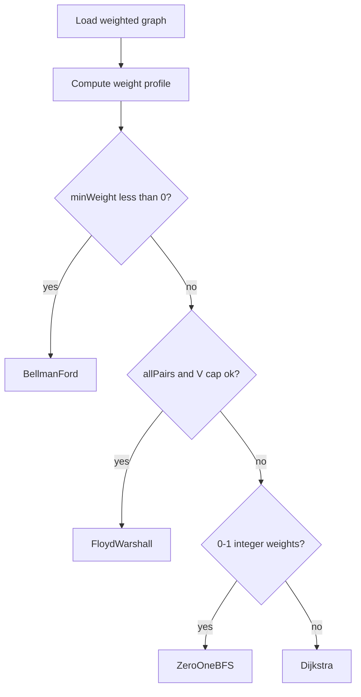

# ADR-003: Shortest-Path Dispatch

## Status

Accepted on 2026-07-21.

## Context

[[05-Algorithms/projects/Pathfinding Lab/README|Pathfinding Lab]] implements multiple shortest-path algorithms with incompatible preconditions. Calling Dijkstra on negative edges produces wrong answers silently—a correctness and security failure. Workbench needs centralized **fail-closed dispatch**.

## Decision

`ShortestPathDispatcher` selects algorithm from graph **weight profile** computed at load time:

| Condition | Algorithm |
| --- | --- |
| `allPairs && V ≤ FLOYD_V_CAP` (default 500) | Floyd-Warshall |
| `minWeight < 0` | Bellman-Ford |
| `minWeight ≥ 0 && maxWeight ≤ 1 && integerWeights` | Zero-One BFS |
| `minWeight ≥ 0` | Dijkstra with indexed heap |
| Mixed unsupported (e.g., negative + all-pairs request) | Error `UNSUPPORTED_PROFILE` |

Explicit `--algorithm` CLI override allowed for teaching but **must** re-validate preconditions—override does not bypass contract checks.

## Alternatives Considered

| Option | Pros | Cons |
| --- | --- | --- |
| Central dispatcher fail-closed | Prevents silent wrong answers | Extra metadata pass |
| User picks algorithm always | Flexible | Error-prone in labs |
| Auto-fallback Dijkstra→BF | Convenient | Masks contract misunderstanding |
| Single generic Johnson algorithm | Handles more cases | Heavier teaching load |

## Consequences

- Pathfinding vectors include `weightProfile` metadata for dispatch tests.
- Certificate checker runs after every successful shortest-path run.
- Advisor recommends dispatch profile before algorithm name.
- Floyd capped—large V all-pairs requests error with explicit message.

## Follow-ups

- Negative tests: Dijkstra override on negative edge vector must exit DOMAIN_ERROR.
- Document Johnson algorithm as Ideas backlog—not default.

## Related Documents

- [[05-Algorithms/08-Shortest-Paths/Shortest-Path Contracts and Relaxation|Shortest-Path Contracts]]
- [[05-Algorithms/projects/Pathfinding Lab/Architecture|Pathfinding Lab Architecture]]
- [[05-Algorithms/projects/Algorithm Workbench/Security|Security]]
