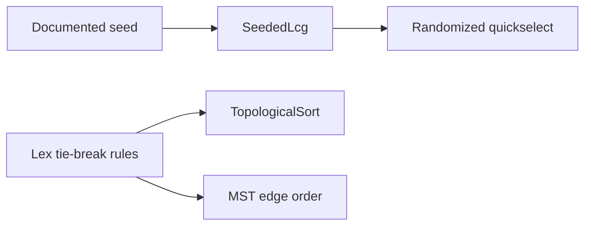

# ADR-004: Deterministic Tie-Breaking and RNG

## Status

Accepted on 2026-07-21.

## Context

Many algorithms admit multiple valid outputs: equal-weight MST edges, zero-indegree topo order, equal-distance shortest paths, Rabin-Karp modulus choices, randomized quickselect pivots. Shared vectors and experiment reports require **cross-language deterministic** results when inputs are identical.

## Decision

### Tie-breaking

| Algorithm | Rule |
| --- | --- |
| Topological sort (Kahn) | Among ready vertices, pick **smallest string label**; if numeric ids, smallest id |
| MST (equal weights) | Sort candidate edges by `(weight, u, v)` with `u < v` canonical undirected pair |
| Shortest-path reconstruction | When multiple predecessors valid, pick **smallest predecessor id** |
| Match reporting | Report matches in **increasing index order** |

### RNG

- Default seed **`0x5EB_ALGO`** (documented hex) for any randomized algorithm in CI/teaching mode.
- `experiment` CLI accepts `--seed` override; report must record seed used.
- Rabin-Karp: modulus **`1_000_000_007`**, base **`256`**, verify on every hit—collision tests use crafted modulus for teaching only in tagged vectors.

Randomized algorithms (quickselect random pivot) use **`SeededLcg`** shared implementation in both languages—not platform `Math.random` / `random.random` in tests.

## Alternatives Considered

| Option | Pros | Cons |
| --- | --- | --- |
| Lexicographic tie-break | Reproducible | May not match production |
| Arbitrary first-seen | Fast | TS/Python drift |
| Platform RNG | Simple | Non-reproducible CI |
| No tie-break spec | Flexible | Broken vector parity |

## Consequences

- Golden hashes in CI depend on ADR-004 rules—changing rules bumps vector schema version.
- Docs must state tie-break is **teaching contract**, not production requirement.
- [[05-Algorithms/projects/Text Search Toolkit/README|Text Search Toolkit]] and [[05-Algorithms/projects/Dependency Planner/README|Dependency Planner]] reference this ADR.

## Follow-ups

- Implement shared SeededLcg in `code/shared/rng/`.
- Add vectors asserting topo order hash on tied indegree sets.

## Related Documents

- [[05-Algorithms/12-Randomized-Approximation-and-Online/Randomized Algorithms and Reproducible RNG|Randomized Algorithms and Reproducible RNG]]
- [[05-Algorithms/projects/Algorithm Workbench/Testing|Testing]]
- [[05-Algorithms/projects/Algorithm Workbench/ADR/ADR-005 Benchmark Methodology|ADR-005]]
