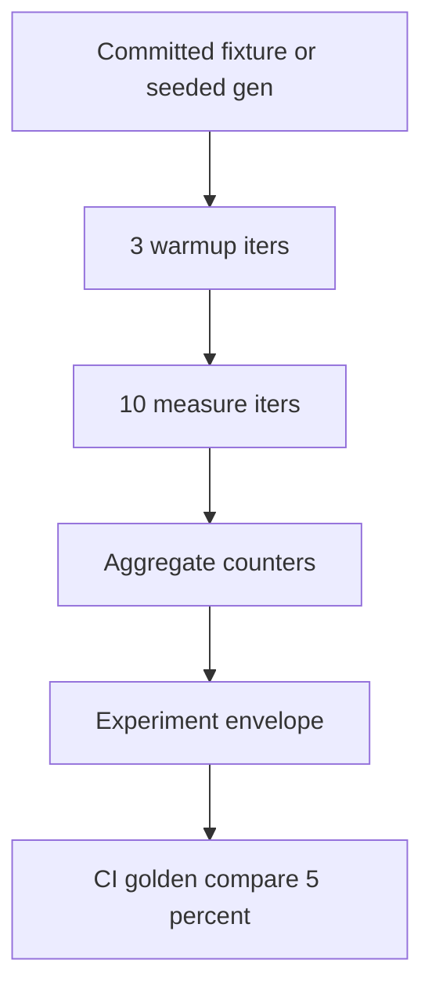

# ADR-005: Benchmark Methodology

## Status

Accepted on 2026-07-21.

## Context

[[05-Algorithms/01-Complexity-and-Analysis/Practical Constants Locality and Benchmark Design|Practical Constants Locality and Benchmark Design]] warns that naive wall-clock benchmarks mislead. Workbench ships a **benchmark harness** and **experiment reports** consumed by mini projects and CI. Without methodology rules, results are neither reproducible nor comparable.

## Decision

### Fixture policy

- Benchmarks run on **committed fixtures** in `code/shared/bench/fixtures/` or **seeded generators** with seed recorded in report.
- Default sizes: small (n=1e3), medium (n=1e5), large (n=1e6)—large only when CLI `--allow-large` and caps permit.
- **Warmup**: 3 iterations discarded; **measure**: 10 iterations; report median and p95.

### Counters over wall-clock alone

Primary metrics: **comparison counts**, **relaxations**, **UF ops**, **heap ops**, **match verifications**—wall-clock included but not sole regression gate.

### Experiment report envelope

```json
{
  "schemaVersion": "1",
  "algorithm": "MergeSort",
  "fixtureId": "uniform-int-1e5",
  "seed": 1543940671,
  "vectorSchemaVersion": "2026-07-21",
  "environment": { "language": "typescript", "node": "20.x" },
  "metrics": { "comparisons": 0, "nsPerOpMedian": 0 },
  "certificatePassed": true
}
```

### Regression gates

- CI compares **counter medians** against golden fixtures within **5% tolerance**.
- Wall-clock regressions alert only when counter unchanged—flags environment drift.
- Adversarial fixtures labeled `adversarial: true`—never mixed into uniform latency SLOs.

## Alternatives Considered

| Option | Pros | Cons |
| --- | --- | --- |
| Counter-first methodology | Stable CI | Requires instrumentation |
| Wall-clock only | Simple | Flaky |
| Unbounded random inputs | Realistic | Non-reproducible |
| No warmup | Faster CI | Noisy |

## Consequences

- Mini project README benchmark tables reference ADR-005 fields.
- `seb-alg experiment` emits full envelope; `bench` may emit slim metrics.
- Teaching mode enables `--instrument`; performance mode minimizes overhead.



## Follow-ups

- Commit first golden experiment files under Workbench `assets/`.
- Document hardware pinning as optional local practice—not CI requirement.

## Related Documents

- [[05-Algorithms/01-Complexity-and-Analysis/Practical Constants Locality and Benchmark Design|Practical Constants Locality and Benchmark Design]]
- [[05-Algorithms/13-Production-Selection-and-Interview-Patterns/Profiling Correctness and Regression Gates|Profiling Correctness and Regression Gates]]
- [[05-Algorithms/projects/Algorithm Workbench/Monitoring|Monitoring]]
