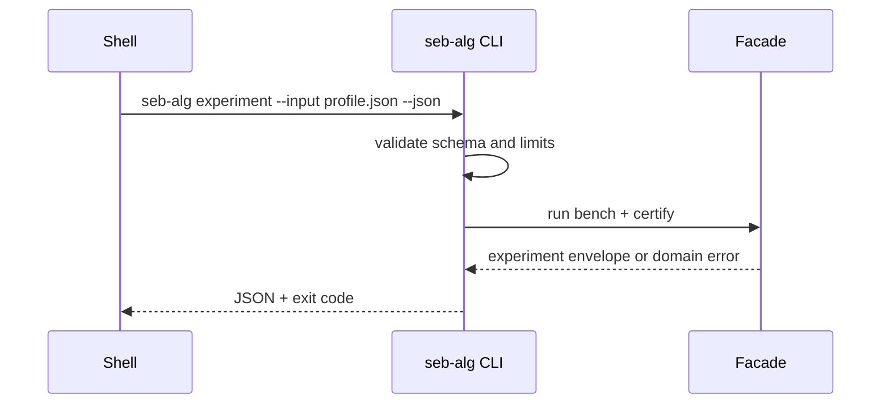

# API — Algorithm Workbench

## Library Surface (Target Facade)

| Module group | Symbols | Contract summary |
| --- | --- | --- |
| Sorting | `MergeSort`, `Quicksort`, `Heapsort`, `CountingSort`, `RadixSort` | stability, range checks |
| Selection | `Quickselect`, `TopK` | rank semantics documented |
| Search | `BinarySearch`, `LowerBound`, `UpperBound` | monotone precondition |
| Graph traversal | `Bfs`, `Dfs`, `TopologicalSort`, `TarjanSCC`, `CycleDetector` | ADR-002 graph view |
| Shortest paths | `Dijkstra`, `BellmanFord`, `ZeroOneBFS`, `FloydWarshall`, `ShortestPathDispatcher` | ADR-003 dispatch |
| MST / connectivity | `KruskalMST`, `PrimMST`, `BridgeFinder`, `ArticulationPoints` | undirected weighted |
| Strings | `NaiveSearch`, `KMPSearch`, `ZAlgorithm`, `RabinKarpSearch` | match index list |
| Greedy / DP | `IntervalScheduling`, `Knapsack01`, `LCS`, `EditDistance` | representative solvers |
| Cross-cutting | `VectorRunner`, `CertificateChecker`, `BenchmarkHarness`, `AlgorithmAdvisor` | JSON I/O |

Source: [[05-Algorithms/code/README|Algorithms code labs]]. Educational APIs—not stdlib drop-in replacements.

## CLI Contract (Target)

Syntax: `seb-alg <run-vectors|bench|certify|advise|experiment> --input <json> --json`

| Command | Purpose |
| --- | --- |
| `run-vectors` | Execute shared vector against named algorithm |
| `bench` | Run benchmark profile; emit metrics JSON |
| `certify` | Validate algorithm output certificate |
| `advise` | Workload profile → algorithm recommendation |
| `experiment` | Full reproducible report per ADR-005 |

## Error Model

| Exit | Code | Meaning |
| --- | --- | --- |
| 0 | OK | Completed |
| 2 | INVALID_INPUT | Parse/schema/limit failure |
| 3 | DOMAIN_ERROR | Contract violation, algorithm error |
| 4 | VECTOR_FAIL | Shared vector mismatch |
| 5 | CERT_FAIL | Certificate validation failed |
| 70 | INTERNAL_ERROR | Unexpected defect |

## Certificate Types

| Type | Validates |
| --- | --- |
| `sort` | Total order; optional stability tag |
| `shortest-path` | Relaxation inequalities; reachable distances |
| `mst` | Acyclic; V-1 edges; weight sum |
| `match-list` | Pattern occurs at each reported index |
| `topo` | Edge order; optional cycle witness |

## Compatibility

Semantic versioning after first tagged release. Shared vector schema version, JSON field names, exit codes, certificate schemas, and public export names are compatibility surfaces.

## Related Documents

- [[05-Algorithms/projects/Algorithm Workbench/Requirements|Requirements]]
- [[05-Algorithms/projects/Algorithm Workbench/Testing|Testing]]
