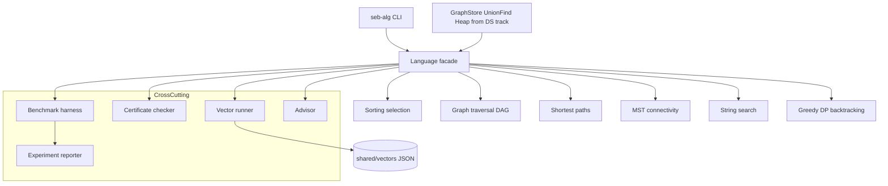
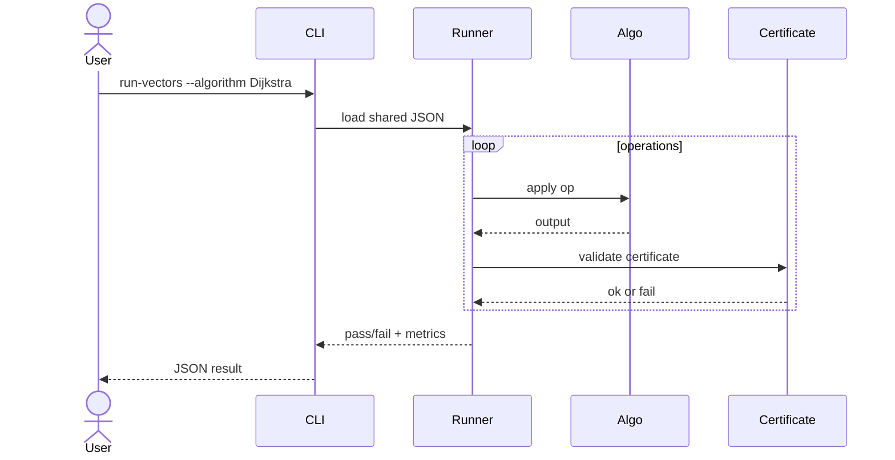

# Architecture — Algorithm Workbench

## Summary

Modular monolith: dual-language algorithm libraries, thin CLI, shared vectors, cross-cutting certificate, benchmark, and advisor layers. All state is **in-memory**; graph storage imported from Data Structures per ADR-002.

## Data Flow — Vector Runner + Certificate

## Key Components

| Component | Responsibility |
| --- | --- |
| Language facades | Stable exports, semver surface |
| Core algorithm modules | Implementations in `code/typescript` and `code/python` |
| Vector runner | Parse schema, dispatch ops, compare snapshots |
| Certificate checker | Sort order, relaxation, MST cut, match indices, topo order |
| Benchmark harness | Fixtures, counters, ADR-005 report envelope |
| Advisor | Rules engine over workload profile → recommendation |
| Experiment reporter | Seed, versions, metrics bundle for reproducibility |
| CLI adapter | Parse bounded JSON, format stdout, stderr diagnostics |

## Quality Attributes

- **Correctness**: shared vectors + certificates; contracts enforced at dispatch boundaries.
- **Reproducibility**: ADR-004 tie-break and RNG; ADR-005 benchmark fixtures.
- **Security**: resource ceilings, overflow checks, adversarial input suites.
- **Teachability**: complexity and comparison counters exported in teaching mode.

## Explicit Boundaries

| In scope | Out of scope (other tracks) |
| --- | --- |
| In-memory algorithms + CLI | Distributed consensus |
| Graph **algorithms** on imported storage | Database execution engines |
| Benchmark + advisor | Product HTTP services |
| Certificate checker | Query optimizers / WAL |

## Decisions

- [[05-Algorithms/projects/Algorithm Workbench/ADR/ADR-001 Sorting Default|ADR-001 Sorting Default]]
- [[05-Algorithms/projects/Algorithm Workbench/ADR/ADR-002 Graph Representation Boundary|ADR-002 Graph Representation Boundary]]
- [[05-Algorithms/projects/Algorithm Workbench/ADR/ADR-003 Shortest-Path Dispatch|ADR-003 Shortest-Path Dispatch]]
- [[05-Algorithms/projects/Algorithm Workbench/ADR/ADR-004 Deterministic Tie-Breaking and RNG|ADR-004 Deterministic Tie-Breaking and RNG]]
- [[05-Algorithms/projects/Algorithm Workbench/ADR/ADR-005 Benchmark Methodology|ADR-005 Benchmark Methodology]]

## Trade-offs

Dual-language parity increases maintenance but enforces semantic clarity. Central CLI simplifies demos but hides embedding patterns—document both paths. Certificate checking adds overhead; default on in teaching mode, optional in raw bench mode.

## Related Documents

- [[05-Algorithms/projects/Algorithm Workbench/Requirements|Requirements]]
- [[05-Algorithms/projects/Algorithm Workbench/API|API]]
- [[05-Algorithms/projects/Algorithm Workbench/Database|Database]]
