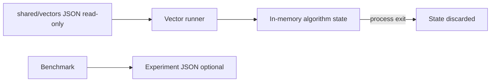

# Database — Algorithm Workbench

## Storage Choice: None (In-Memory Only)

| Store | Role | Rationale |
| --- | --- | --- |
| **N/A — process heap only** | All algorithm state lives in RAM for the lifetime of the CLI/library call | Portfolio teaches **algorithm contracts and complexity**, not durability, replication, or query planning |
| Shared JSON vectors (read-only files) | Test/bench **inputs**, not application state | Deterministic contracts across TypeScript and Python |
| Optional experiment JSON (stdout/files) | Ephemeral benchmark output | Not authoritative storage; no migration story |

## Why No Durable Database

1. **Scope**: Durable engines belong in [[08-Databases/README|Databases]] (B-trees on disk, WAL, LSM, query optimizers). This track isolates in-memory algorithm semantics.
2. **Pedagogy**: Learners must see relaxations, partitions, and traversals **in process** without IO noise.
3. **Safety**: No connection strings, migrations, or backup drills—reduces accidental scope creep into execution engines.
4. **Parity**: Dual-language labs share file-based vectors; runtime state remains identical shape in both hosts.

## Consistency Model

Single-process, single-threaded default. No cross-process transactions. Graph views may reference in-memory GraphStore instances from Data Structures—still process-local.

## If You Need Persistence

| Need | Redirect |
| --- | --- |
| Indexed durable queries | [[08-Databases/README|Databases]] B-tree / LSM tracks |
| Sorted runs at disk scale | [[05-Algorithms/03-Sorting/External Sorting Concepts and Production Selection|External Sorting Concepts]] + Databases |
| Distributed job DAG store | [[09-System-Design/README|System Design]] |
| Serialized snapshots for demos | Export JSON graph/result **artifacts** only—explicit import, no hidden DB |

## Operational Concerns

- No backups, pooling, or migration locks apply.
- Memory caps enforced at CLI boundary ([[05-Algorithms/projects/Algorithm Workbench/Security|Security]]).
- Long-running daemons explicitly out of scope.

## Related Documents

- [[05-Algorithms/projects/Algorithm Workbench/Architecture|Architecture]]
- [[05-Algorithms/13-Production-Selection-and-Interview-Patterns/From In-Memory Algorithms to Production Systems|From In-Memory Algorithms to Production Systems]]
