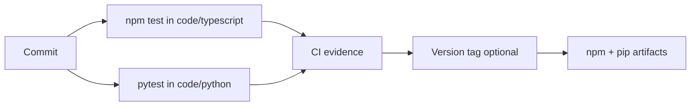

# Deployment — Algorithm Workbench

## Environments

| Environment | Purpose | Promotion rule |
| --- | --- | --- |
| local | Implementation and focused tests | editable install + vector suite pass |
| CI | Reproducible TS + Python verification | required checks green |
| npm/PyPI release | Immutable library artifacts (optional) | reviewed tag + smoke tests |



## Local Bootstrap

```bash
cd 05-Algorithms/code/typescript
npm install
npm test

cd ../python
python -m pip install -e ".[dev]"
python -m pytest -q
```

## Release Notes

- No long-running service deployment—library and CLI only.
- Artifacts exclude secrets and local benchmark caches.
- Changelog must mention shared vector schema bumps, ADR default changes, and certificate schema revisions.

## Rollback

Package versions are immutable once published; rollback means yanking bad version and restoring last known-good tag recommendation.

## Checklist

- [ ] Clean checkout passes dual-language vector suite
- [ ] CLI smoke (when present) respects input ceilings
- [ ] Documentation commands copy-paste verified
- [ ] Excluded scopes (consensus, DB engines, product services) not bundled

## Related Documents

- [[05-Algorithms/projects/Algorithm Workbench/Testing|Testing]]
- [[05-Algorithms/projects/Algorithm Workbench/Monitoring|Monitoring]]
