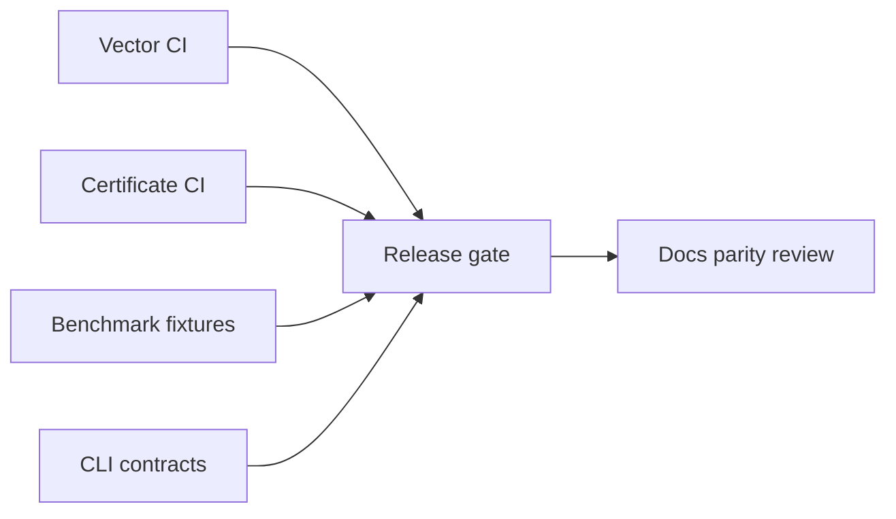

# Monitoring — Algorithm Workbench

## Operability Model

Local library and CLI—not an always-on service. Release health measured via CI, vector pass rate, certificate suite, benchmark fixture drift, and experiment report golden hashes.

| Signal | Target | Evidence |
| --- | --- | --- |
| Shared vector pass rate | 100% both languages | CI |
| Certificate suite | 100% on registered algorithms | CI job |
| CLI contract tests | 100% when adapter present | integration suite |
| Adversarial suites | Documented degradation bounds | bench artifact |
| Experiment report drift | 0 unexpected hash change | golden file CI |
| Dependency audit | 0 unmitigated critical on release | audit log |

## Instrumentation Metrics (Teaching Mode)

When `--instrument` enabled, algorithms emit:

| Metric | Algorithms |
| --- | --- |
| `comparisons`, `swaps` | Sorting |
| `relaxations`, `heap_ops` | Shortest paths |
| `uf_ops`, `mst_weight` | Kruskal |
| `match_count`, `prefix_build_ns` | String search |
| `layer_count`, `cycle_witness_len` | Dependency planner |

Default off in performance benchmarks; on in Workbench teaching panel. Never include raw user text in exported metrics.

## Production Bridge

For translating metrics to production observability, see [[05-Algorithms/13-Production-Selection-and-Interview-Patterns/Profiling Correctness and Regression Gates|Profiling Correctness and Regression Gates]]—Workbench metrics are **didactic**, not SLO dashboards.

## Triage

Vector failure blocks merge. Certificate failure blocks merge. Advisor golden mismatch blocks release. Performance observations become regressions only against versioned fixtures per ADR-005.

## Related Documents

- [[05-Algorithms/projects/Algorithm Workbench/Deployment|Deployment]]
- [[05-Algorithms/projects/Algorithm Workbench/Debug Diary|Debug Diary]]
