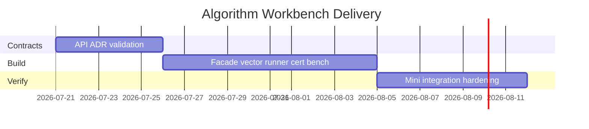

# Planning — Algorithm Workbench

## Problem Statement

Individual labs in [[05-Algorithms/code/README|Algorithms code labs]] teach algorithm families in isolation, but learners lack an integrated surface to compare implementations, run shared vectors, validate certificates, benchmark under adversarial inputs, and connect choices to production trade-offs.

## Success Definition

Dual-language vector suite green; CLI demonstrates bench + certify + advise + experiment; documentation and ADRs explain major defaults; exclusions (consensus, DB engines, product services) remain explicit.

## Scope

### In Scope

- Facade + CLI over existing algorithm modules
- Shared vector runner and schema
- Correctness certificate checker
- Benchmark harness and experiment reports
- Algorithm-selection advisor
- Integration hooks for five mini projects
- ADRs for sorting default, graph boundary, path dispatch, tie-break/RNG, benchmarks

### Out of Scope

- Distributed consensus and replication protocols
- Database query planners, WAL, disk sorts at engine scale
- HTTP APIs, microservices, and product caches
- Graph storage ADTs (import from Data Structures)
- Production replacements for stdlib algorithms

## Milestones

| Milestone | Outcome | Exit criteria |
| --- | --- | --- |
| M1 Contracts | API, vectors, ADRs reviewed | Requirements + ADR acceptance |
| M2 Core integration | Facade + vector runner | All shared vectors pass both languages |
| M3 Certificate + bench | certify + bench + experiment | ADR-005 reports in CI |
| M4 CLI vertical slice | advise + full command set | JSON schema tests green |
| M5 Mini project linkage | Metrics import from labs | Mini acceptance checklists satisfied |
| M6 Hardening | Caps, adversarial tests, docs parity | Security checklist complete |

## Risks

| Risk | Impact | Mitigation |
| --- | --- | --- |
| TS/Python semantic drift | Broken learning contract | Shared vectors as source of truth |
| Scope creep into Backend/Databases/System Design | Unmaintainable portfolio | Enforce non-goals in review |
| Benchmark flakiness | False regressions | ADR-005 fixtures, no network |
| Wrong algorithm dispatch | Silent incorrect paths | Certificate + ADR-003 fail-closed |
| Advisor oversimplifies | Wrong production choices | Link to decision matrix + caveats |

## Dependencies

Node.js + Vitest, Python 3.11+ + pytest, shared JSON schema under `code/shared/`, graph/heap/UF modules from [[04-Data-Structures/code/README|Data Structures code labs]].

## Related Documents

- [[05-Algorithms/projects/Algorithm Workbench/Roadmap|Roadmap]]
- [[05-Algorithms/projects/Algorithm Workbench/Requirements|Requirements]]
