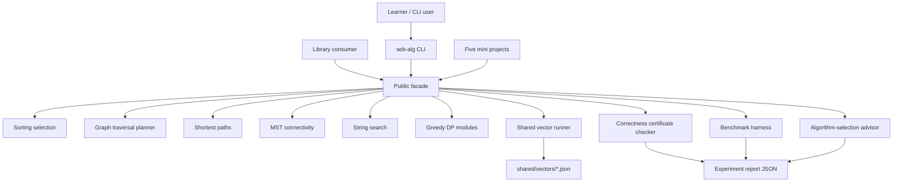

# Algorithm Workbench

## One-Line Purpose

A dual-language in-memory algorithms library and CLI that exposes core algorithm families, runs shared JSON vectors, validates correctness certificates, instruments benchmarks, recommends algorithm choices from workload profiles, and emits reproducible experiment reports—without building distributed consensus, database execution engines, or product service architecture.

## Status

**Active.** Core labs live in [[05-Algorithms/code/README|Algorithms code labs]]; Workbench documentation defines the integrated portfolio boundary, ADRs, and acceptance for facade, CLI, certificate checker, benchmark harness, advisor, and experiment report layers.

## Goals

- Unify sorting, selection, graph, shortest-path, MST, string, greedy, and DP labs behind one discoverable API and CLI.
- Run **shared vector runner** across TypeScript and Python with identical semantics.
- Provide **correctness certificate checker** for sorts, paths, MSTs, match lists, and topo orders.
- Export **benchmark harness** with deterministic fixtures per [[05-Algorithms/projects/Algorithm Workbench/ADR/ADR-005 Benchmark Methodology|ADR-005]].
- Ship **algorithm-selection advisor** grounded in [[05-Algorithms/13-Production-Selection-and-Interview-Patterns/Algorithm Selection Decision Matrix|Algorithm Selection Decision Matrix]].
- Generate **reproducible experiment reports** (JSON + metadata: seed, git sha, vector versions).

## Non-Goals

- Distributed consensus, leader election, or replication protocols—see [[09-System-Design/README|System Design]].
- Database query planners, WAL, disk sorts, or execution engines—see [[08-Databases/README|Databases]].
- HTTP APIs, caches, queues, or product microservices—see [[07-Backend/README|Backend]].
- Graph **storage** ADTs—see [[04-Data-Structures/projects/Graph Store CLI/README|Graph Store CLI]].
- Replacing language stdlib algorithms in production.

## Architecture Snapshot



## Document Map

| Document | Purpose |
| --- | --- |
| [[05-Algorithms/projects/Algorithm Workbench/Planning\|Planning]] | Scope, milestones, risks |
| [[05-Algorithms/projects/Algorithm Workbench/Requirements\|Requirements]] | Functional and non-functional requirements |
| [[05-Algorithms/projects/Algorithm Workbench/Architecture\|Architecture]] | System shape and components |
| [[05-Algorithms/projects/Algorithm Workbench/Database\|Database]] | In-memory-only storage rationale |
| [[05-Algorithms/projects/Algorithm Workbench/API\|API]] | Library and CLI contracts |
| [[05-Algorithms/projects/Algorithm Workbench/Deployment\|Deployment]] | Local install and release path |
| [[05-Algorithms/projects/Algorithm Workbench/Security\|Security]] | DoS, overflow, resource ceilings |
| [[05-Algorithms/projects/Algorithm Workbench/Testing\|Testing]] | Verification strategy |
| [[05-Algorithms/projects/Algorithm Workbench/Monitoring\|Monitoring]] | Metrics and release health |
| [[05-Algorithms/projects/Algorithm Workbench/Engineering Journal\|Engineering Journal]] | Session logs |
| [[05-Algorithms/projects/Algorithm Workbench/Debug Diary\|Debug Diary]] | Investigations |
| [[05-Algorithms/projects/Algorithm Workbench/Known Issues\|Known Issues]] | Open defects |
| [[05-Algorithms/projects/Algorithm Workbench/Lessons Learned\|Lessons Learned]] | Durable takeaways |
| [[05-Algorithms/projects/Algorithm Workbench/Postmortem\|Postmortem]] | Retrospectives |
| [[05-Algorithms/projects/Algorithm Workbench/Ideas\|Ideas]] | Future directions |
| [[05-Algorithms/projects/Algorithm Workbench/Roadmap\|Roadmap]] | Phased delivery |

### ADRs

- [[05-Algorithms/projects/Algorithm Workbench/ADR/ADR-001 Sorting Default|ADR-001 Sorting Default]]
- [[05-Algorithms/projects/Algorithm Workbench/ADR/ADR-002 Graph Representation Boundary|ADR-002 Graph Representation Boundary]]
- [[05-Algorithms/projects/Algorithm Workbench/ADR/ADR-003 Shortest-Path Dispatch|ADR-003 Shortest-Path Dispatch]]
- [[05-Algorithms/projects/Algorithm Workbench/ADR/ADR-004 Deterministic Tie-Breaking and RNG|ADR-004 Deterministic Tie-Breaking and RNG]]
- [[05-Algorithms/projects/Algorithm Workbench/ADR/ADR-005 Benchmark Methodology|ADR-005 Benchmark Methodology]]

## Mini Projects

| Mini project | Focus |
| --- | --- |
| [[05-Algorithms/projects/Sorting and Selection Bake-Off/README\|Sorting and Selection Bake-Off]] | Sorts + quickselect |
| [[05-Algorithms/projects/Dependency Planner/README\|Dependency Planner]] | Topo, cycles, SCC |
| [[05-Algorithms/projects/Pathfinding Lab/README\|Pathfinding Lab]] | Shortest paths dispatch |
| [[05-Algorithms/projects/Network Connectivity and MST Lab/README\|Network Connectivity and MST Lab]] | MST, bridges, articulation |
| [[05-Algorithms/projects/Text Search Toolkit/README\|Text Search Toolkit]] | KMP, Z, Rabin-Karp |

## Run and Test

```bash
cd 05-Algorithms/code/typescript
npm install
npm test

cd ../python
python -m pip install -e ".[dev]"
python -m pytest -q
```

Target CLI: `seb-alg <run-vectors|bench|certify|advise|experiment> --json`. Until the adapter lands, use module imports and mini-project CLIs documented in [[05-Algorithms/projects/Algorithm Workbench/API|API]].

## Portfolio Acceptance Checklist

- [ ] All documented algorithm modules exported from one facade per language.
- [ ] Shared vector runner green in TypeScript and Python.
- [ ] Certificate checker covers sort, path, MST, match, and topo outputs.
- [ ] Benchmark harness emits ADR-005 compliant experiment reports.
- [ ] Advisor output cites decision matrix dimensions with trade-offs.
- [ ] Security ceilings enforced on CLI JSON inputs.
- [ ] Explicit exclusions (consensus, DB engines, product services) remain out of repo scope.

## Related Notes

- [[05-Algorithms/README|Algorithms MOC]]
- [[05-Algorithms/code/README|Algorithms Code Labs]]
- [[05-Algorithms/13-Production-Selection-and-Interview-Patterns/Algorithm Selection Decision Matrix|Algorithm Selection Decision Matrix]]
- [[04-Data-Structures/projects/Structures Workbench/README|Structures Workbench]]
- [[07-Backend/README|Backend]]
- [[08-Databases/README|Databases]]
- [[09-System-Design/README|System Design]]
- [[Projects/README|Projects]]
- [[Career/README|Career]]
