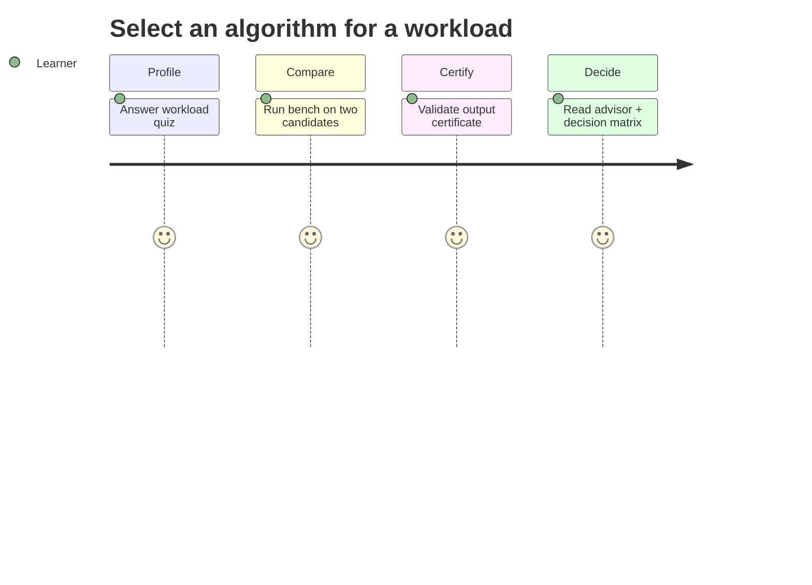

# Requirements — Algorithm Workbench

## Actors

| Actor | Goal |
| --- | --- |
| Learner | Compare algorithms, run vectors, read certificates and benchmarks |
| Library consumer | Import typed algorithm modules with stable contracts |
| CLI user | Run vectors, bench, advise, and experiments without writing code |
| Maintainer | Extend labs without breaking shared vectors or ADR defaults |

## Functional Requirements

| ID | Requirement | Acceptance |
| --- | --- | --- |
| FR-001 | Export documented core algorithms from one facade per language | Import smoke resolves every symbol in [[05-Algorithms/projects/Algorithm Workbench/API\|API]] |
| FR-002 | Run shared JSON vectors identically in TS and Python | Full vector suite pass |
| FR-003 | CLI: `run-vectors`, `bench`, `certify`, `advise`, `experiment` with JSON stdout | Schema tests + exit codes |
| FR-004 | Correctness certificate checker validates algorithm outputs | Certify command green on vectors; fail injected corruption |
| FR-005 | Benchmark harness exports comparison, relax, and match metrics | JSON matches ADR-005 schema |
| FR-006 | Algorithm-selection advisor maps workload quiz to recommendations | Output cites matrix dimensions |
| FR-007 | Integrate five mini projects as documented modules | Mini README acceptance criteria met |
| FR-008 | Reproducible experiment reports include seed, vector version, environment | Golden report hash stable in CI |
| FR-009 | Document explicit exclusions | No consensus/DB-engine/product-service code in scope |

## Non-Functional Requirements

| ID | Category | Requirement | Measurement |
| --- | --- | --- | --- |
| NFR-001 | Correctness | Deterministic results for deterministic inputs | 100% vector pass |
| NFR-002 | Performance | Benchmark mode respects configured size ceilings | rejects over-limit before alloc |
| NFR-003 | Security | Overflow and adversarial suites documented | caps + adversarial vectors |
| NFR-004 | Portability | TS + Python parity on shared vectors | CI matrix |
| NFR-005 | Observability | Metrics JSON separated from diagnostics | stdout/stderr contract |
| NFR-006 | Teachability | Complexity bounds visible per algorithm family | Complexity panel in CLI/report |
| NFR-007 | Reproducibility | Fixed seeds and tie-break rules per ADR-004 | cross-run hash match |

## Traceability

FR-001/002 → code labs + facade; FR-003 → CLI adapter; FR-004 → certificate module; FR-005 → benchmark harness + ADR-005; FR-006 → [[05-Algorithms/13-Production-Selection-and-Interview-Patterns/Algorithm Selection Decision Matrix|Decision Matrix]]; FR-007 → mini projects; FR-008 → experiment reporter; NFR-003 → [[05-Algorithms/projects/Algorithm Workbench/Security|Security]] and ADR-003/004.

## Related Documents

- [[05-Algorithms/projects/Algorithm Workbench/API|API]]
- [[05-Algorithms/projects/Algorithm Workbench/Testing|Testing]]
