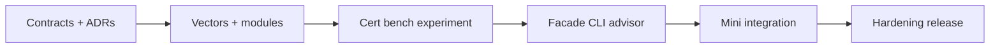

# Roadmap — Algorithm Workbench

## Current Phase

**P0 — Contracts and documentation active.** Core module layout documented; facade, CLI, vectors, certificate checker, and advisor are acceptance work.

| Phase | Outcome | Exit criteria |
| --- | --- | --- |
| P0 | Truthful contracts | Requirements, API, ADRs, project docs reviewed |
| P1 | Shared vectors + algorithm modules | Dual-language vector suite green |
| P2 | Certificate + benchmark + experiment | ADR-005 reports in CI |
| P3 | Integrated CLI | run-vectors, bench, certify, advise, experiment pass |
| P4 | Mini project metrics import | Five mini acceptance checklists done |
| P5 | Release evidence | Security caps, adversarial tests, docs parity |

## Now

- Commit shared vector schema and first vector files under `code/shared/`
- Implement per-module tests in both languages
- Land certificate checker for sort and shortest-path outputs

## Next

- Unified facades and `seb-alg` CLI adapter
- Advisor golden outputs from decision matrix
- Experiment report golden hash in CI

## Later

Evaluate Ideas backlog (relaxation viz, certificate diff) without expanding into consensus, DB engines, or product services.

## Related Documents

- [[05-Algorithms/projects/Algorithm Workbench/Planning|Planning]]
- [[05-Algorithms/projects/Algorithm Workbench/Known Issues|Known Issues]]
