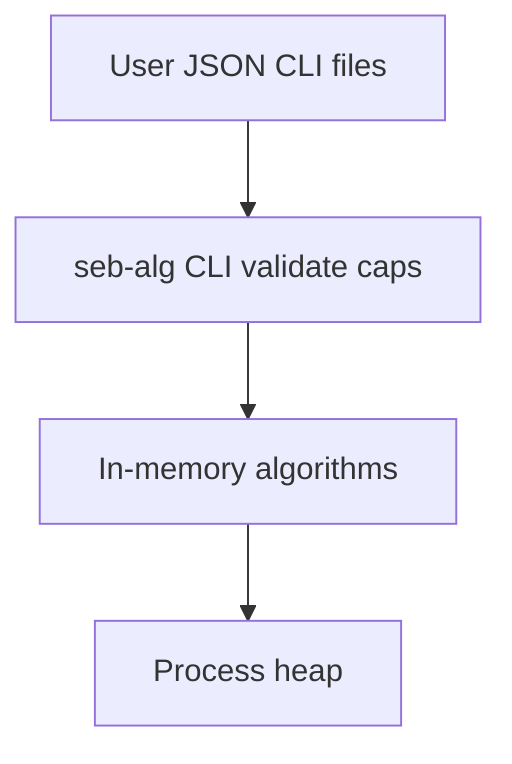

# Security — Algorithm Workbench

## Trust Boundaries

Untrusted input enters via CLI JSON, graph imports, or benchmark profiles—all must pass schema validation and **resource ceilings** before allocation.

## Assets

| Asset | Sensitivity | Location |
| --- | --- | --- |
| In-memory algorithm state | Process-local | Heap |
| Shared vectors | Integrity (teaching contract) | `code/shared/vectors/` |
| Experiment reports | Low | stdout / optional files |

## Threat Model

| Threat | Example | Mitigation |
| --- | --- | --- |
| Spoofing | N/A for local CLI | No auth surface in v1 |
| Tampering | Malformed vector JSON | Schema validation |
| Repudiation | N/A | Local logs only |
| Information disclosure | Metrics leak input sizes | Redact raw text/keys in default reports |
| Denial of service | Huge n, V, E, text length | Hard caps per mini project |
| Elevation | Code exec via import | No eval; strict parsers |

## Algorithm-Specific Controls

- **Sorting**: adversarial pivot suite; introsort default; array size cap
- **Graph/planner**: V/E caps; one cycle witness only; iterative DFS option
- **Shortest paths**: overflow-checked dist; Floyd V cap; fail-closed dispatch (ADR-003)
- **MST/connectivity**: UF bounded; Tarjan depth guard
- **String search**: text/pattern caps; Rabin-Karp verify mandatory
- **RNG**: fixed seeds in CI per ADR-004

## Controls Checklist

- [ ] Checked arithmetic on all size and weight calculations
- [ ] CLI rejects over-limit operations before alloc
- [ ] Adversarial suites documented per mini project
- [ ] Certificate checker runs on teaching paths
- [ ] No secrets in repository
- [ ] Dependency scanning on TS/Python lockfiles when published

## Related Documents

- [[05-Algorithms/projects/Sorting and Selection Bake-Off/Security|Sorting Bake-Off Security]]
- [[05-Algorithms/projects/Pathfinding Lab/Security|Pathfinding Lab Security]]
- [[05-Algorithms/projects/Algorithm Workbench/ADR/ADR-003 Shortest-Path Dispatch|ADR-003]]
