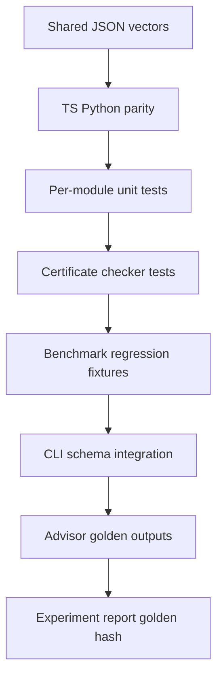

# Testing — Algorithm Workbench

## Strategy



## Test Layers

| Layer | Coverage |
| --- | --- |
| Contract | All `shared/vectors/*.json` in both languages |
| Unit | Edge cases per algorithm module |
| Certificate | Sort, path, MST, match, topo validators |
| Adversarial | Pivot, negative cycle, hash collision, graph size |
| Integration | Facade exports, CLI JSON, exit codes |
| Advisor | Golden recommendations for fixed workload profiles |
| Experiment | ADR-005 report envelope hash in CI |

## Commands

```bash
cd 05-Algorithms/code/typescript && npm test
cd 05-Algorithms/code/python && python -m pytest -q
```

Module filters mirror [[05-Algorithms/code/README|Algorithms code labs]] structure table.

## Critical Paths

1. Full vector suite green both languages
2. Certificate checker fails injected corruption in tests
3. CLI rejects over-limit input with exit code 2
4. Mini project benchmark JSON imports without schema errors
5. Dispatcher refuses Dijkstra on negative-edge profile
6. Experiment report includes seed and vector version fields

## Definition of Done

- [ ] Failure modes asserted, not only happy path
- [ ] No network in default test run
- [ ] Benchmark regressions tied to committed fixtures, not wall-clock thresholds alone
- [ ] Documentation commands copy-paste verified
- [ ] All five mini project acceptance checklists traceable to tests

## Related Documents

- [[05-Algorithms/projects/Algorithm Workbench/API|API]]
- [[05-Algorithms/projects/Algorithm Workbench/Requirements|Requirements]]
