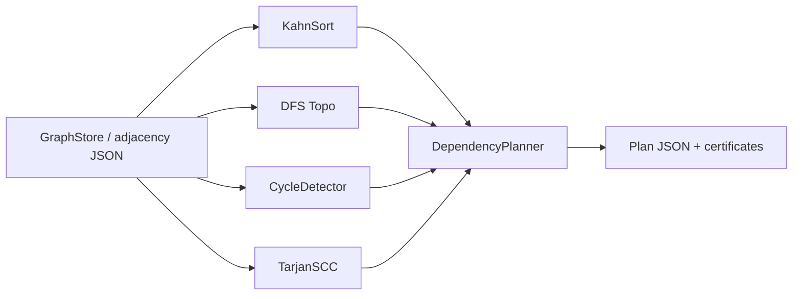
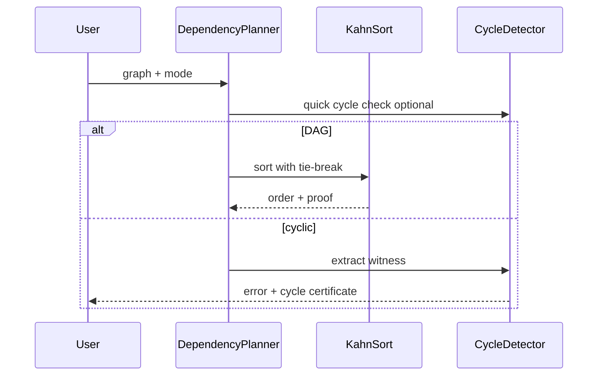

# Architecture — Dependency Planner

## Summary

Directed graph algorithms for build planning sit on the **graph representation boundary** from Data Structures. Storage is imported; this lab owns traversal, ordering, and certificates only. See [[05-Algorithms/projects/Algorithm Workbench/ADR/ADR-002 Graph Representation Boundary|ADR-002]].

## Components

| Component | Input | Output |
| --- | --- | --- |
| `KahnSort` | DAG adjacency + indegree | Topo order or cycle signal |
| `DfsTopoSort` | DAG adjacency | Topo order (reverse postorder) |
| `CycleDetector` | Directed graph | Optional cycle vertex sequence |
| `TarjanSCC` | Directed graph | SCC lists + ids |
| `DependencyPlanner` | Graph + options | Order, layers, or error with witness |

## Invariants

- Topo output: for every edge `(u,v)`, `index(u) < index(v)` in order array
- Cycle witness: closed walk with at least one edge, length ≤ V
- SCC partition: every vertex in exactly one component; edges only intra- or inter-SCC consistently
- Layered mode: nodes in layer `i` depend only on layers `< i`
- Lex tie-break: among ready nodes, pick smallest label per ADR-004

## Planning Flow

## Failure Model

| Condition | Response |
| --- | --- |
| Cyclic graph in strict topo mode | Error + cycle witness |
| Empty graph | Empty order |
| Disconnected DAG | Valid global topo with tie-break |
| Unknown vertex in edge list | Schema validation error at load |
| Layer mode on cyclic graph | Reject before layering |

## Trade-offs

| Approach | Strength | Weakness |
| --- | --- | --- |
| Kahn (BFS) | Natural layering, cycle detection | Queue overhead |
| DFS postorder | Low memory, one pass feel | Layer extraction extra step |
| Tarjan SCC | Linear, builds condensation | More complex to teach first |
| Full cycle enumeration | Complete diagnostics | Exponential—out of scope |

## Related Documents

- [[05-Algorithms/projects/Dependency Planner/README|README]]
- [[05-Algorithms/projects/Dependency Planner/Security|Security]]
- [[05-Algorithms/projects/Algorithm Workbench/ADR/ADR-002 Graph Representation Boundary|ADR-002]]
- [[05-Algorithms/projects/Algorithm Workbench/ADR/ADR-004 Deterministic Tie-Breaking and RNG|ADR-004]]
