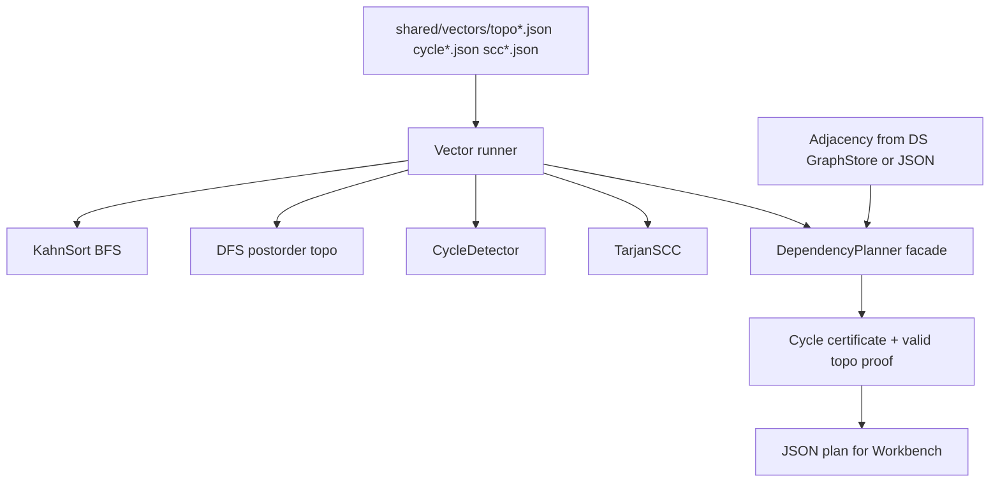

# Dependency Planner

## One-Line Purpose

Resolve build and task dependency graphs with topological ordering, cycle detection, and strongly connected component decomposition—emitting actionable plans, cycle certificates, and deterministic tie-break order for reproducible CI simulation.

## Status

**Active.** Core implementations target [[05-Algorithms/code/README|Algorithms code labs]] modules `TopologicalSort`, `CycleDetector`, `KahnSort`, `TarjanSCC`, and `DependencyPlanner`; this folder defines graph input contracts, security ceilings, and acceptance against shared vectors.

## Prerequisites

- [[05-Algorithms/07-Graph-Traversal-and-DAGs/Topological Sorting and Dependency Resolution|Topological Sorting and Dependency Resolution]]
- [[05-Algorithms/07-Graph-Traversal-and-DAGs/Cycle Detection|Cycle Detection]]
- [[05-Algorithms/07-Graph-Traversal-and-DAGs/Strongly Connected Components|Strongly Connected Components]]
- [[05-Algorithms/07-Graph-Traversal-and-DAGs/DFS|DFS]]
- [[05-Algorithms/07-Graph-Traversal-and-DAGs/BFS|BFS]]
- [[04-Data-Structures/08-Graphs-as-Representation/Graph ADT Vertices Edges and Labels|Graph ADT Vertices Edges and Labels]]
- [[05-Algorithms/00-Foundations-and-Correctness/Problem Specifications Preconditions and Postconditions|Problem Specifications Preconditions and Postconditions]]

## Architecture



See [[05-Algorithms/projects/Dependency Planner/Architecture|Architecture]] for tie-breaking and graph boundary with [[04-Data-Structures/projects/Graph Store CLI/README|Graph Store CLI]].

## Acceptance Criteria

- [ ] Kahn and DFS topological sorts agree on DAG inputs in both languages.
- [ ] Cycle detection returns explicit cycle vertex list on cyclic graphs per shared vectors.
- [ ] SCC decomposition matches reference on `scc*.json`; condensation DAG topo succeeds.
- [ ] `DependencyPlanner` emits parallelizable layers when `mode: layered` requested.
- [ ] Tie-break order deterministic per [[05-Algorithms/projects/Algorithm Workbench/ADR/ADR-004 Deterministic Tie-Breaking and RNG|ADR-004]].
- [ ] Graph representation consumed via documented boundary—no duplicate storage engine in this lab.
- [ ] Certificate checker validates topo order and cycle witnesses.

## Run and Test

```bash
cd 05-Algorithms/code/typescript
npm install
npm test -- -t "TopologicalSort|CycleDetector|TarjanSCC|DependencyPlanner"

cd ../python
python -m pip install -e ".[dev]"
python -m pytest -q -k "topological or cycle or tarjan or dependency"
```

Benchmark entry point (when added): `05-Algorithms/code/shared/bench/dependency_planner.ts` / `.py`. Vectors: `05-Algorithms/code/shared/vectors/`.

## Benchmarks

| Workload | Variants | Primary metrics |
| --- | --- | --- |
| 10k node DAG sparse | Kahn vs DFS topo | ns/op, queue ops |
| 10k node cyclic | cycle find + SCC | cycle length, SCC count |
| Package-lock-like skew | high indegree hub | layer depth, parallelism width |
| Dense small graph | Floyd-style not used | verify O(V+E) paths only |
| Lex tie-break stress | many zero-indegree nodes | deterministic order hash |

## Security and Failure Constraints

- Cap vertices, edges, and string label length from untrusted JSON/CLI.
- Reject self-loops and multi-edges per schema—or normalize explicitly in docs.
- No unbounded recursion on deep DFS—iterative stack option for large V.
- Cycle reports must not include unbounded path enumeration on huge SCCs—emit one witness cycle.
- Planner output size bounded; layered mode caps layer count.

## Exercises and Reflection

1. Prove Kahn's algorithm detects cycles iff no complete topological order exists.
2. Build condensation graph from SCCs and topo sort the meta-DAG.
3. Compare parallel layer width vs critical path length on a build graph.

**Reflection prompts**

- Why do package managers surface SCCs differently from a single cycle path?
- When is lexicographic tie-breaking a production requirement versus teaching convenience?
- How does this lab differ from a distributed build orchestrator?

## Interview Questions

- Kahn vs DFS for topological sort—trade-offs?
- How do you find a cycle in a directed graph?
- What is an SCC and why does condensation help planning?

## Related Notes

- [[05-Algorithms/projects/Dependency Planner/Architecture|Architecture]]
- [[05-Algorithms/projects/Dependency Planner/Testing|Testing]]
- [[05-Algorithms/projects/Dependency Planner/Security|Security]]
- [[05-Algorithms/README|Algorithms MOC]]
- [[05-Algorithms/code/README|Algorithms Code Labs]]
- [[05-Algorithms/projects/Algorithm Workbench/README|Algorithm Workbench]]
- [[04-Data-Structures/projects/Graph Store CLI/README|Graph Store CLI]]
- [[Career/README|Career]]
