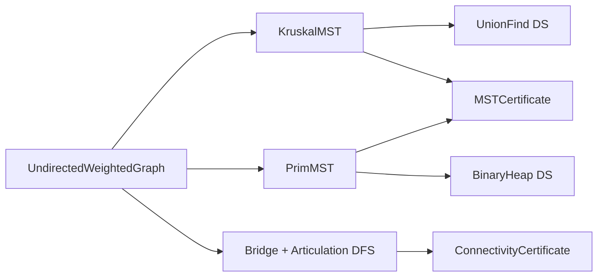
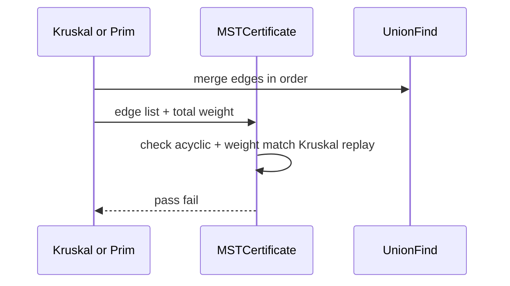

# Architecture — Network Connectivity and MST Lab

## Summary

Undirected weighted graph algorithms for spanning trees and biconnectivity. UnionFind from Data Structures; Prim uses BinaryHeap. Graph loaded via ADR-002 boundary.

## Components

| Component | Algorithm | Dependencies |
| --- | --- | --- |
| `KruskalMST` | Sort edges + UF merge | UnionFind |
| `PrimMST` | Grow tree from seed | BinaryHeap |
| `BridgeFinder` | Tarjan low-link DFS | Graph adjacency |
| `ArticulationPoints` | Tarjan DFS variant | Graph adjacency |
| `ConnectivityLab` | Facade + reports | All above |
| `MSTCertificate` | Sum weight, acyclicity, |V|-1 edges | — |

## Invariants

- MST: connected input → exactly V-1 edges, acyclic, minimum total weight
- Kruskal: edges considered in non-decreasing weight; skip edge if endpoints connected
- Prim: tree grows with min outgoing edge; all vertices in component reachable
- Bridge: edge whose removal increases component count
- Articulation: vertex whose removal increases component count

## MST Verification Flow

## Failure Model

| Condition | Response |
| --- | --- |
| Disconnected (strict mode) | Error: cannot span all vertices |
| Disconnected (per-component mode) | MST forest per vector tag |
| Parallel edges | Keep min weight or reject per schema |
| Negative weights | Allowed for MST; document semantics |
| Self-loop | Reject at load |

## Trade-offs

| Method | Strength | Weakness |
| --- | --- | --- |
| Kruskal | Simple with UF; great sparse | Sort all edges |
| Prim + heap | Good on dense near-complete | Heap overhead sparse |
| Tarjan bi-connectivity | One DFS pass family | Recursive depth on path graphs |

## Related Documents

- [[05-Algorithms/projects/Network Connectivity and MST Lab/README|README]]
- [[05-Algorithms/projects/Network Connectivity and MST Lab/Security|Security]]
- [[05-Algorithms/projects/Algorithm Workbench/ADR/ADR-002 Graph Representation Boundary|ADR-002]]
- [[05-Algorithms/projects/Algorithm Workbench/ADR/ADR-004 Deterministic Tie-Breaking and RNG|ADR-004]]
