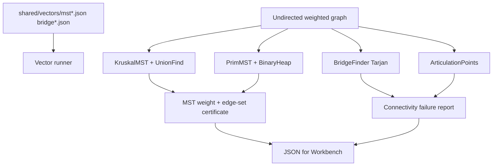

# Network Connectivity and MST Lab

## One-Line Purpose

Build minimum spanning trees, analyze connectivity failures, and locate bridges and articulation points on weighted undirected graphs—comparing Kruskal and Prim while certifying cut properties and union-find correctness.

## Status

**Active.** Core implementations target [[05-Algorithms/code/README|Algorithms code labs]] modules `KruskalMST`, `PrimMST`, `BridgeFinder`, `ArticulationPoints`, and `ConnectivityLab`; this folder defines undirected graph contracts, DSU integration, and acceptance against shared vectors.

## Prerequisites

- [[05-Algorithms/09-MST-and-Connectivity/Minimum Spanning Tree Contracts and Cut Property|Minimum Spanning Tree Contracts and Cut Property]]
- [[05-Algorithms/09-MST-and-Connectivity/Kruskal with Union-Find|Kruskal with Union-Find]]
- [[05-Algorithms/09-MST-and-Connectivity/Prim with Priority Queues|Prim with Priority Queues]]
- [[05-Algorithms/09-MST-and-Connectivity/Bridges Articulation Points and Connectivity Failure|Bridges Articulation Points and Connectivity Failure]]
- [[04-Data-Structures/09-Disjoint-Set/Union-Find Structure|Union-Find Structure]]
- [[04-Data-Structures/06-Heaps-and-Priority-Queues/Priority Queue ADT|Priority Queue ADT]]
- [[05-Algorithms/07-Graph-Traversal-and-DAGs/DFS|DFS]]

## Architecture



See [[05-Algorithms/projects/Network Connectivity and MST Lab/Architecture|Architecture]] for DSU and heap boundaries.

## Acceptance Criteria

- [ ] Kruskal and Prim produce equal total MST weight on all connected vectors (tie-break per ADR-004).
- [ ] MST edge count equals V-1 for connected components processed per spec.
- [ ] Bridge and articulation output matches reference on `bridge*.json`.
- [ ] UnionFind path compression + rank documented and tested via Kruskal.
- [ ] Certificate validates no cycle and cut property for returned edge set.
- [ ] Disconnected graph handling documented: MST per component or error mode per vector tag.
- [ ] Dual-language parity on MST and connectivity vectors.

## Run and Test

```bash
cd 05-Algorithms/code/typescript
npm install
npm test -- -t "Kruskal|PrimMST|BridgeFinder|Articulation|ConnectivityLab"

cd ../python
python -m pip install -e ".[dev]"
python -m pytest -q -k "kruskal or prim or bridge or articulation"
```

Benchmark entry point (when added): `05-Algorithms/code/shared/bench/mst_connectivity.ts` / `.py`. Vectors: `05-Algorithms/code/shared/vectors/`.

## Benchmarks

| Workload | Variants | Primary metrics |
| --- | --- | --- |
| 100k edges sparse connected | Kruskal vs Prim | ns/op, UF ops / heap ops |
| Equal-weight edges | tie-break determinism | edge list hash |
| Grid graph | Prim on dense local | decrease-key count |
| Bridge chain graph | bridge finder | bridge count, DFS time |
| Articulation star | cut vertex detection | single articulation found |

## Security and Failure Constraints

- Cap V, E, and weight magnitude on import.
- Reject multigraph unless edges consolidated with min-weight rule documented.
- UnionFind array size bounded; no recursion depth overflow on bridge DFS—iterative option.
- MST on disconnected graph must not silently return tree spanning wrong component count.
- Output edge list size capped at E.

## Exercises and Reflection

1. Prove cut property and use it to justify Kruskal's greedy step.
2. Construct graph where every edge is a bridge.
3. Compare Prim with binary heap vs Kruskal on sparse vs dense regimes.

**Reflection prompts**

- Why do network designers care about articulation points separately from bridges?
- When does Kruskal beat Prim in practice despite same Big-O on sparse graphs?
- How is MST different from shortest-path tree?

## Interview Questions

- Kruskal vs Prim—data structure dependencies?
- Define bridge and articulation point.
- What happens to MST algorithms on disconnected graphs?

## Related Notes

- [[05-Algorithms/projects/Network Connectivity and MST Lab/Architecture|Architecture]]
- [[05-Algorithms/projects/Network Connectivity and MST Lab/Testing|Testing]]
- [[05-Algorithms/projects/Network Connectivity and MST Lab/Security|Security]]
- [[05-Algorithms/README|Algorithms MOC]]
- [[05-Algorithms/code/README|Algorithms Code Labs]]
- [[05-Algorithms/projects/Algorithm Workbench/README|Algorithm Workbench]]
- [[04-Data-Structures/projects/Graph Store CLI/README|Graph Store CLI]]
- [[Career/README|Career]]
