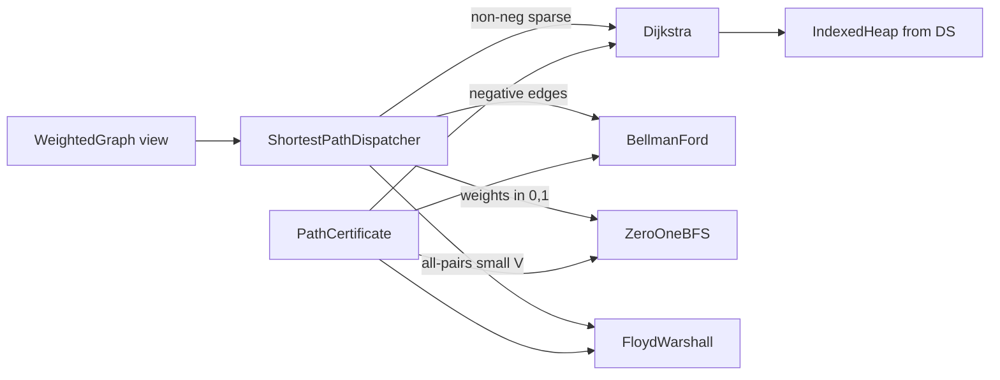

# Architecture — Pathfinding Lab

## Summary

Weighted shortest-path solvers share relaxation semantics and a dispatcher that enforces algorithm–contract fit. Graph storage imported per [[05-Algorithms/projects/Algorithm Workbench/ADR/ADR-002 Graph Representation Boundary|ADR-002]]; heap operations from Data Structures indexed heap module.

## Components

| Component | Preconditions | Postconditions |
| --- | --- | --- |
| `Dijkstra` | Non-negative edge weights | Optimal distances; unreachable = ∞ |
| `BellmanFord` | No requirement on sign | Distances if no neg cycle; else witness |
| `ZeroOneBFS` | w ∈ {0,1} | Same as Dijkstra on valid inputs |
| `FloydWarshall` | Dense all-pairs budget | dist[i][j] optimal for small V |
| `ShortestPathDispatcher` | Graph metadata profile | Routes to one solver or error |
| `PathCertificate` | Solver output | Validates relaxation inequalities |

## Relaxation Invariant

For each settled vertex `u` and edge `(u,v,w)`: after relaxation, `dist[v] ≤ dist[u] + w`. Certificate re-walks edges used in parent tree.

## Dispatch Matrix (ADR-003)

| Profile flag | Algorithm |
| --- | --- |
| `allPairs && V ≤ V_CAP` | Floyd-Warshall |
| `hasNegativeEdge` | Bellman-Ford |
| `maxWeight ≤ 1 && minWeight ≥ 0 && integer` | Zero-One BFS |
| `nonNegative` | Dijkstra |
| else | Error: unsupported mix |

## Failure Model

| Condition | Response |
| --- | --- |
| Negative edge in Dijkstra mode | Fail before run with contract error |
| Negative cycle reachable from source | BF returns cycle witness |
| Overflow in dist | Explicit error code |
| Unreachable target | dist = ∞; path reconstruction empty |
| V too large for Floyd | Reject all-pairs request |

## Trade-offs

| Algorithm | Strength | Weakness |
| --- | --- | --- |
| Dijkstra + indexed heap | Best for sparse non-neg | Needs heap; no negatives |
| Bellman-Ford | Handles negatives | O(VE) slower |
| 0-1 BFS | O(V+E) on special weights | Narrow contract |
| Floyd-Warshall | Simple all-pairs code | O(V³) memory/time |

## Related Documents

- [[05-Algorithms/projects/Pathfinding Lab/README|README]]
- [[05-Algorithms/projects/Pathfinding Lab/Security|Security]]
- [[05-Algorithms/projects/Algorithm Workbench/ADR/ADR-003 Shortest-Path Dispatch|ADR-003]]
