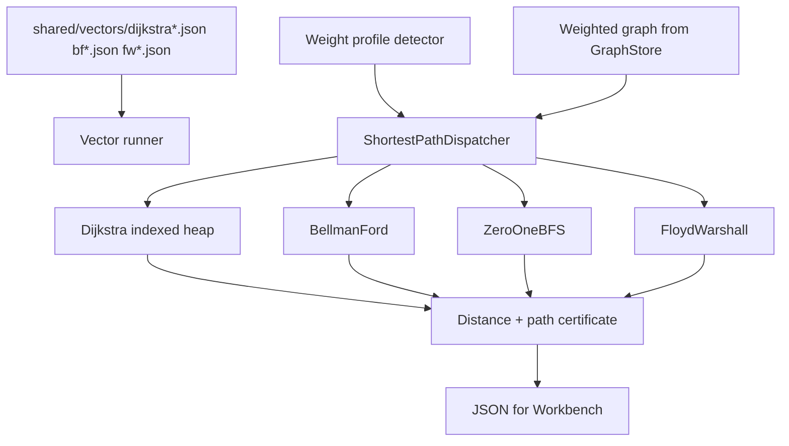

# Pathfinding Lab

## One-Line Purpose

Dispatch and compare single-source and all-pairs shortest-path algorithms under non-negative, negative, zero-one, and dense weight regimes—validating relaxation certificates, negative-cycle detection, and reproducible path reconstruction.

## Status

**Active.** Core implementations target [[05-Algorithms/code/README|Algorithms code labs]] modules `Dijkstra`, `BellmanFord`, `ZeroOneBFS`, `FloydWarshall`, and `ShortestPathDispatcher`; this folder defines weight contracts, dispatch rules, and acceptance against shared vectors.

## Prerequisites

- [[05-Algorithms/08-Shortest-Paths/Shortest-Path Contracts and Relaxation|Shortest-Path Contracts and Relaxation]]
- [[05-Algorithms/08-Shortest-Paths/Dijkstra with Indexed Heaps|Dijkstra with Indexed Heaps]]
- [[05-Algorithms/08-Shortest-Paths/Bellman-Ford and Negative Cycles|Bellman-Ford and Negative Cycles]]
- [[05-Algorithms/08-Shortest-Paths/Zero-One BFS and Specialized Weights|Zero-One BFS and Specialized Weights]]
- [[05-Algorithms/08-Shortest-Paths/Floyd-Warshall and All-Pairs Trade-offs|Floyd-Warshall and All-Pairs Trade-offs]]
- [[04-Data-Structures/06-Heaps-and-Priority-Queues/Indexed Heap Decrease-Key|Indexed Heap Decrease-Key]]
- [[05-Algorithms/projects/Algorithm Workbench/ADR/ADR-003 Shortest-Path Dispatch|ADR-003 Shortest-Path Dispatch]]

## Architecture



See [[05-Algorithms/projects/Pathfinding Lab/Architecture|Architecture]] for dispatch matrix and heap dependency.

## Acceptance Criteria

- [ ] Dijkstra passes non-negative vectors; rejects negative edge with explicit error.
- [ ] Bellman-Ford detects negative cycles and returns witness per `bf-negative*.json`.
- [ ] Zero-one BFS matches Dijkstra on {0,1} weights within tolerance.
- [ ] Floyd-Warshall all-pairs matches single-source baselines on small dense graphs.
- [ ] Path reconstruction follows parent pointers; certificate validates `dist[v] ≤ dist[u] + w(u,v)`.
- [ ] Dispatcher selects algorithm per ADR-003 given weight profile flags.
- [ ] Dual-language parity on all shared shortest-path vectors.

## Run and Test

```bash
cd 05-Algorithms/code/typescript
npm install
npm test -- -t "Dijkstra|BellmanFord|ZeroOneBFS|FloydWarshall|ShortestPath"

cd ../python
python -m pip install -e ".[dev]"
python -m pytest -q -k "dijkstra or bellman or zero_one or floyd"
```

Benchmark entry point (when added): `05-Algorithms/code/shared/bench/pathfinding.ts` / `.py`. Vectors: `05-Algorithms/code/shared/vectors/`.

## Benchmarks

| Workload | Variants | Primary metrics |
| --- | --- | --- |
| 100k edges sparse non-neg | Dijkstra binary vs indexed heap | ns/op, heap decrease-keys |
| Negative edge present | Dijkstra fail fast vs BF | correct error / cycle find |
| {0,1} grid graph | 0-1 BFS vs Dijkstra | queue ops vs heap ops |
| V=500 dense | Floyd-Warshall vs repeated Dijkstra | time, memory |
| Tie equal distances | path reconstruction tie-break | deterministic path hash |

## Security and Failure Constraints

- Cap V, E, and absolute weight magnitude before graph build.
- Detect overflow in distance accumulation—saturate or error explicitly.
- No infinite relax loops; Bellman-Ford bounded to V-1 passes plus cycle check.
- Untrusted graphs cannot trigger all-pairs on huge V without explicit flag.
- Path output length capped; reconstruct only when requested.

## Exercises and Reflection

1. Prove Dijkstra fails with negative edges; construct minimal counterexample.
2. Implement negative-cycle witness extraction from Bellman-Ford round V.
3. Compare indexed heap vs lazy decrease-key for sparse road-network-like graphs.

**Reflection prompts**

- Why do map routers rarely run Floyd-Warshall despite teaching convenience?
- When is zero-one BFS "good enough" instead of generic Dijkstra?
- How does certificate checking catch off-by-one relax bugs?

## Interview Questions

- Dijkstra vs Bellman-Ford—when each?
- What breaks Dijkstra with negative weights?
- How do you reconstruct paths from predecessor arrays?

## Related Notes

- [[05-Algorithms/projects/Pathfinding Lab/Architecture|Architecture]]
- [[05-Algorithms/projects/Pathfinding Lab/Testing|Testing]]
- [[05-Algorithms/projects/Pathfinding Lab/Security|Security]]
- [[05-Algorithms/README|Algorithms MOC]]
- [[05-Algorithms/code/README|Algorithms Code Labs]]
- [[05-Algorithms/projects/Algorithm Workbench/README|Algorithm Workbench]]
- [[Career/README|Career]]
