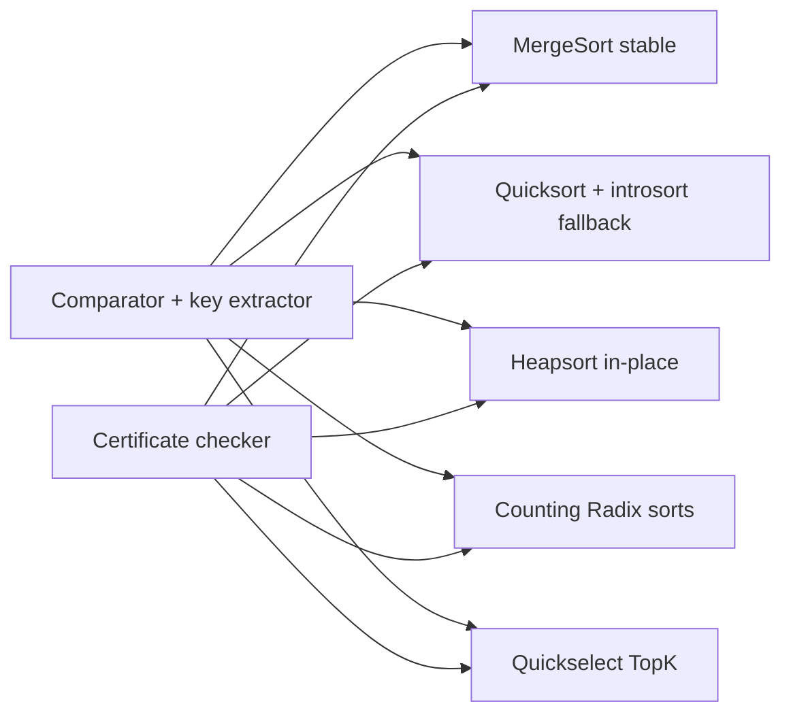
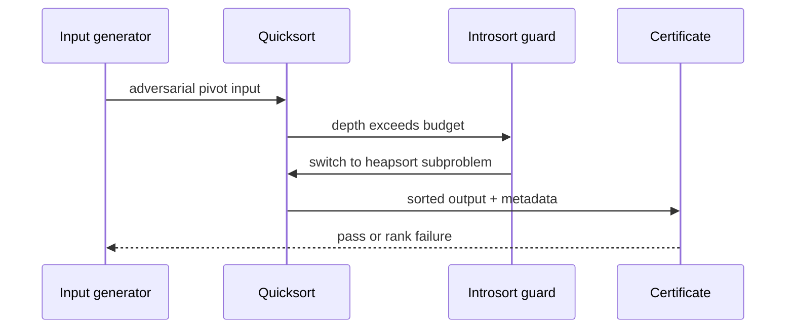

# Architecture — Sorting and Selection Bake-Off

## Summary

Multiple sort and selection implementations share comparator contracts, input generators, and a certificate checker. Default sort policy: [[05-Algorithms/projects/Algorithm Workbench/ADR/ADR-001 Sorting Default|ADR-001 Sorting Default]].

## Components

| Component | Contract | Notes |
| --- | --- | --- |
| `MergeSort` | Stable O(n log n) | Extra buffer; natural merge optional |
| `Quicksort` | In-place; pivot policy documented | 3-way partition for duplicates |
| `Heapsort` | In-place O(n log n) | Unstable; good worst-case guard |
| `CountingSort` / `RadixSort` | Integer keys in bounded range | Reject out-of-range |
| `Quickselect` | O(n) expected k-th | Partition shares pivot policy with quicksort |
| `SortCertificate` | Validates order, stability, rank | Emits machine-readable proof fields |

## Invariants

- Post-sort: `∀ i < n-1 : cmp(a[i], a[i+1]) ≤ 0` under total order (or strict per spec)
- Stable sorts: equal keys retain input relative order (verified by satellite key or index tag)
- Selection: returned element has exactly `k-1` keys less than it (0-based rank semantics documented)
- Integer sorts: bucket counts sum to `n`; output length equals input length
- No mutating input during certificate verification pass

## Pivot and Adaptivity Path

## Failure Model

| Condition | Response |
| --- | --- |
| Empty array | Return empty; selection error if k > 0 |
| k out of range | Explicit error with valid range |
| Integer key out of declared range | Fail before counting phase |
| Non-total comparator | Debug assert; vectors use total orders only |
| Recursion depth exceeded | Introsort fallback or iterative path |

## Trade-offs

| Strategy | Strength | Weakness |
| --- | --- | --- |
| Merge sort | Stability, predictable | O(n) extra memory |
| Quicksort | Cache-friendly, fast average | Pivot sensitivity without guard |
| Heapsort | O(n log n) worst in-place | Poor locality, unstable |
| Counting/radix | Linear on bounded integers | Range assumptions |
| Quickselect | O(n) expected for one rank | Worst-case without careful pivot |

## Related Documents

- [[05-Algorithms/projects/Sorting and Selection Bake-Off/README|README]]
- [[05-Algorithms/projects/Sorting and Selection Bake-Off/Security|Security]]
- [[05-Algorithms/projects/Algorithm Workbench/ADR/ADR-001 Sorting Default|ADR-001]]
- [[05-Algorithms/projects/Algorithm Workbench/ADR/ADR-004 Deterministic Tie-Breaking and RNG|ADR-004]]
