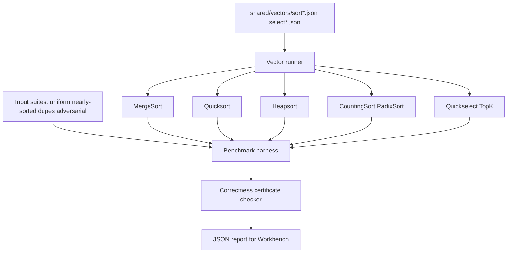

# Sorting and Selection Bake-Off

## One-Line Purpose

Compare comparison sorts, integer sorts, and partition-based selection under uniform, nearly sorted, duplicate-heavy, and adversarial pivot workloads while measuring stability, adaptivity, certificate validity, and top-k correctness.

## Status

**Active.** Core implementations target [[05-Algorithms/code/README|Algorithms code labs]] modules `MergeSort`, `Quicksort`, `Heapsort`, `CountingSort`, `RadixSort`, and `Quickselect`; this folder defines benchmarks, security ceilings, and acceptance against shared vectors.

## Prerequisites

- [[05-Algorithms/03-Sorting/Sorting Contracts Stability and Adaptivity|Sorting Contracts Stability and Adaptivity]]
- [[05-Algorithms/03-Sorting/Merge Sort|Merge Sort]]
- [[05-Algorithms/03-Sorting/Quicksort Partitioning and Introspective Fallbacks|Quicksort Partitioning and Introspective Fallbacks]]
- [[05-Algorithms/03-Sorting/Heapsort|Heapsort]]
- [[05-Algorithms/03-Sorting/Counting Radix and Bucket Sort|Counting Radix and Bucket Sort]]
- [[05-Algorithms/02-Searching-and-Selection/Quickselect and Partition-Based Selection|Quickselect and Partition-Based Selection]]
- [[05-Algorithms/02-Searching-and-Selection/Order Statistics Median and Top-K Trade-offs|Order Statistics Median and Top-K Trade-offs]]
- [[05-Algorithms/01-Complexity-and-Analysis/Practical Constants Locality and Benchmark Design|Practical Constants Locality and Benchmark Design]]

## Architecture



See [[05-Algorithms/projects/Sorting and Selection Bake-Off/Architecture|Architecture]] for stability contracts and pivot policies.

## Acceptance Criteria

- [ ] All documented sorts and `Quickselect` pass shared vectors in TypeScript and Python.
- [ ] Stable sorts preserve relative order of equal keys per [[05-Algorithms/projects/Algorithm Workbench/ADR/ADR-001 Sorting Default|ADR-001]].
- [ ] Integer sorts reject out-of-range keys with explicit errors—not silent wrap.
- [ ] Quicksort documents pivot policy; introsort fallback triggers on depth budget per vectors tagged `adversarial-pivot`.
- [ ] Top-k and median selection match full-sort baseline on shared `select*.json`.
- [ ] Certificate checker validates sorted order, stability tags, and selection rank on every vector run.
- [ ] Benchmark exports: ns/op, comparisons, swaps, allocations, stability flag, certificate pass rate.

## Run and Test

```bash
cd 05-Algorithms/code/typescript
npm install
npm test -- -t "MergeSort|Quicksort|Heapsort|CountingSort|Quickselect"

cd ../python
python -m pip install -e ".[dev]"
python -m pytest -q -k "merge_sort or quicksort or heapsort or counting_sort or quickselect"
```

Benchmark entry point (when added): `05-Algorithms/code/shared/bench/sort_bakeoff.ts` / `.py`. Vectors: `05-Algorithms/code/shared/vectors/`.

## Benchmarks

| Workload | Variants | Primary metrics |
| --- | --- | --- |
| 1M uniform random ints | merge vs quick vs heap | ns/op, comparisons |
| 1M nearly sorted (+5% swaps) | adaptive vs non-adaptive | comparisons, passes |
| 1M ints 90% duplicates | 3-way partition quick vs merge | swap count, stability |
| Adversarial pivot inputs | naive pivot vs median-of-three vs introsort | depth, worst-case guard |
| Small n (n ≤ 32) | insertion hybrid threshold | crossover constant |
| Top-k k=10 on 1M | quickselect vs partial heap vs full sort | ns/op, certificate rank |
| Bounded integer range | counting vs radix vs comparison sort | memory bytes, passes |

Compare against language stdlib `sort` as reference only—not pass/fail.

## Security and Failure Constraints

- Cap array length and key magnitude before sort from untrusted JSON/CLI.
- Reject negative sizes and overflow in `k` for top-k queries.
- Document quadratic worst-case exposure when introsort disabled in teaching mode.
- Integer sorts must validate `min ≤ key ≤ max` before counting pass—no silent bucket overflow.
- No unbounded recursion—iterative merge and explicit quicksort stack depth limits.

## Exercises and Reflection

1. Prove stability preservation for merge sort given stable merge of equals.
2. Implement 3-way Dutch-national-flag partition and measure duplicate-heavy inputs.
3. Derive expected comparisons for quickselect vs full sort for varying k.

**Reflection prompts**

- When does stability matter in audit logs versus numeric analytics pipelines?
- Why can a faster average-case sort lose on nearly sorted real data?
- How does certificate checking differ from asserting `array[i] ≤ array[i+1]` alone?

## Interview Questions

- What is stability and when is it required?
- How does introsort combine quicksort and heapsort guarantees?
- When is O(n) counting sort unavailable in production?

## Related Notes

- [[05-Algorithms/projects/Sorting and Selection Bake-Off/Architecture|Architecture]]
- [[05-Algorithms/projects/Sorting and Selection Bake-Off/Testing|Testing]]
- [[05-Algorithms/projects/Sorting and Selection Bake-Off/Security|Security]]
- [[05-Algorithms/README|Algorithms MOC]]
- [[05-Algorithms/code/README|Algorithms Code Labs]]
- [[05-Algorithms/projects/Algorithm Workbench/README|Algorithm Workbench]]
- [[Career/README|Career]]
