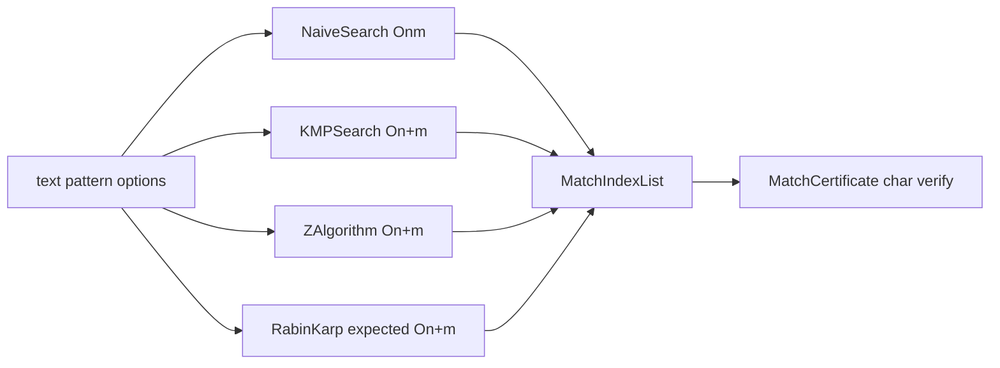
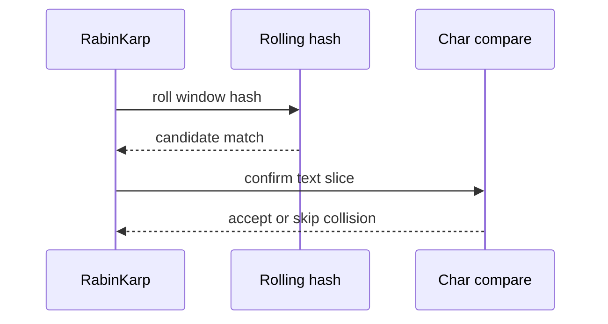

# Architecture — Text Search Toolkit

## Summary

Substring search algorithms share match reporting semantics and a certificate that re-validates each reported index. Rabin-Karp uses deterministic modulus and base per [[05-Algorithms/projects/Algorithm Workbench/ADR/ADR-004 Deterministic Tie-Breaking and RNG|ADR-004]].

## Components

| Component | Time | Notes |
| --- | --- | --- |
| `NaiveSearch` | O(n·m) | Baseline correctness reference |
| `KMPSearch` | O(n+m) | Prefix function π |
| `ZAlgorithm` | O(n+m) | Z-array on text⊕sep⊕pattern |
| `RabinKarpSearch` | O(n+m) expected | Double-hash optional for bench |
| `TextSearchToolkit` | Dispatches by profile | Batch multi-pattern facade |
| `MatchCertificate` | O(k·m) verify | k = match count |

## Match Semantics

- Index = start position in text (0-based)
- Overlapping matches included when flag set
- Empty pattern: matches every position (documented) or error per vector tag
- Case sensitivity: ASCII case-sensitive default

## Rabin-Karp Flow

## Failure Model

| Condition | Response |
| --- | --- |
| Pattern longer than text | Empty matches |
| Invalid alphabet char | Load error |
| Hash collision without verify | Bug—tests must catch |
| Pattern count over cap | Reject batch request |

## Trade-offs

| Algorithm | Strength | Weakness |
| --- | --- | --- |
| Naive | Zero prep | Quadratic on repeats |
| KMP | Linear, no hash | Prefix table allocation |
| Z | Unified for multiple queries on same text | Higher constant factors |
| Rabin-Karp | Multi-pattern friendly | Collisions without verify |

## Related Documents

- [[05-Algorithms/projects/Text Search Toolkit/README|README]]
- [[05-Algorithms/projects/Text Search Toolkit/Security|Security]]
- [[05-Algorithms/projects/Algorithm Workbench/ADR/ADR-004 Deterministic Tie-Breaking and RNG|ADR-004]]
