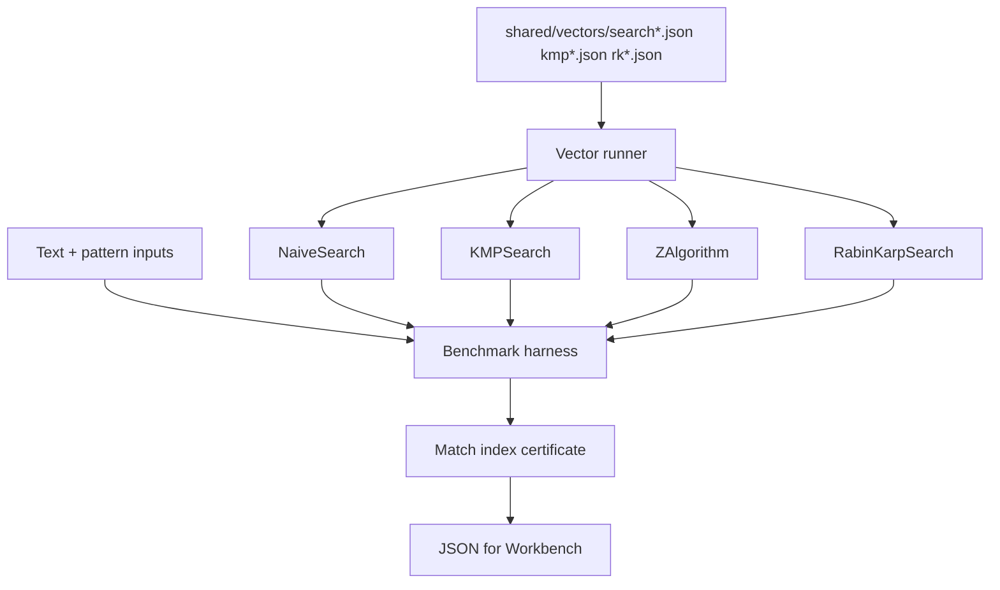

# Text Search Toolkit

## One-Line Purpose

Implement and compare linear-time substring search—naive, KMP, Z-algorithm, and Rabin-Karp rolling hash—under repetitive, periodic, and adversarial pattern workloads while validating match indices and hash collision handling.

## Status

**Active.** Core implementations target [[05-Algorithms/code/README|Algorithms code labs]] modules `NaiveSearch`, `KMPSearch`, `ZAlgorithm`, `RabinKarpSearch`, and `TextSearchToolkit`; this folder defines alphabet contracts, collision policies, and acceptance against shared vectors.

## Prerequisites

- [[05-Algorithms/11-String-and-Sequence-Algorithms/Naive Matching and Prefix Structure|Naive Matching and Prefix Structure]]
- [[05-Algorithms/11-String-and-Sequence-Algorithms/KMP Prefix Function|KMP Prefix Function]]
- [[05-Algorithms/11-String-and-Sequence-Algorithms/Z Algorithm|Z Algorithm]]
- [[05-Algorithms/11-String-and-Sequence-Algorithms/Rabin-Karp and Rolling Hash|Rabin-Karp and Rolling Hash]]
- [[05-Algorithms/12-Randomized-Approximation-and-Online/Randomized Algorithms and Reproducible RNG|Randomized Algorithms and Reproducible RNG]]
- [[05-Algorithms/projects/Algorithm Workbench/ADR/ADR-004 Deterministic Tie-Breaking and RNG|ADR-004 Deterministic Tie-Breaking and RNG]]

## Architecture



See [[05-Algorithms/projects/Text Search Toolkit/Architecture|Architecture]] for rolling hash modulus and collision verification.

## Acceptance Criteria

- [ ] All search algorithms return identical match index lists on shared vectors (order preserved).
- [ ] KMP prefix function and Z-array match reference implementations on `kmp*.json`.
- [ ] Rabin-Karp verifies character equality on every hash hit—no false positives on vectors.
- [ ] Empty pattern, empty text, and pattern longer than text edge cases handled per contract.
- [ ] Overlapping matches reported when `overlapping: true` in vector metadata.
- [ ] Alphabet mode documented: byte ASCII default; Unicode out of scope unless tagged.
- [ ] Dual-language parity on entire search vector suite.

## Run and Test

```bash
cd 05-Algorithms/code/typescript
npm install
npm test -- -t "NaiveSearch|KMPSearch|ZAlgorithm|RabinKarp|TextSearch"

cd ../python
python -m pip install -e ".[dev]"
python -m pytest -q -k "naive_search or kmp or z_algorithm or rabin_karp"
```

Benchmark entry point (when added): `05-Algorithms/code/shared/bench/text_search.ts` / `.py`. Vectors: `05-Algorithms/code/shared/vectors/`.

## Benchmarks

| Workload | Variants | Primary metrics |
| --- | --- | --- |
| 1MB text random alphabet | naive vs KMP vs Z | ns/char, comparisons |
| Highly repetitive text | naive quadratic vs KMP linear | comparison count |
| Periodic pattern | Z vs KMP | array build time |
| Rabin-Karp long pattern | hash roll cost | mod ops per step |
| Many short patterns batch | toolkit facade | throughput patterns/sec |

## Security and Failure Constraints

- Cap text length, pattern length, and pattern count from untrusted CLI/JSON.
- Rabin-Karp must confirm matches—never return hash-only hits as final answer.
- No regex or backtracking catastrophic patterns in default scope.
- Binary/text mode explicit; reject invalid UTF-8 unless conversion documented.
- Seed and modulus for rolling hash fixed per ADR-004 in deterministic tests.

## Exercises and Reflection

1. Construct text/pattern pair where naive search hits Θ(n·m) comparisons.
2. Derive KMP failure function for pattern `abacaba`.
3. Estimate Rabin-Karp collision probability for 32-bit modulus on random strings.

**Reflection prompts**

- Why is Rabin-Karp popular for multi-pattern search despite hash overhead?
- When would you still use naive search in production?
- How does suffix-array scale differ from KMP for static text?

## Interview Questions

- Explain KMP failure function intuition.
- Rabin-Karp collision handling?
- Z-algorithm vs KMP trade-offs?

## Related Notes

- [[05-Algorithms/projects/Text Search Toolkit/Architecture|Architecture]]
- [[05-Algorithms/projects/Text Search Toolkit/Testing|Testing]]
- [[05-Algorithms/projects/Text Search Toolkit/Security|Security]]
- [[05-Algorithms/README|Algorithms MOC]]
- [[05-Algorithms/code/README|Algorithms Code Labs]]
- [[05-Algorithms/projects/Algorithm Workbench/README|Algorithm Workbench]]
- [[Career/README|Career]]
