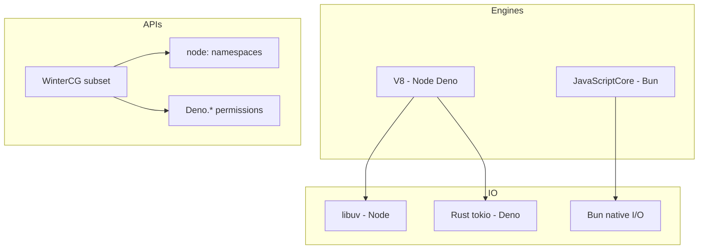
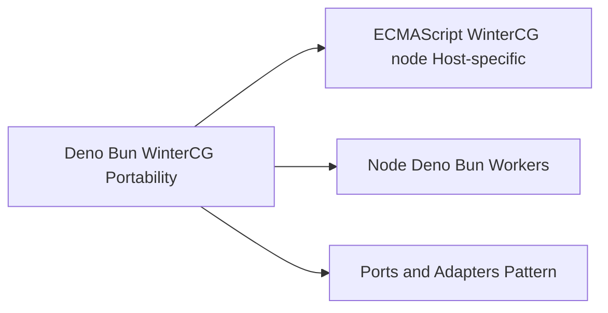

# Deno Bun and WinterCG Portability

## Overview

Node.js is no longer the only serious JavaScript **server host**. **Deno** (secure-by-default, Rust + V8, Web APIs first) and **Bun** (Zig + JavaScriptCore, npm-compatible, performance-focused) compete and converge through **WinterCG**—a community effort to standardize cross-runtime APIs like `fetch`, `URL`, `Web Streams`, `crypto.subtle`, and `AbortSignal`.

Portability is not "write once, run anywhere blindly." It is **layered**: ECMAScript core, WinterCG web-standard subset, Node-compatible `node:` namespaces (where implemented), and host-specific capabilities (`fs` layout, permissions, package managers). This note maps those layers so you can choose APIs deliberately and know what breaks when you switch runtimes.

## Learning Objectives

- Compare Node, Deno, and Bun host stacks and design goals
- List WinterCG APIs and their support variance across runtimes
- Write portable core logic with injected I/O ports
- Identify Node-only APIs that block migration and their alternatives
- Choose a runtime based on constraints, not hype

## Prerequisites

- [[06-NodeJS/00-Orientation/V8 libuv and the Node Host|V8 libuv and the Node Host]]
- [[02-JavaScript/04-Engines-and-Memory/Host Environments and Web APIs|Host Environments and Web APIs]]
- [[02-JavaScript/06-Modules-and-Tooling/ES Modules|ES Modules]]

## Difficulty

`intermediate`

## Estimated Time

- Reading: 2 hours
- Exercises: 2 hours
- Mini project: 4 hours

## History

Node (2009) predated modern Web APIs in JavaScript. Browser standards (`fetch`, Streams) matured separately. **Deno** (2020) shipped with permissions and URL imports to reject Node's implicit full-access model. **Bun** (2022) targeted drop-in speed for npm workloads. **WinterCG** formed so edge runtimes (Cloudflare Workers, Deno Deploy, Vercel) and servers could share API shapes. Node adopted `fetch` (undici), experimental Web Crypto alignment, and `node:` import specifiers to reduce ambiguity.

## Problem It Solves

- **Framework fragmentation**: libraries hard-coded to `require('fs')` could not run on edge workers
- **Security models**: Deno permissions vs. Node's "full OS access by default"
- **Developer confusion**: "Is `fetch` part of JavaScript?"—it's a host API, now widely shared
- **Tooling churn**: bundlers and test runners must target multiple hosts

## Internal Implementation

### Runtime comparison (conceptual)



| Aspect | Node.js | Deno | Bun |
| --- | --- | --- | --- |
| Engine | V8 | V8 | JavaScriptCore |
| Default module system | ESM + CJS interop | ESM (URLs) | ESM + CJS compat |
| Package manager | npm/pnpm/yarn | JSR + npm compat | Built-in npm client |
| Security | Full OS unless containerized | Explicit permissions | Full OS (Node-like) |
| npm ecosystem | Native | Compat mode | High compat target |

### Portability layers

1. **ECMAScript** — runs everywhere (promises: [[02-JavaScript/05-Async-and-Concurrency/Promises Internals|Promises Internals]])
2. **WinterCG** — `fetch`, `Request`/`Response`, `URL`, `TextEncoder`, Web Streams, `AbortSignal`, `crypto.subtle` (subset)
3. **Node `node:` APIs** — increasing Deno/Bun support; check compatibility tables
4. **Host-specific** — Deno `Deno.readTextFile`, Node `process.binding`, Bun `Bun.serve`

## Mermaid Diagrams

### Structure



### Sequence / Lifecycle — same fetch, different stacks

```mermaid
sequenceDiagram
    participant App
    participant Node as Node undici
    participant Deno as Deno Rust net
    participant Bun as Bun fetch
    App->>Node: fetch('https://api.example.com')
    App->>Deno: fetch('https://api.example.com')
    App->>Bun: fetch('https://api.example.com')
    Note over Node,Bun: Same API surface; different native implementations TLS DNS HTTP2
```

## Examples

### Minimal Example — capability detection

```typescript
// TypeScript 5+ — portable across modern Node 20+, Deno 1.4+, Bun 1.0+
const runtime = (() => {
  if (typeof Bun !== "undefined") return "bun" as const;
  if (typeof Deno !== "undefined") return "deno" as const;
  if (typeof process !== "undefined" && process.versions?.node) return "node" as const;
  return "unknown" as const;
})();

const hasWinterFetch = typeof fetch === "function";
const hasNodeFs = typeof process !== "undefined" && "versions" in process;

console.log({ runtime, hasWinterFetch, hasNodeFs });
```

### Production-Shaped Example — portable HTTP client core

```typescript
// TypeScript 5+ — WinterCG layer; inject for tests.
export interface HttpPort {
  fetch(input: string | URL, init?: RequestInit): Promise<Response>;
}

export function createApiClient(http: HttpPort, baseUrl: string) {
  return {
    async getHealth(): Promise<{ ok: boolean }> {
      const res = await http.fetch(new URL("/health", baseUrl));
      if (!res.ok) throw new Error(`health ${res.status}`);
      return res.json() as Promise<{ ok: boolean }>;
    },
  };
}

// Node 20+ wiring:
import { fetch as nodeFetch } from "undici"; // also global fetch in Node 18+
export const client = createApiClient({ fetch: globalThis.fetch ?? nodeFetch }, "https://api.example.com");

// Test wiring: inject undici MockAgent or Deno fetch mock.
```

Express/Fastify servers remain in [[07-Backend/README|Backend]]; this pattern keeps **domain logic** host-agnostic.

## Trade-offs

| Dimension | Upside | Downside | When it matters |
| --- | --- | --- | --- |
| WinterCG APIs | Shared mental model | Lowest-common-denominator features | Libraries |
| Node `node:` | Mature fs/net/streams | Not universal on edge | Infrastructure code |
| Deno permissions | Explicit capability grants | Friction for quick scripts | Untrusted code |
| Bun speed | Fast startup/npm install | JSC vs V8 subtle diffs | Dev inner loop |
| Multi-runtime CI | Confidence in portability | Matrix cost | Public SDKs |

### When to Use

- WinterCG APIs for HTTP, encoding, crypto in shared libraries
- Node for maximum ecosystem/native addon support
- Deno for permissioned tooling or JSR-first libraries
- Bun when npm compat + speed dominate local dev (validate in CI on Node LTS)

### When Not to Use

- Do not assume `node:fs/promises` on Cloudflare Workers
- Do not pick Bun-only APIs in libraries meant for Node LTS without guards
- Do not conflate "has fetch" with "has Node streams"—different models ([[06-NodeJS/04-Buffers-Streams-and-IO/Web Streams Interop with Node Streams|Web Streams Interop with Node Streams]])

## Exercises

1. Run the same `fetch` script on Node, Deno, and Bun; compare headers, TLS errors, and performance cold start.
2. Port a small script from `node:fs` to Deno `Deno.readTextFile` and document permission flags.
3. List ten APIs from [[02-JavaScript/04-Engines-and-Memory/Host Environments and Web APIs|Host Environments and Web APIs]] and classify as ECMAScript / WinterCG / Node-only.
4. Write a test double for `HttpPort` without network I/O.
5. Read WinterCG minimum common API draft and note gaps vs. Node `http.Server`.

## Mini Project

**Runtime probe CLI.** Emit JSON describing runtime, versions, supported WinterCG features (probe `ReadableStream`, `crypto.subtle`, `AbortSignal.timeout`), and one micro-benchmark (cold start + 100 fetches). Publish matrix in [[06-NodeJS/code/README|Node.js code labs]].

## Portfolio Project

Design [[06-NodeJS/projects/Node Runtime Toolkit/README|Node Runtime Toolkit]] with a `HostAdapter` interface implemented for Node and tested with injected mocks—document Deno/Bun gaps explicitly.

## Interview Questions

1. What is WinterCG and why did it form?
2. Compare Deno's permission model to Node's default security posture.
3. Why might Bun choose JavaScriptCore instead of V8?
4. How do you structure a library to run on Node and edge workers?
5. Is `fetch` part of ECMAScript? Explain precisely.

### Stretch / Staff-Level

1. What breaks when moving a Node `http.Server` app to Workers—list API and lifecycle differences.
2. Evaluate "Bun as production runtime" for a regulated environment—risk checklist.

## Common Mistakes

- Environment sniffing via `process.versions` in shared library code instead of dependency injection
- Using Node streams where Web Streams suffice (or vice versa) without conversion
- Testing only on Bun dev builds, never Node LTS in CI
- Assuming identical `fetch` redirect/cookie/TLS behavior across hosts

## Best Practices

- Target **ECMAScript + WinterCG** for portable cores; isolate Node-specific adapters
- Run CI on Node LTS at minimum; add Deno/Bun jobs for libraries
- Prefer `node:` import specifiers in Node for clarity
- Document supported runtimes in package README with explicit non-goals
- Defer HTTP product design to [[07-Backend/README|Backend]]; own host primitives here

## Summary

Node, Deno, and Bun are different hosts sharing an increasingly standardized API surface via WinterCG. Portability comes from layering: language core, web-standard APIs, optional `node:` modules, and host-specific extensions. Choose APIs deliberately, inject I/O for tests, and validate on Node LTS even when Bun accelerates local development.

## Further Reading

- [[00-References/NodeJS/README|Node.js References]]
- WinterCG — Minimum Common Web Platform API
- Deno manual — permissions and JSR
- Bun compatibility documentation

## Related Notes

- [[06-NodeJS/00-Orientation/Node Versioning LTS and Compatibility Policies|Node Versioning LTS and Compatibility Policies]]
- [[02-JavaScript/04-Engines-and-Memory/Host Environments and Web APIs|Host Environments and Web APIs]]
- [[02-JavaScript/06-Modules-and-Tooling/ES Modules|ES Modules]]
- [[06-NodeJS/04-Buffers-Streams-and-IO/Web Streams Interop with Node Streams|Web Streams Interop with Node Streams]]
- [[07-Backend/README|Backend]]

## Progress Checklist

- [ ] Explained from first principles
- [ ] Drew at least one Mermaid diagram
- [ ] Implemented a minimal version
- [ ] Documented trade-offs and non-goals
- [ ] Completed exercises
- [ ] Practiced interview questions aloud
- [ ] Linked prerequisites and dependents
