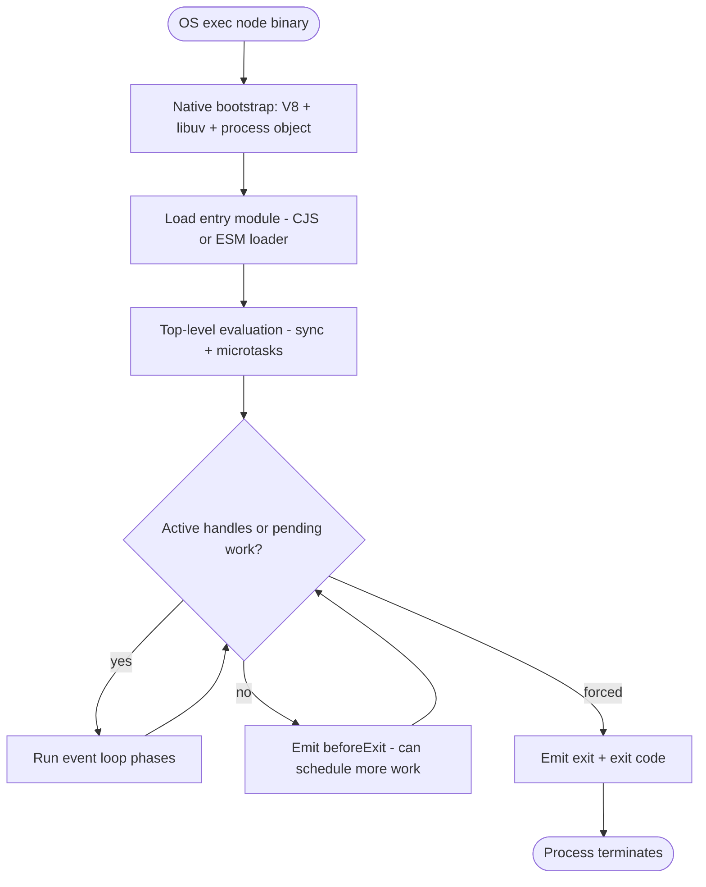
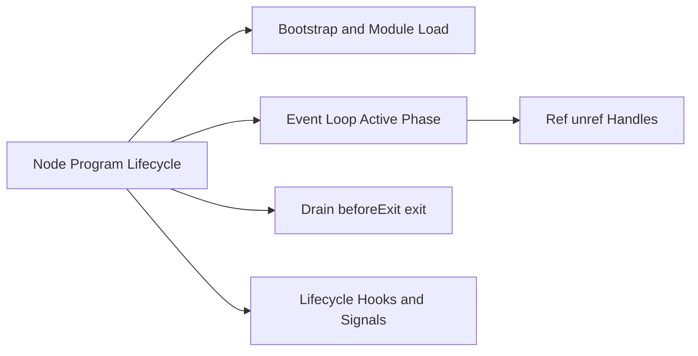

# Node Program Lifecycle

## Overview

A Node program is not "a `.js` file runs top to bottom and exits." It is a **hosted process** that bootstraps V8, initializes libuv, loads modules, registers handles, runs the event loop until work completes or `exit` is called, and tears down native resources. Understanding lifecycle phases—**bootstrap**, **evaluation**, **active loop**, **drain**, **exit**—is prerequisite to graceful shutdown, test harness design, and diagnosing zombie processes.

This note maps the host contract from `node entry.js` through `process.exit`, including how `beforeExit`, `exit`, and signal handlers interact. Signal and error specifics live in [[06-NodeJS/01-Process-and-Runtime/Signals Exit Codes and Lifecycle Hooks|Signals Exit Codes and Lifecycle Hooks]] and [[06-NodeJS/01-Process-and-Runtime/unhandledRejection uncaughtException and Fatal Errors|unhandledRejection uncaughtException and Fatal Errors]].

## Learning Objectives

- Enumerate Node bootstrap phases from binary start to first line of user code
- Explain why a program with pending timers never "finishes" without explicit shutdown
- Distinguish `beforeExit`, `exit`, and signal-driven termination
- Predict when the event loop keeps the process alive vs. when it drains
- Design startup/shutdown sequences suitable for production services

## Prerequisites

- [[06-NodeJS/00-Orientation/V8 libuv and the Node Host|V8 libuv and the Node Host]]
- [[02-JavaScript/00-Orientation/JavaScript Program Lifecycle|JavaScript Program Lifecycle]]
- [[06-NodeJS/01-Process-and-Runtime/Process argv env and stdio|Process argv env and stdio]]

## Difficulty

`beginner`

## Estimated Time

- Reading: 1.5 hours
- Exercises: 1.5 hours
- Mini project: 3 hours

## History

Early Node behaved like a script runner: load file, run, exit when sync code finished. As servers, watchers, and timers became normal, **ref/unref handles** and **`beforeExit`** (Node 0.12 era) clarified that lifecycle is **event-loop-driven**. Modern Node adds module loaders, compile cache, snapshot support (internal), and stricter defaults for unhandled rejections—each affecting when and how processes terminate.

## Problem It Solves

- **Mystery hangs**: "My script finished but Node won't exit" → active handles (servers, timers, open DB pools)
- **Data loss on deploy**: killing pods without drain → need shutdown hooks ([[06-NodeJS/10-Production-Node/Graceful Shutdown and Drain|Graceful Shutdown and Drain]])
- **Test flakiness**: Jest/Vitest waiting on open handles → lifecycle-aware teardown
- **CLI tools**: exit codes and stdio flush on `process.exit` ([[06-NodeJS/01-Process-and-Runtime/Signals Exit Codes and Lifecycle Hooks|Signals Exit Codes and Lifecycle Hooks]])

## Internal Implementation

### Lifecycle phases



**Active handles** (open servers, setInterval, unresolved promises do *not* count—only libuv handles ref'd by default) keep the loop alive.

### What runs before your code

1. Parse CLI flags and `NODE_OPTIONS` ([[06-NodeJS/01-Process-and-Runtime/NODE_OPTIONS and Runtime Flags|NODE_OPTIONS and Runtime Flags]])
2. Initialize V8 isolate and Node context (`globalThis`, `process`, `Buffer`)
3. Resolve entry point (`package.json` `"main"`, `--eval`, REPL)
4. Run module loader pipeline (ESM graph or CJS wrap)

### Exit mechanics

| Mechanism | Behavior |
| --- | --- |
| Natural drain | No ref'd handles → `beforeExit` → if still idle → `exit(0)` |
| `process.exit(n)` | **Immediate**; `beforeExit` skipped; other `exit` listeners still run |
| Uncaught exception | Default: print stack, `exit(1)` unless handled |
| Signal (SIGTERM) | Handler can graceful-shutdown; default may terminate |

## Mermaid Diagrams

### Structure



### Sequence / Lifecycle — HTTP server keeps process alive

```mermaid
sequenceDiagram
    participant OS
    participant Node
    participant Loop as Event Loop
    participant Server as http.Server
    OS->>Node: node server.ts
    Node->>Node: load + evaluate top-level
    Node->>Server: listen(3000) creates ref'd handle
    Server->>Loop: register TCP handle
    Note over Loop: loop spins - process stays alive
    OS->>Node: SIGTERM
    Node->>Server: close() in handler
    Server->>Loop: unref when idle
    Loop->>Node: beforeExit then exit(0)
```

## Examples

### Minimal Example — natural exit vs. held-open timer

```typescript
// Node 20+ / TypeScript 5+
// Portability: Node-only (`node:timers/promises`).

// Exits immediately after sync code (no active handles):
console.log("done");

// Uncomment to prevent exit until timer fires:
// import { setTimeout } from "node:timers/promises";
// await setTimeout(60_000); // ref'd timer keeps process alive 60s
```

### Production-Shaped Example — startup and shutdown coordinator

```typescript
// Node 20+ / TypeScript 5+
// Portability: Node-only. Pattern applies to any long-running service.
import { createServer, type Server } from "node:http";
import { once } from "node:events";

let server: Server | undefined;

async function start(): Promise<void> {
  server = createServer((_req, res) => {
    res.writeHead(200).end("ok");
  });
  server.listen(3000);
  await once(server, "listening");
  console.log(JSON.stringify({ event: "startup", port: 3000 }));
}

async function shutdown(signal: string): Promise<void> {
  console.log(JSON.stringify({ event: "shutdown", signal }));
  if (!server) return;
  const closed = once(server, "close");
  server.close(); // stop accepting; drain in-flight (see Production Node module)
  await closed;
}

process.on("SIGTERM", () => void shutdown("SIGTERM"));
process.on("SIGINT", () => void shutdown("SIGINT"));

start().catch((err) => {
  console.error(err);
  process.exitCode = 1;
});
```

Deep shutdown patterns: [[06-NodeJS/10-Production-Node/Graceful Shutdown and Drain|Graceful Shutdown and Drain]].

## Trade-offs

| Dimension | Upside | Downside | When it matters |
| --- | --- | --- | --- |
| Event-loop-driven exit | Servers stay up naturally | CLI scripts need explicit `exit` or unref | Mixed codebase |
| `process.exit` | Fast fail in CI | Skips async cleanup | Emergency only |
| `beforeExit` | Last-chance scheduling | Easy to accidentally extend life | Batch flush jobs |
| Multiple listeners | Composable shutdown | Ordering not guaranteed | Microservices |

### When to Use

- Explicit startup (`await listen()`) and signal-driven shutdown for servers
- `beforeExit` for lightweight "flush metrics" when loop idles naturally
- `process.exitCode` assignment over `process.exit()` when async cleanup must run

### When Not to Use

- Do not call `process.exit(0)` in library code—let consumers control lifecycle
- Do not rely on `beforeExit` for SIGTERM handling—signals may bypass it

## Exercises

1. Write a script that exits immediately vs. one with `setInterval`; use `process._getActiveHandles?.()` or `--trace-exit` (if available) to inspect.
2. Register `beforeExit` and schedule another timer from it—observe recursive idle detection.
3. Compare `process.exit(1)` vs. throwing uncaught exception—what listeners run?
4. Boot a server and send SIGINT; verify whether in-flight requests complete.
5. Map Node lifecycle phases to [[02-JavaScript/00-Orientation/JavaScript Program Lifecycle|JavaScript Program Lifecycle]] in a browser.

## Mini Project

**Lifecycle logger.** Instrument bootstrap, first tick, `beforeExit`, and `exit` with monotonic timestamps and active handle counts. Run under nodemon and Docker stop to compare signal paths.

## Portfolio Project

Integrate lifecycle logging into [[06-NodeJS/projects/Graceful Shutdown Harness/README|Graceful Shutdown Harness]] with documented phase diagram.

## Interview Questions

1. Why doesn't Node exit when your sync code finishes but a server is listening?
2. What is the difference between `beforeExit` and `exit` events?
3. Does `process.exit(0)` invoke `beforeExit`? Why does that matter?
4. What keeps the event loop alive besides timers and servers?
5. How does ESM top-level `await` affect startup lifecycle?

### Stretch / Staff-Level

1. How would you structure startup so config, DB, and HTTP readiness are ordered and observable?
2. Explain why unhandled promise rejections can leave a process in a "zombie healthy" state.

## Common Mistakes

- Calling `process.exit()` inside async flows before `await` cleanup finishes
- Forgetting that `setInterval` prevents natural exit in CLI tools
- Assuming top-level `await` blocks the event loop from starting—it delays module evaluation completion
- Using `beforeExit` for SIGTERM shutdown (unreliable under kill)

## Best Practices

- Separate **boot**, **serve**, and **shutdown** modules; make shutdown idempotent
- Set `process.exitCode` and let natural drain run when possible
- Close servers and databases in SIGTERM handlers; enforce timeouts
- Log lifecycle transitions as structured JSON for operations
- Test shutdown in CI with real signals, not only mocked handlers

## Summary

Node programs bootstrap native subsystems, evaluate modules, then run the event loop while **ref'd libuv handles** or pending work exist. When idle, `beforeExit` offers a final scheduling opportunity before `exit`. Production services must orchestrate startup readiness and signal-driven shutdown explicitly—natural drain is for batch jobs, not rolling deploys without hooks.

## Further Reading

- [[00-References/NodeJS/README|Node.js References]]
- Node.js documentation — Process event: `beforeExit`, `exit`
- [[06-NodeJS/10-Production-Node/Graceful Shutdown and Drain|Graceful Shutdown and Drain]]

## Related Notes

- [[06-NodeJS/01-Process-and-Runtime/Signals Exit Codes and Lifecycle Hooks|Signals Exit Codes and Lifecycle Hooks]]
- [[06-NodeJS/01-Process-and-Runtime/unhandledRejection uncaughtException and Fatal Errors|unhandledRejection uncaughtException and Fatal Errors]]
- [[02-JavaScript/00-Orientation/JavaScript Program Lifecycle|JavaScript Program Lifecycle]]
- [[01-Computer-Science/04-Processes-and-Execution/Process Creation and Termination|Process Creation and Termination]]
- [[07-Backend/04-Authentication/OAuth2 and OIDC Application Flows|OAuth2 and OIDC Application Flows]] · [[07-Backend/README|Backend]] — application-level startup and auth patterns

## Progress Checklist

- [ ] Explained from first principles
- [ ] Drew at least one Mermaid diagram
- [ ] Implemented a minimal version
- [ ] Documented trade-offs and non-goals
- [ ] Completed exercises
- [ ] Practiced interview questions aloud
- [ ] Linked prerequisites and dependents
