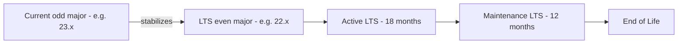
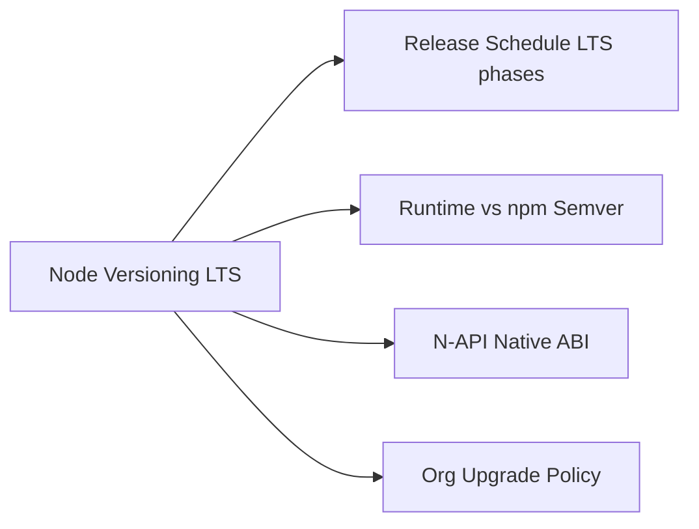
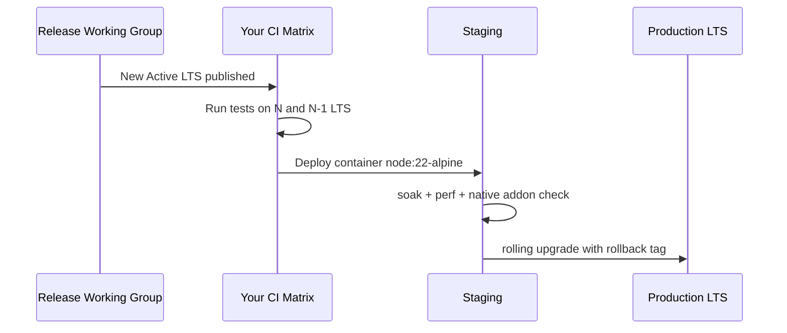

# Node Versioning LTS and Compatibility Policies

## Overview

Node.js releases on a **predictable calendar**: even-numbered majors become **LTS** (Long-Term Support) for production; odd majors are **Current** feature lines. Semver governs the **npm package** `node` distribution, but application developers care about **runtime behavior changes**, **deprecations**, **OpenSSL/V8 upgrades**, and **native addon ABI** (N-API) compatibility.

This note explains how to read Node's version matrix, pin versions in CI and containers, interpret breaking changes vs. semver-major releases, and plan upgrades without surprise production outages.

## Learning Objectives

- Interpret Node version numbers (major, LTS codenames, EOL dates)
- Distinguish semver for npm packages vs. compatibility guarantees for the runtime
- Explain N-API stability for native addons across Node majors
- Design an org policy: Current vs. LTS, upgrade cadence, smoke tests
- Map Node release changes to operational risk (OpenSSL, undici, permission flags)

## Prerequisites

- [[06-NodeJS/00-Orientation/Why Node.js Exists|Why Node.js Exists]]
- [[06-NodeJS/00-Orientation/Deno Bun and WinterCG Portability|Deno Bun and WinterCG Portability]]
- [[16-DevOps/README|DevOps]] — containers and CI (conceptual)

## Difficulty

`intermediate`

## Estimated Time

- Reading: 1.5 hours
- Exercises: 1 hour
- Mini project: 2 hours

## History

Early Node used rapid 0.x iterations with frequent breaking API changes. **Node 4** (2015) established even/odd release roles. **LTS** branches receive security fixes for ~30 months; **Current** receives new features first. The **Node.js Release Working Group** publishes schedules; enterprises standardized on LTS after painful 0.10 → 0.12 → 4 migrations. **N-API** (Node 8+) decoupled native addons from V8 internals, reducing rebuild pain across majors.

## Problem It Solves

- **Production drift**: dev on Latest, prod on EOL Node → missing security patches
- **Native module breaks**: `node-gyp rebuild` after every major bump
- **Silent behavior changes**: undici/fetch default, unhandled rejection terminating process
- **Compliance**: auditors ask for supported runtime proof

## Internal Implementation

### Release line model



| Phase | Support | Typical use |
| --- | --- | --- |
| Current | New features, shorter support | Library authors, early adopters |
| Active LTS | Features frozen, fixes + semver-minor | Production default |
| Maintenance LTS | Critical fixes only | Slow-moving enterprises |
| EOL | No patches | Migration mandatory |

Check the official Node release schedule for exact dates—this note uses the model, not a live calendar.

### What semver-major Node can change

- V8 upgrade → JS performance characteristics, deprecated syntax removal
- OpenSSL bump → TLS cipher defaults, certificate validation
- Deprecation → `--pending-deprecation`, `--throw-deprecation` for CI gates
- Default behavior → e.g., `--unhandled-rejections=throw` became default in newer lines

npm **library** semver (`^1.2.3`) does not protect you from Node runtime changes affecting `fs`, `fetch`, or timers.

### N-API and native addons

**N-API** (ABI-stable C interface) lets prebuilt binaries target a known N-API version rather than a specific Node major—if authors ship N-API builds. Addons using raw V8 headers still require per-major rebuilds.

## Mermaid Diagrams

### Structure



### Sequence / Lifecycle — upgrade rollout



## Examples

### Minimal Example — read runtime version

```typescript
// Node 20+ / TypeScript 5+
// Portability: Node-only.
import { version, versions } from "node:process";

console.log({
  release: version,        // e.g. v20.15.0
  node: versions.node,
  modules: versions.modules, // ABI module version for native addons
  napi: versions.napi,
});
```

### Production-Shaped Example — enforce LTS in startup guard

```typescript
// Node 20+ / TypeScript 5+
// Fail fast in prod if running unsupported major (adjust MIN/MAX to org policy).
const [major] = process.versions.node.split(".").map(Number);

const MIN_LTS_MAJOR = 20;
const MAX_TESTED_MAJOR = 22;

if (process.env.NODE_ENV === "production") {
  if (major < MIN_LTS_MAJOR || major > MAX_TESTED_MAJOR) {
    console.error(
      JSON.stringify({
        event: "unsupported_node_major",
        major,
        allowed: [MIN_LTS_MAJOR, MAX_TESTED_MAJOR],
      }),
    );
    process.exit(1);
  }
}
```

Pair with `.nvmrc`, `engines` in `package.json`, and CI matrix:

```json
{
  "engines": {
    "node": ">=20.10.0 <23"
  }
}
```

Container pinning (DevOps handoff): use digest-pinned `node:22-bookworm-slim` images, not floating `latest`.

## Trade-offs

| Dimension | Upside | Downside | When it matters |
| --- | --- | --- | --- |
| LTS pinning | Predictable patches | Miss new APIs until upgrade | Regulated prod |
| Current tracking | Early feature access | More frequent breakages | Library maintainers |
| Strict engines field | Prevents drift | Local dev friction | Monorepos |
| N-API addons | Smoother major upgrades | Not all deps support it | bcrypt, sharp, orms |

### When to Use

- **Active LTS** for all production services unless explicit exception
- CI matrix on current LTS and next LTS during migration windows
- `engines` + `.nvmrc` + container tag trinity for reproducibility

### When Not to Use

- Do not chase every Current odd major in production on day zero
- Do not ignore Maintenance EOL dates—plan migration 3–6 months ahead

## Exercises

1. Look up the current Node release schedule; map Active LTS and EOL for your production major.
2. Explain difference between `process.version` and `process.versions.modules`.
3. Enable `--pending-deprecation` in CI and triage one warning to root cause.
4. Simulate native addon failure by upgrading major without rebuild—document fix.
5. Draft an org policy: upgrade within 90 days of new Active LTS.

## Mini Project

**Version gate action.** Create a CI step that reads `package.json` engines, runs `node -v`, and fails with actionable message. Add matrix jobs for two LTS lines.

## Portfolio Project

Document Node version policy for [[06-NodeJS/projects/Node Runtime Toolkit/README|Node Runtime Toolkit]] including native dependency inventory and N-API status.

## Interview Questions

1. What is the difference between Node Current and LTS?
2. Why doesn't npm package semver protect you from Node runtime upgrades?
3. What is N-API and who benefits?
4. How would you roll out Node 22 LTS across 200 microservices?
5. Name three runtime-level changes that can break apps without API removals.

### Stretch / Staff-Level

1. How do OpenSSL upgrades in Node affect TLS connectivity to legacy clients?
2. Compare pinning Node in containers vs. relying on platform Node (PaaS)—operational trade-offs.

## Common Mistakes

- Using `node:latest` Docker tags in production
- Testing only on developers' newest local Node
- Ignoring `engines` warnings with `npm install --force`
- Assuming native addons "just work" after major bump

## Best Practices

- Standardize on Active LTS; track EOL calendar in ticketing system
- Run integration tests on upgrade candidates with production-like native deps
- Log `process.version` at startup in structured logs
- Use feature detection over version sniffing when possible
- Coordinate with [[16-DevOps/README|DevOps]] for image rebuild cadence

## Summary

Node versioning separates fast-moving Current releases from production-grade LTS lines with defined support windows. Runtime upgrades can change behavior through engines, TLS, and defaults even when application code is unchanged—native addons add ABI risk mitigated by N-API. Operational excellence means pinning LTS in containers, enforcing `engines`, testing matrix upgrades, and planning migrations before EOL.

## Further Reading

- [[00-References/NodeJS/README|Node.js References]]
- Node.js Release Working Group schedule
- N-API stability documentation
- Node CHANGELOG for behavior change archaeology

## Related Notes

- [[06-NodeJS/00-Orientation/Deno Bun and WinterCG Portability|Deno Bun and WinterCG Portability]]
- [[06-NodeJS/01-Process-and-Runtime/NODE_OPTIONS and Runtime Flags|NODE_OPTIONS and Runtime Flags]]
- [[06-NodeJS/03-Modules-and-Loading/Native Addons and N-API Concepts|Native Addons and N-API Concepts]]
- [[16-DevOps/README|DevOps]]
- [[07-Backend/README|Backend]]

## Progress Checklist

- [ ] Explained from first principles
- [ ] Drew at least one Mermaid diagram
- [ ] Implemented a minimal version
- [ ] Documented trade-offs and non-goals
- [ ] Completed exercises
- [ ] Practiced interview questions aloud
- [ ] Linked prerequisites and dependents
