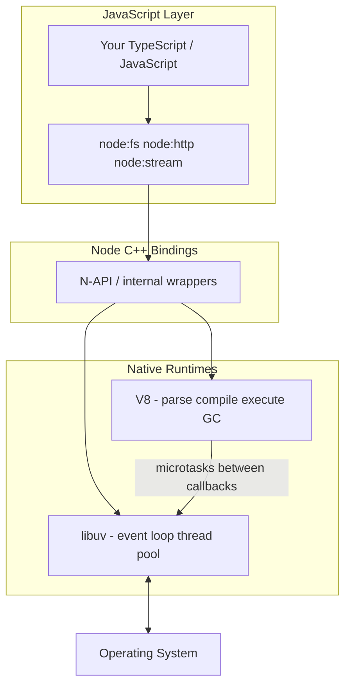
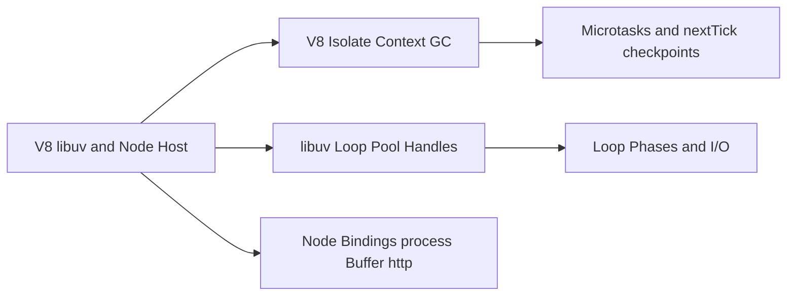
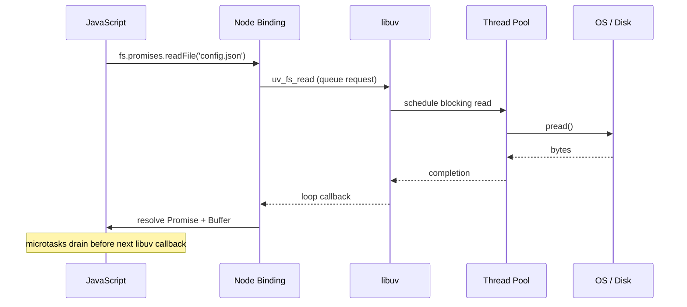

# V8 libuv and the Node Host

## Overview

Node.js is a **native host program** composed of three cooperating layers: **V8** executes ECMAScript, **libuv** multiplexes OS I/O and runs a thread pool, and **Node's C++ bindings** expose `process`, `Buffer`, `fs`, `http`, and other APIs to JavaScript. None of these three is "Node" alone—the **host contract** is how they schedule work, allocate memory, and surface errors.

This note maps that stack from first principles: isolates and contexts, how libuv wakes the loop, where microtasks drain relative to libuv phases, and which failures originate in V8 vs. libuv vs. user code. Promise *language* semantics belong to [[02-JavaScript/05-Async-and-Concurrency/Promises Internals|Promises Internals]]; here we focus on **host scheduling around** those jobs.

## Learning Objectives

- Diagram V8, libuv, and Node bindings as distinct responsibilities
- Explain `Isolate`, `Context`, and `globalThis` in embedding terms
- Describe how an async `fs.read` crosses JS → native → libuv → kernel → callback
- Predict where GC, thread-pool work, and JavaScript execution interleave
- Identify portability boundaries between Node, Deno, and Bun at the host layer

## Prerequisites

- [[06-NodeJS/00-Orientation/Why Node.js Exists|Why Node.js Exists]]
- [[02-JavaScript/00-Orientation/ECMAScript Engines and Host Runtimes|ECMAScript Engines and Host Runtimes]]
- [[02-JavaScript/04-Engines-and-Memory/Garbage Collection in JavaScript|Garbage Collection in JavaScript]]

## Difficulty

`intermediate`

## Estimated Time

- Reading: 2 hours
- Exercises: 2 hours
- Mini project: 4 hours

## History

**V8** (2008, Google) targeted Chrome with a JIT-capable engine and a C++ embedding API. **libuv** (originally Node-only, now shared) abstracted Windows IOCP vs. Unix `epoll`/`kqueue`. Node's early architecture placed almost all I/O in libuv and almost all JavaScript in V8, connected by **binding layers** (`node_file`, `node_http2`, etc.). Over time, Node integrated **V8 microtask checkpoints** explicitly between libuv callbacks, added **worker threads** (separate isolates), and adopted **Web-standard APIs** (`fetch`, Web Crypto) implemented in C++ or bundled native deps (e.g., undici).

## Problem It Solves

- **Cross-platform I/O**: one libuv API over divergent OS primitives
- **Safe embedding**: V8 isolates prevent guest scripts from corrupting host memory
- **Predictable scheduling**: a single event-loop driver coordinates timers, I/O completions, and JS execution
- **Observability hooks**: diagnostics channels, async hooks, and inspector protocol bridge JS and native

Without understanding the split, developers blame "JavaScript slowness" for thread-pool exhaustion, or "Node bugs" for V8 GC pauses—both are host-level phenomena with different mitigations.

## Internal Implementation

### Layered architecture



### V8 embedding concepts

| Concept | Role in Node |
| --- | --- |
| **Isolate** | Independent VM heap and compiler pipeline; main thread + each `worker_thread` has one |
| **Context** | Global environment inside an isolate; `vm.createContext` adds realms |
| **Handle scope** | C++ RAII for V8 object lifetimes during binding calls |
| **Microtask checkpoint** | Drains promise jobs; Node also runs `process.nextTick` queue first |

V8 executes **run-to-completion** turns on the JS thread. See [[02-JavaScript/05-Async-and-Concurrency/Run to Completion and Event Loop|Run to Completion and Event Loop]] for language-level job rules.

### libuv responsibilities

- **Event loop phases**: timers, pending, poll, check, close (detailed in [[06-NodeJS/02-Event-Loop-and-libuv/Event Loop Phases|Event Loop Phases]])
- **Handles**: persistent objects representing sockets, timers, TTYs ([[06-NodeJS/02-Event-Loop-and-libuv/Handles and Requests|Handles and Requests]])
- **Requests**: one-shot async work (e.g., thread-pool `fs` operations)
- **Thread pool**: default size 4; configurable via `UV_THREADPOOL_SIZE` ([[06-NodeJS/02-Event-Loop-and-libuv/Thread Pool and Blocking Work|Thread Pool and Blocking Work]])

### Crossing the boundary: async file read

1. JS calls `fs.promises.readFile(path)` 
2. Binding validates args, allocates a `uv_fs_t` request
3. libuv queues work to thread pool (read is blocking at OS level)
4. Pool thread runs `pread`; on completion, libuv posts callback to loop
5. Binding copies bytes into a `Buffer`, resolves a Promise (microtasks drain before next libuv callback)

## Mermaid Diagrams

### Structure



### Sequence / Lifecycle — async read path



## Examples

### Minimal Example — observe host metadata

```typescript
// Node 20+ / TypeScript 5+
// Portability: Node-only (`process.versions`).
import { versions, arch, platform } from "node:process";

console.log({
  node: versions.node,
  v8: versions.v8,
  uv: versions.uv,       // libuv version linked into this binary
  napi: versions.napi,   // N-API version for native addons
  arch,
  platform,
});
```

### Production-Shaped Example — isolate-aware worker offload sketch

```typescript
// Node 20+ / TypeScript 5+
// Portability: Node-only (`worker_threads`). Each Worker = new V8 Isolate.
import { Worker, isMainThread, parentPort, workerData } from "node:worker_threads";

if (isMainThread) {
  export async function hashInWorker(payload: string): Promise<string> {
    return new Promise((resolve, reject) => {
      const w = new Worker(new URL(import.meta.url), {
        workerData: payload,
      });
      w.on("message", resolve);
      w.on("error", reject);
      w.on("exit", (code) => {
        if (code !== 0) reject(new Error(`worker exited ${code}`));
      });
    });
  }
} else {
  // CPU work here does NOT block the main isolate's event loop.
  import { createHash } from "node:crypto";
  const digest = createHash("sha256").update(workerData).digest("hex");
  parentPort!.postMessage(digest);
}
```

Full worker patterns: [[06-NodeJS/06-Concurrency-and-Scaling/worker_threads Model|worker_threads Model]].

## Trade-offs

| Dimension | Upside | Downside | When it matters |
| --- | --- | --- | --- |
| V8 JIT | Fast warm JS | GC pauses, deopt cliffs | Latency-sensitive APIs |
| libuv abstraction | Portable I/O | Lowest-level OS tuning hidden | Edge tuning (SO_REUSEPORT) |
| Single main isolate | Simple mental model | CPU + GC on one thread | Throughput vs. tail latency |
| Native addons (N-API) | Performance, legacy libs | ABI/version coupling | Crypto, DB drivers |

### When to Use

- Default mental model for diagnosing stalls: *is it JS, GC, libuv poll, or thread pool?*
- Choosing worker isolates when CPU would block the main loop

### When Not to Use

- Do not reach for native addons before profiling JS and thread-pool saturation
- Do not assume `fetch` and `fs` share the same libuv path—they use different native stacks

## Exercises

1. Print `process.versions` and research what each component (uv, zlib, openssl) provides.
2. Trace a `setTimeout` and a `fs.readFile` through the diagrams above; identify where each enters libuv.
3. Run Node with `--trace-gc` briefly and correlate GC lines with request latency spikes.
4. Spawn a Worker and verify separate thread IDs via `worker_threads.threadId`.
5. Explain why `process.nextTick` is Node-specific while `queueMicrotask` is ECMAScript.

## Mini Project

**Host stack tracer.** Build a script that logs timestamps for: timer callback, `queueMicrotask`, `process.nextTick`, and `fs.readFile` completion—in one turn sequence. Compare ordering to [[06-NodeJS/02-Event-Loop-and-libuv/process.nextTick vs Microtasks vs Timers|process.nextTick vs Microtasks vs Timers]].

## Portfolio Project

Document the host stack for [[06-NodeJS/projects/Node Runtime Toolkit/README|Node Runtime Toolkit]]: which subsystems own timers, I/O, logging, and shutdown.

## Interview Questions

1. What are V8 isolates and contexts? How do Workers relate?
2. What does libuv do that V8 does not?
3. Walk through an async `fs.readFile` from JS to disk and back.
4. Where do microtasks run relative to libuv callbacks in Node?
5. What is N-API and why does Node promote it over raw V8 APIs?

### Stretch / Staff-Level

1. How does libuv choose between `epoll`, `kqueue`, and IOCP?
2. Explain how a native addon bug can crash the entire process despite JS "try/catch."

## Common Mistakes

- Treating Node as pure JavaScript with no native layer
- Ignoring `UV_THREADPOOL_SIZE` when many concurrent crypto/fs ops queue up
- Creating excessive Workers (each carries isolate overhead)
- Confusing V8 heap limits with process RSS

## Best Practices

- Profile with `--inspect`, `perf_hooks`, and loop-delay metrics before optimizing
- Offload CPU to workers; keep main isolate for orchestration and I/O
- Pin Node LTS versions in production; native ABI ties to Node major ([[06-NodeJS/00-Orientation/Node Versioning LTS and Compatibility Policies|Node Versioning LTS and Compatibility Policies]])
- Cross-link language async docs instead of duplicating promise mechanics

## Summary

The Node host is V8 plus libuv plus bindings: V8 runs ECMAScript in isolates with GC and microtask checkpoints; libuv drives the event loop, socket polling, and a blocking-work thread pool; Node's C++ layer translates between them and exposes stable JavaScript APIs. Every async operation is a round trip across that boundary—understanding the trip is how you diagnose blocked loops, pool starvation, and GC tail latency in production.

## Further Reading

- [[00-References/NodeJS/README|Node.js References]]
- libuv design overview documentation
- V8 embedder's guide (`Isolate`, `Context`, microtasks)
- [[02-JavaScript/04-Engines-and-Memory/Garbage Collection in JavaScript|Garbage Collection in JavaScript]]

## Related Notes

- [[06-NodeJS/02-Event-Loop-and-libuv/libuv Architecture Overview|libuv Architecture Overview]]
- [[06-NodeJS/02-Event-Loop-and-libuv/Event Loop Phases|Event Loop Phases]]
- [[02-JavaScript/00-Orientation/ECMAScript Engines and Host Runtimes|ECMAScript Engines and Host Runtimes]]
- [[02-JavaScript/05-Async-and-Concurrency/Tasks Microtasks and Rendering|Tasks Microtasks and Rendering]]
- [[01-Computer-Science/06-IO-and-Persistence/Blocking Nonblocking and Multiplexed IO|Blocking Nonblocking and Multiplexed IO]]

## Progress Checklist

- [ ] Explained from first principles
- [ ] Drew at least one Mermaid diagram
- [ ] Implemented a minimal version
- [ ] Documented trade-offs and non-goals
- [ ] Completed exercises
- [ ] Practiced interview questions aloud
- [ ] Linked prerequisites and dependents
