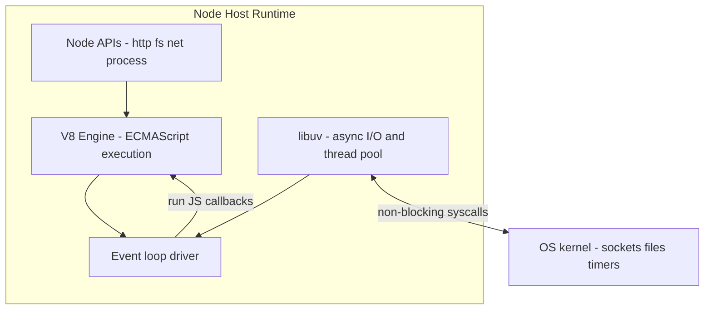
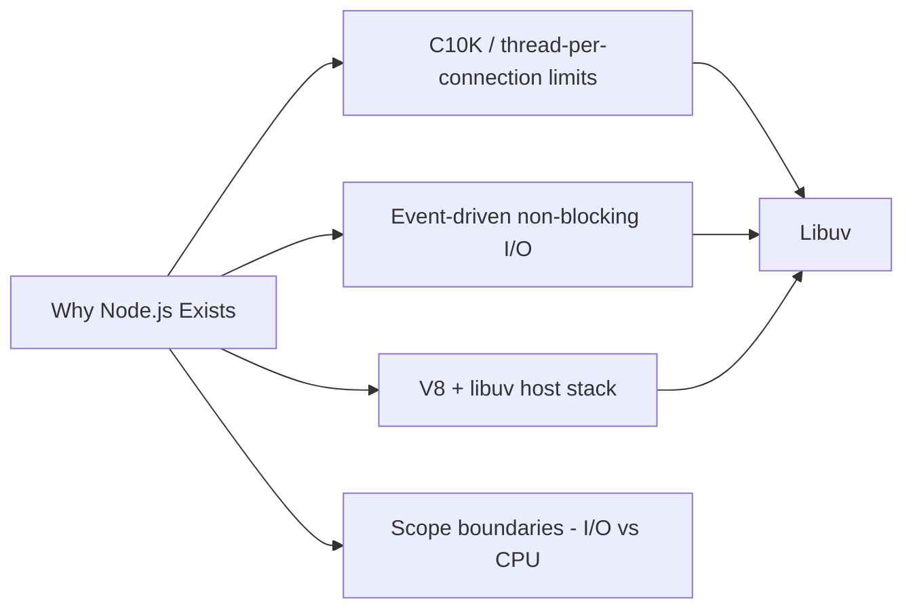
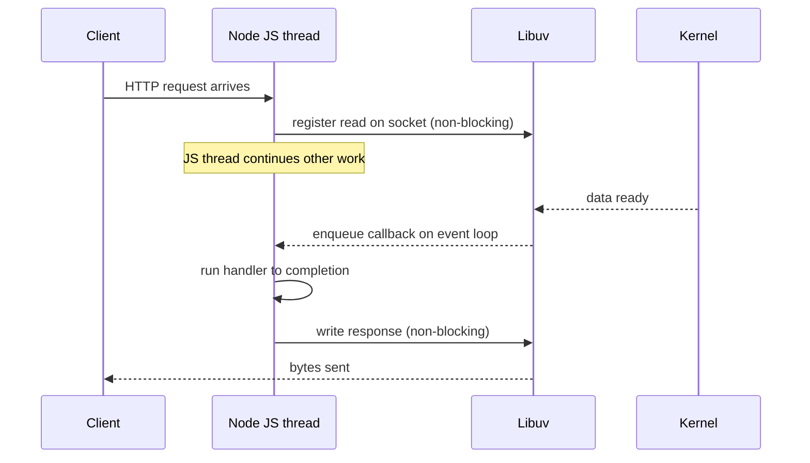

# Why Node.js Exists

## Overview

**Node.js** is a server-side **host runtime** that embeds the V8 JavaScript engine and drives I/O through **libuv**. It was created to answer a specific systems question: *how do you build network services that handle thousands of concurrent connections without allocating a thread per connection?*

Node's answer is **non-blocking, event-driven I/O on a single JavaScript thread**, with a small thread pool for blocking kernel work. That design trades away CPU parallelism on the main thread in exchange for predictable memory use, low context-switch overhead, and a programming model where I/O completion is expressed as callbacks, promises, and streams—not blocking syscalls inside request handlers.

This note explains the historical constraints, the failure modes of thread-per-connection servers, and why Node remains relevant even as runtimes multiply (Deno, Bun). It establishes the **host contract** that every later Node topic assumes.

## Learning Objectives

- Explain the C10K problem and why thread-per-connection servers break at scale
- Articulate Node's core bet: single-threaded JS + non-blocking I/O via libuv
- Distinguish what Node optimizes for (I/O-bound concurrency) vs. what it does not (CPU-bound parallelism on the main thread)
- Map Node's design to first-principles concurrency models from Computer Science
- Recognize when Node is the wrong tool—and what to use instead

## Prerequisites

- [[02-JavaScript/04-Engines-and-Memory/Host Environments and Web APIs|Host Environments and Web APIs]]
- [[01-Computer-Science/05-Concurrency-Fundamentals/Asynchronous Event-Driven Models|Asynchronous Event-Driven Models]]
- [[01-Computer-Science/06-IO-and-Persistence/Blocking Nonblocking and Multiplexed IO|Blocking Nonblocking and Multiplexed IO]]

## Difficulty

`beginner`

## Estimated Time

- Reading: 1.5 hours
- Exercises: 1 hour
- Mini project: 3 hours

## History

Before Node (2009), server-side JavaScript was rare. **Ryan Dahl** observed that Apache-style and early Java/.NET servers often used **one OS thread per connection**. Under load, that model hits three walls:

1. **Memory**: each thread needs a stack (often 1–8 MB) plus kernel bookkeeping.
2. **Scheduling**: thousands of threads mean constant context switches; most threads are blocked waiting on I/O anyway.
3. **Programming complexity**: shared mutable state across threads invites races unless you invest heavily in locking.

Browsers already solved a related problem: one UI thread, non-blocking network and timer APIs, event callbacks. Dahl combined **V8** (fast, embeddable ECMAScript) with **libuv** (cross-platform async I/O: epoll/kqueue/IOCP, thread pool) and a small set of host APIs (`http`, `fs`, `net`). The result was a runtime where a single process could juggle many idle connections cheaply.

Node's early demos—a web server in ~20 lines, real-time chat, streaming proxies—showed that **developer ergonomics and operational efficiency could align** for I/O-heavy workloads. npm (2010) accelerated adoption by making dependency sharing trivial, for better and worse.

## Problem It Solves

| Failure mode (pre-Node patterns) | Node's approach |
| --- | --- |
| Thread explosion under concurrent idle connections | One JS thread + multiplexed I/O (see [[01-Computer-Science/06-IO-and-Persistence/Blocking Nonblocking and Multiplexed IO|Blocking Nonblocking and Multiplexed IO]]) |
| Blocking the server thread on disk/network | libuv async APIs; completion callbacks enqueue work on the event loop |
| Language fragmentation on the server | Reuse JavaScript skills and eventually share isomorphic code with browsers |
| Slow iteration on network services | Dynamic language + rich stdlib for HTTP, streams, crypto |

Node does **not** solve CPU-bound parallelism on the main thread. That limitation is intentional—it forces explicit offload to `worker_threads`, child processes, or external services (see [[06-NodeJS/06-Concurrency-and-Scaling/Choosing Threads Processes and Offload|Choosing Threads Processes and Offload]]).

## Internal Implementation

### The host contract (high level)



Node is not "JavaScript that runs on servers." It is a **native program** that embeds V8, registers C++ bindings, and schedules JavaScript when I/O completes. ECMAScript semantics (promises, `async/await`) live in the language layer—see [[02-JavaScript/05-Async-and-Concurrency/Promises Internals|Promises Internals]]—while **when** I/O callbacks fire is libuv's responsibility.

### Why JavaScript specifically?

- **Embed-friendly**: V8 exposes a stable embedding API (`Isolate`, `Context`).
- **Event-loop-native ecosystem**: closures and first-class functions map cleanly to callback-oriented I/O (pre-`async/await` era).
- **JSON ubiquity**: web APIs increasingly exchange JSON; dynamic objects reduce boilerplate.

Trade-off: no static types at runtime (TypeScript is compile-time), and single-threaded JS means CPU work must be managed deliberately.

## Mermaid Diagrams

### Structure



### Sequence / Lifecycle — request handling model



## Examples

### Minimal Example — I/O concurrency without threads

```typescript
// Node 20+ / TypeScript 5+
// Portability: Node-only (`node:http`). Deno/Bun have compatible APIs with import differences.
import { createServer } from "node:http";

const server = createServer((req, res) => {
  // This handler must not block the event loop with sync CPU or sync fs.
  res.writeHead(200, { "content-type": "text/plain" });
  res.end(`pid=${process.pid} at ${Date.now()}\n`);
});

server.listen(3000, () => {
  console.log("listening on :3000");
});
```

One process, one JS thread, many concurrent connections—each socket registered with libuv.

### Production-Shaped Example — where Node shines vs. struggles

```typescript
// Node 20+ / TypeScript 5+
// Good fit: I/O-bound proxy with backpressure awareness (details in streams module).
import { createServer } from "node:http";
import { request as upstreamRequest } from "node:https";
import { pipeline } from "node:stream/promises";

createServer(async (req, res) => {
  const upstream = upstreamRequest("https://api.example.com/data", {
    method: req.method,
    headers: { accept: "application/json" },
  });

  upstream.on("response", (upRes) => {
    res.writeHead(upRes.statusCode ?? 502, upRes.headers);
    // pipeline propagates errors and respects backpressure
    pipeline(upRes, res).catch((err) => {
      if (!res.headersSent) res.writeHead(502);
      res.end();
      console.error("proxy pipeline failed", err);
    });
  });

  upstream.on("error", (err) => {
    console.error("upstream error", err);
    if (!res.headersSent) res.writeHead(502);
    res.end();
  });

  req.pipe(upstream); // forward body without buffering entire payload in RAM
}).listen(3000);

// BAD on main thread: JSON.parse on a 500 MB sync-read file, image transcoding,
// bcrypt rounds in the request path without worker offload.
```

Product-level HTTP frameworks (routing, middleware, OpenAPI) belong to [[07-Backend/README|Backend]]; this track owns the **runtime primitives** underneath.

## Trade-offs

| Dimension | Upside | Downside | When it matters |
| --- | --- | --- | --- |
| Concurrency model | Cheap idle connections | Main-thread CPU blocks all clients | Chat, APIs, proxies |
| Memory | One JS heap, shared code | Single process OOM kills everything | Small/medium services |
| Ecosystem | npm, tooling, hiring pool | Supply-chain risk, dependency weight | Enterprise adoption |
| Language | Fast iteration, isomorphic JS | Runtime type errors without TS discipline | Large codebases |
| Parallelism | Workers/cluster available | Not automatic; design required | CPU-heavy transforms |

### When to Use

- I/O-bound network services: APIs, BFFs, gateways, websockets, streaming ETL
- Real-time systems with many mostly-idle connections
- Teams already standardized on JavaScript/TypeScript

### When Not to Use

- CPU-bound workloads on the hot path without worker/process offload (ML inference, video encode)
- Hard real-time guarantees (GC pauses, event-loop stalls)
- When a simpler operational model (e.g., stateless functions with managed scaling) fits better—still often Node under the hood

## Exercises

1. Draw a diagram comparing thread-per-connection vs. event-loop concurrency for 10,000 idle websocket clients. Estimate memory for 1 MB stacks alone.
2. Write a minimal HTTP server and verify with `ab` or `curl` that one process handles concurrent requests. Observe `process.pid` stays constant.
3. Add a 5-second **synchronous** busy loop in a handler and measure how other requests stall—connect to [[06-NodeJS/02-Event-Loop-and-libuv/Starvation Backpressure and Loop Health|Starvation Backpressure and Loop Health]].
4. List three workloads in your domain that are I/O-bound vs. CPU-bound; justify Node fit for each.
5. Read the Node.js README mission statement and map each claim to a libuv or V8 mechanism.

## Mini Project

**Concurrent echo server lab.** Build a TCP echo server using `node:net` that accepts 1,000 concurrent clients sending periodic messages. Log connection count and event-loop delay (introduce `perf_hooks` later). Document when latency spikes if you inject sync work. Store artifacts under [[06-NodeJS/code/README|Node.js code labs]].

## Portfolio Project

Extend the [[06-NodeJS/projects/HTTP Server From Scratch/README|HTTP Server From Scratch]] mini project with a one-page design doc explaining *why* your server uses non-blocking sockets and where you would add worker offload for CPU tasks.

## Interview Questions

1. What problem was Node.js created to solve? How does it differ from Apache-style threading?
2. Why embed V8 instead of inventing a new language?
3. What does "non-blocking I/O" mean at the syscall level?
4. When is Node a poor choice for a backend service?
5. How does Node relate to the browser JavaScript event loop?

### Stretch / Staff-Level

1. Compare Node's model to Go goroutines and Erlang processes for a gateway handling 50k idle connections.
2. How did npm's design accelerate Node adoption, and what operational risks came with it?

## Common Mistakes

- Assuming Node is "multithreaded JavaScript" on the main thread
- Using Node for CPU-heavy work without measuring event-loop lag
- Conflating "JavaScript everywhere" with "same code everywhere"—host APIs differ
- Blaming V8 for I/O stalls that are sync `fs.*Sync` or unbounded in-memory buffering

## Best Practices

- Classify workloads as I/O-bound vs. CPU-bound before choosing Node
- Measure event-loop delay and p99 latency under load, not just throughput
- Keep handlers non-blocking; stream large payloads
- Use TypeScript for production services; treat types as operational documentation
- Hand off framework/product concerns to [[07-Backend/README|Backend]] after mastering runtime primitives

## Summary

Node.js exists because thread-per-connection servers do not scale to large numbers of concurrent, mostly-idle network clients. By embedding V8 and driving I/O through libuv's non-blocking, event-driven model, Node makes one process cheaply juggle many connections—at the cost of requiring disciplined handling of CPU work and backpressure. Understanding *why* that bet was made is the foundation for every later topic: lifecycle, loop phases, streams, workers, and production shutdown.

## Further Reading

- [[00-References/NodeJS/README|Node.js References]]
- Ryan Dahl's original Node.js presentation (2009)
- [[01-Computer-Science/05-Concurrency-Fundamentals/Asynchronous Event-Driven Models|Asynchronous Event-Driven Models]]
- [[01-Computer-Science/06-IO-and-Persistence/Blocking Nonblocking and Multiplexed IO|Blocking Nonblocking and Multiplexed IO]]

## Related Notes

- [[06-NodeJS/00-Orientation/V8 libuv and the Node Host|V8 libuv and the Node Host]]
- [[06-NodeJS/00-Orientation/Node Program Lifecycle|Node Program Lifecycle]]
- [[02-JavaScript/04-Engines-and-Memory/Host Environments and Web APIs|Host Environments and Web APIs]]
- [[02-JavaScript/05-Async-and-Concurrency/Run to Completion and Event Loop|Run to Completion and Event Loop]]
- [[01-Computer-Science/05-Concurrency-Fundamentals/Asynchronous Event-Driven Models|Asynchronous Event-Driven Models]]
- [[07-Backend/README|Backend]] — product APIs and framework layer

## Progress Checklist

- [ ] Explained from first principles
- [ ] Drew at least one Mermaid diagram
- [ ] Implemented a minimal version
- [ ] Documented trade-offs and non-goals
- [ ] Completed exercises
- [ ] Practiced interview questions aloud
- [ ] Linked prerequisites and dependents
