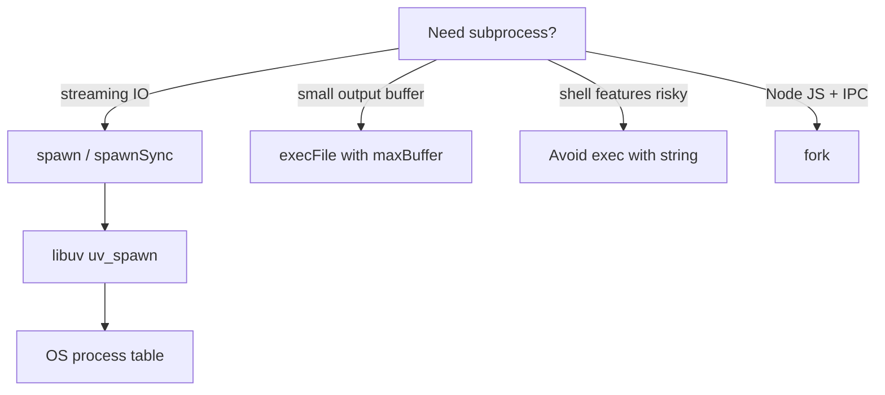
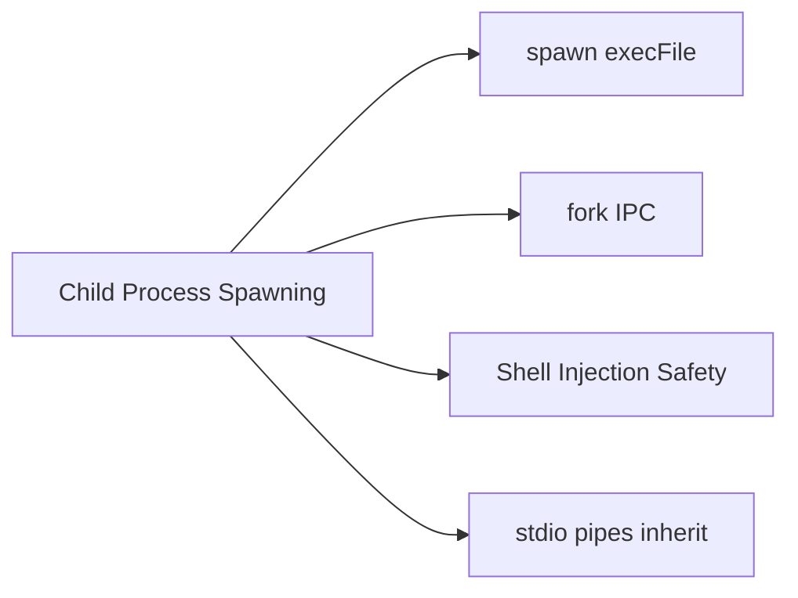
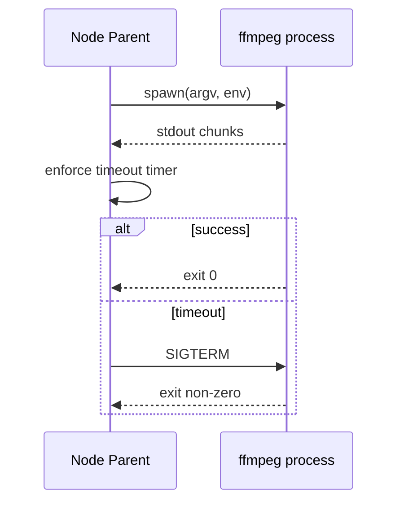

# Child Process Spawning Basics

## Overview

Node can create **child OS processes** via `node:child_process`—running shell commands, other binaries, or additional Node instances. **`spawn`** streams stdio; **`exec`** buffers output; **`fork`** is Node-specialized with IPC channel. Child processes are the escape hatch when you need **process isolation**, legacy CLI tools, or CPU work without blocking the event loop—distinct from `worker_threads` ([[06-NodeJS/06-Concurrency-and-Scaling/worker_threads Model|worker_threads Model]]).

This note covers spawning mechanics, stdio inheritance, exit handling, and failure modes (shell injection, zombie children, runaway buffers).

## Learning Objectives

- Choose among `spawn`, `exec`, `execFile`, and `fork`
- Pass argv and env safely without shell injection
- Stream or cap child stdout/stderr
- Handle exit codes and signals; propagate failures to parent
- Know when workers beat child processes and vice versa

## Prerequisites

- [[06-NodeJS/01-Process-and-Runtime/Process argv env and stdio|Process argv env and stdio]]
- [[01-Computer-Science/04-Processes-and-Execution/Process Creation and Termination|Process Creation and Termination]]
- [[06-NodeJS/01-Process-and-Runtime/Signals Exit Codes and Lifecycle Hooks|Signals Exit Codes and Lifecycle Hooks]]

## Difficulty

`intermediate`

## Estimated Time

- Reading: 2 hours
- Exercises: 2 hours
- Mini project: 4 hours

## History

Node's `child_process` module dates to early releases—before `worker_threads` (Node 10). `fork` enabled cluster-style multi-process servers ([[06-NodeJS/06-Concurrency-and-Scaling/cluster and Multi-Process Scaling|cluster and Multi-Process Scaling]]). Security incidents from `exec('rm -rf ' + userInput)` cemented **`spawn` with argv array** as the safe default.

## Problem It Solves

- **Shell out to proven tools** (ffmpeg, git, openssl) without reimplementing in JS
- **Process isolation** — child crash doesn't kill parent (modulo shared resources)
- **Extra CPU cores** via multiple Node processes vs. one thread
- **Legacy integration** in brownfield systems

## Internal Implementation

### API selection



| API | Shell | stdio | Use when |
| --- | --- | --- | --- |
| `spawn(cmd, args)` | No (default) | streams | Long-running, large IO |
| `exec(cmd string)` | Yes | buffered | Legacy one-liners (discouraged) |
| `execFile(file, args)` | No | buffered | Short commands, capped output |
| `fork(modulePath)` | No | pipe + IPC | Node workers with messages |

### Parent/child lifecycle

1. Parent calls `spawn` → libuv creates pipes for stdio
2. Child runs; stdout/stderr data events on parent
3. Child exits → `close` event with code/signal
4. Parent must `await` completion or detach intentionally

## Mermaid Diagrams

### Structure



### Sequence / Lifecycle — spawn with timeout



## Examples

### Minimal Example — safe spawn

```typescript
// Node 20+ / TypeScript 5+
// Portability: Node-only (`node:child_process`).
import { spawn } from "node:child_process";

const child = spawn("node", ["--version"], { stdio: ["ignore", "pipe", "pipe"] });

child.stdout.on("data", (chunk: Buffer) => {
  process.stdout.write(chunk);
});

child.on("close", (code) => {
  process.exitCode = code ?? 1;
});
```

### Production-Shaped Example — execFile with limits and cancellation

```typescript
// Node 20+ / TypeScript 5+
import { execFile } from "node:child_process";
import { promisify } from "node:util";

const execFileAsync = promisify(execFile);

export async function runGitRevParse(cwd: string, signal?: AbortSignal): Promise<string> {
  const timeoutSignal = AbortSignal.timeout(5_000);
  const combined = signal ? AbortSignal.any([signal, timeoutSignal]) : timeoutSignal;

  const { stdout } = await execFileAsync(
    "git",
    ["rev-parse", "HEAD"], // argv array — no shell
    {
      cwd,
      maxBuffer: 1024 * 64,
      signal: combined,
      encoding: "utf8",
    },
  );
  return stdout.trim();
}

// NEVER: exec(`git rev-parse ${userBranch}`) — shell injection if userBranch is "; rm -rf /"
```

Advanced IPC: [[06-NodeJS/06-Concurrency-and-Scaling/child_process IPC Patterns|child_process IPC Patterns]].

## Trade-offs

| Dimension | Upside | Downside | When it matters |
| --- | --- | --- | --- |
| spawn vs worker | OS isolation | Higher startup cost | untrusted code |
| Buffered exec | Simple API | OOM on huge output | log tail commands |
| fork | Built-in IPC | Duplicate Node memory | cluster |
| Shell exec | Convenient | Injection risk | never with user input |

### When to Use

- `spawn`/`execFile` for CLI tools with argv arrays and timeouts
- `fork` for Node-based worker processes with message passing
- Exit code propagation to fail CI/build steps

### When Not to Use

- Do not `exec` string commands with interpolated user input
- Do not spawn per request at high QPS without pooling
- Prefer `worker_threads` for CPU-heavy JS on shared heap boundaries

## Exercises

1. Spawn `sleep 2` and kill with SIGTERM before natural exit—observe signal in `close` event.
2. Compare memory when buffering 100 MB stdout via `exec` vs. streaming `spawn`.
3. Use `fork` to run a script that sends `{ ok: true }` via `process.send`.
4. Demonstrate shell injection with unsafe `exec` and fix with `spawn`.
5. Propagate child non-zero exit to parent `process.exitCode` in npm script chain.

## Mini Project

**Git metadata sidecar.** Async function running `git` commands via `execFile` with cwd, timeout, maxBuffer, structured error types.

## Portfolio Project

Compare child process vs. worker thread offload in [[06-NodeJS/projects/Worker Pool Lab/README|Worker Pool Lab]] decision doc.

## Interview Questions

1. Difference between `spawn` and `exec`?
2. Why is `exec(userInput)` dangerous?
3. When use `fork` instead of `worker_threads`?
4. How do you prevent buffer OOM from verbose child output?
5. What happens to parent's event loop while child runs?

### Stretch / Staff-Level

1. Design process pool for shelling out to ImageMagick under load—limits and backpressure.
2. Compare container PID 1 signal semantics when Node spawns children.

## Common Mistakes

- Shell interpolation of untrusted strings
- Ignoring stderr until mysterious failures
- No timeout → hung deploy pipelines
- Spawning thousands of children without reuse (fork bomb patterns)

## Best Practices

- `spawn`/`execFile` with argv arrays; `shell: false` explicitly when needed
- Stream stdio for large output; set `maxBuffer` when buffering
- Attach timeouts and kill trees on shutdown ([[06-NodeJS/01-Process-and-Runtime/Signals Exit Codes and Lifecycle Hooks|Signals Exit Codes and Lifecycle Hooks]])
- Log child pid, args (redacted secrets), exit code
- Choose workers vs. processes via [[06-NodeJS/06-Concurrency-and-Scaling/Choosing Threads Processes and Offload|Choosing Threads Processes and Offload]]

## Summary

Child processes extend Node with OS-level isolation and CLI integration. Safe spawning uses argv arrays without shell interpretation, streams or caps IO, handles exit codes explicitly, and respects timeouts. Use `fork` for Node IPC; prefer workers for in-process CPU; reserve subprocesses for tools, isolation, and multi-process scaling patterns.

## Further Reading

- [[00-References/NodeJS/README|Node.js References]]
- Node.js `child_process` documentation
- [[06-NodeJS/06-Concurrency-and-Scaling/child_process IPC Patterns|child_process IPC Patterns]]

## Related Notes

- [[06-NodeJS/06-Concurrency-and-Scaling/worker_threads Model|worker_threads Model]]
- [[06-NodeJS/06-Concurrency-and-Scaling/cluster and Multi-Process Scaling|cluster and Multi-Process Scaling]]
- [[01-Computer-Science/04-Processes-and-Execution/Process Creation and Termination|Process Creation and Termination]]
- [[18-Security/README|Security]]
- [[07-Backend/07-Caching-Jobs-and-Messaging/Background Jobs and Workers|Background Jobs and Workers]] · [[07-Backend/README|Backend]]

## Progress Checklist

- [ ] Explained from first principles
- [ ] Drew at least one Mermaid diagram
- [ ] Implemented a minimal version
- [ ] Documented trade-offs and non-goals
- [ ] Completed exercises
- [ ] Practiced interview questions aloud
- [ ] Linked prerequisites and dependents
