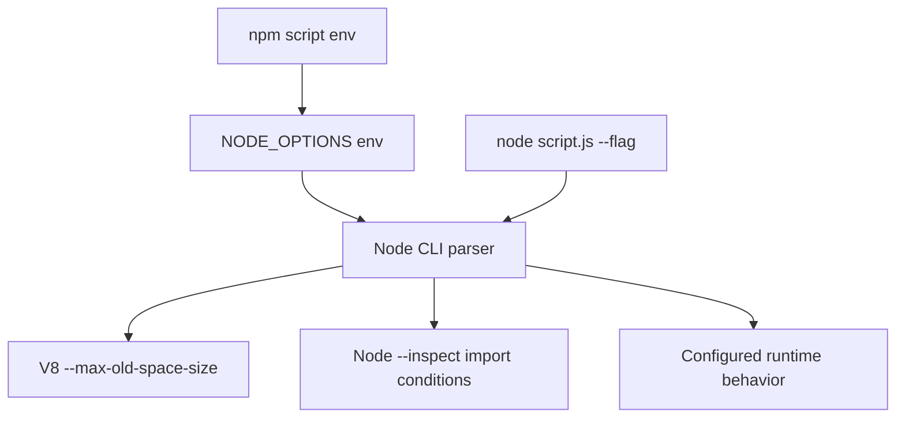
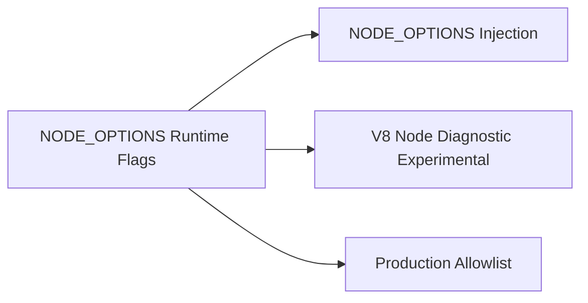
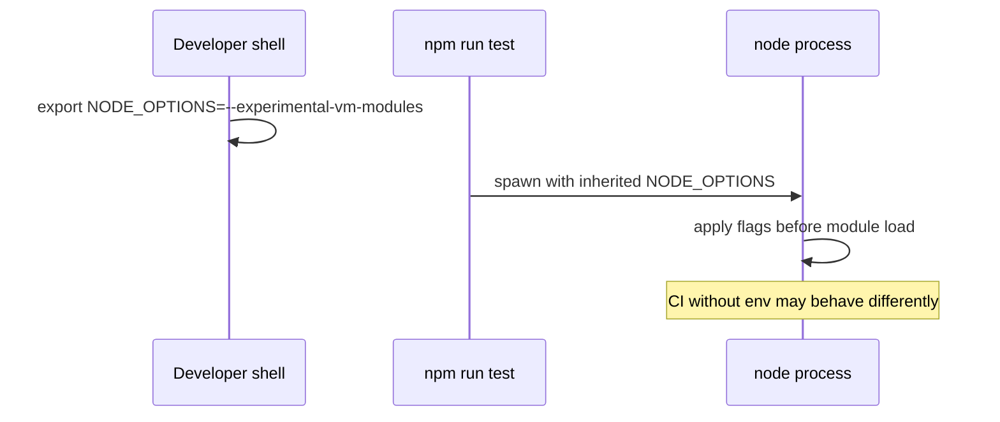

# NODE_OPTIONS and Runtime Flags

## Overview

Node accepts **runtime flags** via the CLI (`node --flag`), **`NODE_OPTIONS` environment variable**, and `.npmrc`/`node` config in some tooling chains. Flags tune V8 heap limits, expose diagnostics (`--inspect`), change module behavior (`--experimental-*`), and alter security-relevant defaults (e.g., `--disable-proto`).

Understanding flag precedence, what is safe in production vs. debug-only, and how containers inherit `NODE_OPTIONS` prevents "works on my laptop" surprises and accidental debug port exposure in prod.

## Learning Objectives

- Explain how `NODE_OPTIONS` merges with explicit CLI flags
- Categorize flags: V8, libuv/threadpool, diagnostics, experimental modules
- Select heap and GC flags for memory-constrained containers
- Avoid leaking debug flags into production images
- Document org allowlists for runtime flags

## Prerequisites

- [[06-NodeJS/01-Process-and-Runtime/Process argv env and stdio|Process argv env and stdio]]
- [[06-NodeJS/00-Orientation/Node Versioning LTS and Compatibility Policies|Node Versioning LTS and Compatibility Policies]]
- [[06-NodeJS/08-Diagnostics-and-Performance/Memory Limits and Heap Flags|Memory Limits and Heap Flags]]

## Difficulty

`intermediate`

## Estimated Time

- Reading: 1.5 hours
- Exercises: 1.5 hours
- Mini project: 2 hours

## History

`NODE_OPTIONS` (Node 8+) unified flag injection for npm scripts and child processes without wrapping binaries. As V8 and Node flags proliferated, misuse caused incidents: `--inspect=0.0.0.0` exposed debuggers publicly, experimental ESM loaders broke CI when inherited from dev shells. Node added **`NODE_OPTIONS` parsing restrictions** for some dangerous combinations and improved documentation groupings.

## Problem It Solves

- **Reproducible tuning**: same heap flags in local, CI, and K8s
- **Diagnostics on demand**: attach inspector without code changes
- **Migration toggles**: `--pending-deprecation`, `--throw-deprecation` in CI
- **Security hardening**: disable `process.binding` prototypes where applicable

## Internal Implementation

### Flag injection flow



**Precedence**: explicit CLI flags generally override conflicting `NODE_OPTIONS` entries; consult Node docs for edge cases. Multiple space-separated options allowed in `NODE_OPTIONS` on most platforms.

### Flag categories

| Category | Examples | Production? |
| --- | --- | --- |
| Heap / GC | `--max-old-space-size`, `--expose-gc` | Heap yes; expose-gc rarely |
| Diagnostics | `--inspect`, `--trace-gc`, `--report-on-fatalerror` | Inspect never on 0.0.0.0 in prod |
| Module system | `--import`, `--experimental-vm-modules`, `--conditions` | Pin in CI matrix |
| Behavior | `--unhandled-rejections=strict`, `--enable-source-maps` | strict yes |
| libuv pool | `UV_THREADPOOL_SIZE` (env, not NODE_OPTIONS) | Tune for crypto/fs |

Deep heap tuning: [[06-NodeJS/08-Diagnostics-and-Performance/Memory Limits and Heap Flags|Memory Limits and Heap Flags]].

## Mermaid Diagrams

### Structure



### Sequence / Lifecycle — npm script inheritance



## Examples

### Minimal Example — inspect effective argv

```typescript
// Node 20+ / TypeScript 5+
// Portability: Node-only.
import { execArgv, env } from "node:process";

console.log({
  NODE_OPTIONS: env.NODE_OPTIONS,
  execArgv, // flags Node actually applied to this process
});
```

Run:

```bash
NODE_OPTIONS="--max-old-space-size=512" node -p "process.execArgv"
```

### Production-Shaped Example — container-safe defaults

```dockerfile
# Document in Dockerfile — not NODE_OPTIONS from dev machines.
ENV NODE_ENV=production
# Heap sized to container limit minus native overhead (example: 512 MiB container → 384 MiB heap)
ENV NODE_OPTIONS="--max-old-space-size=384 --enable-source-maps"
# NEVER in prod:
# ENV NODE_OPTIONS="--inspect=0.0.0.0:9229"
```

```typescript
// Startup guard — Node 20+ / TypeScript 5+
const dangerous = process.execArgv.some((a) =>
  a.startsWith("--inspect") || a.startsWith("--debug"),
);
if (process.env.NODE_ENV === "production" && dangerous) {
  console.error(JSON.stringify({ event: "debug_flag_in_prod" }));
  process.exit(1);
}
```

## Trade-offs

| Dimension | Upside | Downside | When it matters |
| --- | --- | --- | --- |
| NODE_OPTIONS | Uniform tuning | Hidden inheritance surprises | monorepos |
| `--inspect` | Powerful debugging | Remote code execution risk | prod security |
| Experimental flags | Early features | Break across minors | libraries |
| Large heap flags | Fewer OOM | Masks leaks; GC pauses | memory limits |

### When to Use

- `NODE_OPTIONS` in containers for heap + source maps + strict rejections
- `execArgv` logging at startup for supportability
- Deprecation flags in CI only

### When Not to Use

- Do not inherit dev `NODE_OPTIONS` into production deploy pipelines unchecked
- Do not enable experimental loaders globally without pinning Node version

## Exercises

1. Print `process.execArgv` with and without `NODE_OPTIONS`.
2. Trigger OOM with small heap; increase `--max-old-space-size` and observe.
3. Attach Chrome DevTools with local-only `--inspect`; verify not reachable from network.
4. List flags your test runner adds (`node --experimental-vm-modules` etc.).
5. Draft org allowlist: permitted vs. forbidden flags.

## Mini Project

**Flag audit CLI.** Scan Dockerfile, K8s manifests, and `.env*` for `NODE_OPTIONS` and forbidden substrings; exit non-zero on violations.

## Portfolio Project

Include startup `execArgv` JSON log in [[06-NodeJS/projects/Node Runtime Toolkit/README|Node Runtime Toolkit]] runbooks.

## Interview Questions

1. How does `NODE_OPTIONS` interact with CLI flags?
2. What does `process.execArgv` contain vs. `process.argv`?
3. Why is `--inspect=0.0.0.0` dangerous in production?
4. Name three flags you'd set in CI but not prod.
5. Difference between `UV_THREADPOOL_SIZE` and V8 heap flags?

### Stretch / Staff-Level

1. How do `--import` preload hooks affect module resolution order vs. `--require`?
2. Explain `--report-on-fatalerror` and postmortem operations value.

## Common Mistakes

- Committing `.env` with debug `NODE_OPTIONS`
- Setting heap to entire container memory (no room for native stack/libuv)
- Relying on experimental flags in libraries consumed by others
- Assuming npm strips `NODE_OPTIONS` (it does not)

## Best Practices

- Pin flags in container/env templates; forbid drift from developer shells
- Log `execArgv` once at startup
- Separate debug profiles (docker-compose.override) from prod images
- Coordinate with [[16-DevOps/README|DevOps]] for secret-free env injection
- Version-gate experimental flags to Node LTS in use

## Summary

Runtime flags shape Node before user code runs: heap sizing, diagnostics, module hooks, and error strictness. `NODE_OPTIONS` propagates silently through npm and orchestrators—operational discipline requires allowlists, startup logging of `execArgv`, and never exposing debug interfaces on production networks.

## Further Reading

- [[00-References/NodeJS/README|Node.js References]]
- Node.js CLI documentation — `NODE_OPTIONS`
- [[06-NodeJS/08-Diagnostics-and-Performance/Memory Limits and Heap Flags|Memory Limits and Heap Flags]]

## Related Notes

- [[06-NodeJS/01-Process-and-Runtime/Process argv env and stdio|Process argv env and stdio]]
- [[06-NodeJS/08-Diagnostics-and-Performance/Inspector CPU Profiling and Heap Snapshots|Inspector CPU Profiling and Heap Snapshots]]
- [[06-NodeJS/00-Orientation/Node Versioning LTS and Compatibility Policies|Node Versioning LTS and Compatibility Policies]]
- [[16-DevOps/README|DevOps]]

## Progress Checklist

- [ ] Explained from first principles
- [ ] Drew at least one Mermaid diagram
- [ ] Implemented a minimal version
- [ ] Documented trade-offs and non-goals
- [ ] Completed exercises
- [ ] Practiced interview questions aloud
- [ ] Linked prerequisites and dependents
