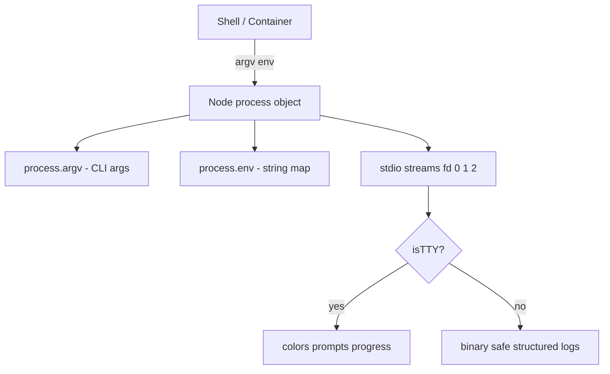
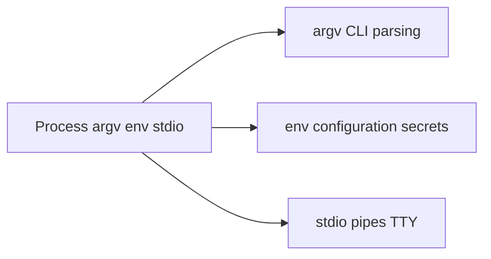
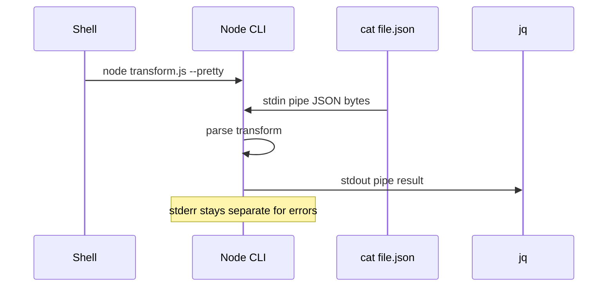

# Process argv env and stdio

## Overview

Every Node process exposes three fundamental **host interfaces** to the outside world: **command-line arguments** (`process.argv`), **environment variables** (`process.env`), and **standard I/O streams** (`stdin`, `stdout`, `stderr`). Together they form the **configuration and observability contract** between your program, the shell, containers, and process supervisors.

CLI parsing libraries and twelve-factor config patterns build on these primitives. This note covers first principles—what Node guarantees, encoding pitfalls, TTY detection, and production-safe logging—without duplicating product-level config frameworks ([[06-NodeJS/10-Production-Node/Configuration Twelve-Factor on Node|Configuration Twelve-Factor on Node]]).

## Learning Objectives

- Explain `process.argv` layout and how it differs from shell word-splitting
- Read and mutate `process.env` safely; understand inheritance from parent processes
- Use stdio streams correctly for CLI tools, pipes, and structured logging
- Detect TTY vs. pipe for interactive vs. batch behavior
- Apply least-privilege patterns for secrets in environment variables

## Prerequisites

- [[06-NodeJS/00-Orientation/Node Program Lifecycle|Node Program Lifecycle]]
- [[01-Computer-Science/04-Processes-and-Execution/Process Creation and Termination|Process Creation and Termination]]

## Difficulty

`beginner`

## Estimated Time

- Reading: 1.5 hours
- Exercises: 1.5 hours
- Mini project: 3 hours

## History

Unix defined argv/env/stdio decades before Node. Node inherited POSIX semantics through libuv and wrapped them in the **`process` global**—one of the earliest stable Node APIs. Container orchestration (Kubernetes downward API, Docker `-e`) made **environment-based config** dominant; structured logging pipelines redirected **stdout/stderr** to aggregators, making "printf debugging to files" an anti-pattern in cloud environments.

## Problem It Solves

- **CLI tools**: accept flags and operands without hard-coded paths
- **12-factor config**: separate config from code via env vars
- **Pipelines**: compose Node CLIs with shell pipes (`node transform.js < in.json > out.json`)
- **Supervisor integration**: systemd/K8s pass env; health via exit codes ([[06-NodeJS/01-Process-and-Runtime/Signals Exit Codes and Lifecycle Hooks|Signals Exit Codes and Lifecycle Hooks]])

## Internal Implementation

### The process global (relevant fields)



| Field | Type | Notes |
| --- | --- | --- |
| `process.argv` | `string[]` | `[nodeBinary, scriptPath, ...userArgs]` |
| `process.env` | `Dict<string, string \| undefined>` | Inherited; mutations local to process |
| `process.stdin` | `Readable` | Default paused; resume to read |
| `process.stdout` | `Writable` | Line buffering when TTY |
| `process.stderr` | `Writable` | For diagnostics; not redirected by shell `2>` alone in all hosts |

On Windows, argv encoding and env case-insensitivity differ—test cross-platform CLIs.

## Mermaid Diagrams

### Structure



### Sequence / Lifecycle — piped execution



## Examples

### Minimal Example — argv and env

```typescript
// Node 20+ / TypeScript 5+
// Portability: Node-only (`node:process`).
import { argv, env } from "node:process";

const userArgs = argv.slice(2); // skip node binary + script path
const port = Number(env.PORT ?? "3000");
const nodeEnv = env.NODE_ENV ?? "development";

console.log({ userArgs, port, nodeEnv });
```

### Production-Shaped Example — CLI + structured stdio

```typescript
// Node 20+ / TypeScript 5+
// Portability: Node-only. Use util.parseArgs (stable Node 20+).
import { parseArgs } from "node:util";
import { env, stdin, stdout, stderr } from "node:process";

const { values, positionals } = parseArgs({
  options: {
    pretty: { type: "boolean", short: "p", default: false },
    input: { type: "string", short: "i" },
  },
  allowPositionals: true,
});

function logInfo(event: Record<string, unknown>): void {
  const line = JSON.stringify({ level: "info", ...event });
  stdout.write(line + "\n");
}

function logError(event: Record<string, unknown>): void {
  const line = JSON.stringify({ level: "error", ...event });
  stderr.write(line + "\n");
}

try {
  logInfo({ msg: "start", pretty: values.pretty, args: positionals });
  // Never log env secrets:
  if (env.DATABASE_URL) logInfo({ msg: "db configured" }); // presence only
} catch (err) {
  logError({ msg: "fatal", err: String(err) });
  process.exitCode = 1;
}
```

Secrets handling: [[06-NodeJS/09-Security-and-Supply-Chain/Secrets Env Injection and Least Privilege|Secrets Env Injection and Least Privilege]].

## Trade-offs

| Dimension | Upside | Downside | When it matters |
| --- | --- | --- | --- |
| Env config | Easy K8s injection | Leaks via `/proc`, crash dumps | Secrets |
| argv flags | Explicit, auditable | Long commands in k8s manifests | CLIs |
| JSON logs on stdout | Parser-friendly | Human grep harder locally | Centralized logging |
| TTY colors | Better DX | Breaks pipes if mis-detected | CLI UX |

### When to Use

- `parseArgs` / dedicated CLI libs for user-facing tools
- Env for deployment-specific config (ports, feature flags)
- stderr for diagnostics; stdout for payload/output

### When Not to Use

- Do not store secrets in argv (visible in `ps`)
- Do not mix human tables and JSON on stdout in the same tool

## Exercises

1. Print `process.argv` when invoked as `node app.js --foo bar` vs. `node --eval "..."`.
2. Pipe output to a file; detect `process.stdout.isTTY` in both modes.
3. Read 1 MB from stdin using async iteration; measure memory vs. buffering all.
4. List env vars inherited from your shell; explain which come from parent process.
5. Design env var naming for a service: `DATABASE_URL`, `LOG_LEVEL`—document required vs. optional.

## Mini Project

**Mini CLI transformer.** Read JSON from stdin or `--input`, apply a transform, write JSON lines to stdout, errors to stderr, exit code non-zero on parse failure.

## Portfolio Project

Wire structured startup logging into [[06-NodeJS/projects/Graceful Shutdown Harness/README|Graceful Shutdown Harness]] using argv/env for config.

## Interview Questions

1. What is in `process.argv[0]` and `process.argv[1]`?
2. Are changes to `process.env` visible to the parent shell? Why?
3. Why log errors to stderr instead of stdout in Unix pipelines?
4. How do containers inject configuration through the environment?
5. What is the risk of logging `process.env` in production?

### Stretch / Staff-Level

1. How does Node handle Windows vs. Unix argv encoding for non-ASCII args?
2. Compare env-based config to file-based config for rotation and auditability.

## Common Mistakes

- Parsing argv manually with brittle string splits
- Logging secrets when dumping env on crash
- Assuming stdout is always a TTY (breaks CI log parsers)
- Using `console.log` for errors in library code (prefer throw or callback)

## Best Practices

- Use `node:util` `parseArgs` or mature CLI libraries for help text and validation
- Validate env at startup; fail fast with clear messages
- Structured JSON logs in production; human pretty mode behind `--pretty` + TTY check
- Never print secrets; redact known keys in error reports
- Document required env vars in README and [[06-NodeJS/10-Production-Node/Configuration Twelve-Factor on Node|Configuration Twelve-Factor on Node]]

## Summary

`process.argv`, `process.env`, and stdio are Node's primary interfaces to the operating environment: arguments for explicit CLI intent, environment for deployment configuration, and streams for composable I/O. Production services treat stdout as a machine channel, stderr as diagnostics, and env as an inherited secret-bearing surface that demands validation and least privilege.

## Further Reading

- [[00-References/NodeJS/README|Node.js References]]
- Node.js `process` documentation
- Twelve-Factor App — Config
- [[06-NodeJS/10-Production-Node/Configuration Twelve-Factor on Node|Configuration Twelve-Factor on Node]]

## Related Notes

- [[06-NodeJS/01-Process-and-Runtime/NODE_OPTIONS and Runtime Flags|NODE_OPTIONS and Runtime Flags]]
- [[06-NodeJS/01-Process-and-Runtime/Signals Exit Codes and Lifecycle Hooks|Signals Exit Codes and Lifecycle Hooks]]
- [[01-Computer-Science/04-Processes-and-Execution/Process Creation and Termination|Process Creation and Termination]]
- [[02-JavaScript/04-Engines-and-Memory/Host Environments and Web APIs|Host Environments and Web APIs]]
- [[07-Backend/README|Backend]]

## Progress Checklist

- [ ] Explained from first principles
- [ ] Drew at least one Mermaid diagram
- [ ] Implemented a minimal version
- [ ] Documented trade-offs and non-goals
- [ ] Completed exercises
- [ ] Practiced interview questions aloud
- [ ] Linked prerequisites and dependents
