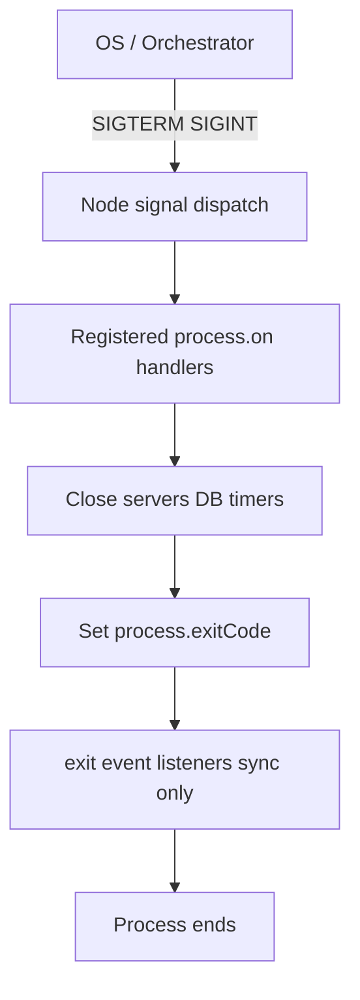
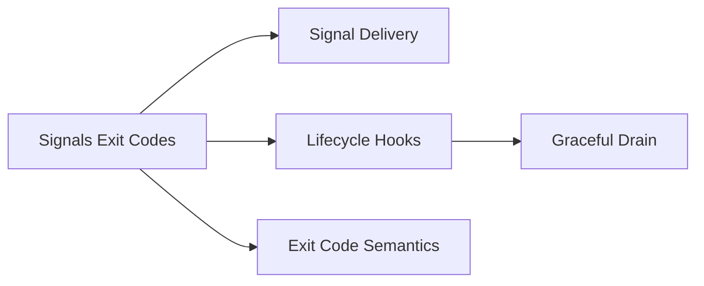
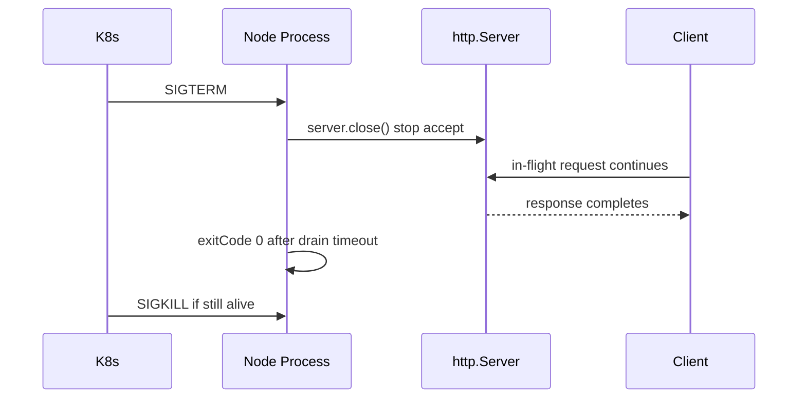

# Signals Exit Codes and Lifecycle Hooks

## Overview

Operating systems terminate processes with **signals**; shells and orchestrators interpret **exit codes**. Node exposes these through **`process.on('SIGTERM')`**, **`process.on('SIGINT')`**, **`process.exitCode`**, and the **`exit`** event—bridging Unix process semantics and JavaScript async cleanup.

Production Node services must handle **SIGTERM** (Kubernetes pod deletion, `docker stop`) and **SIGINT** (local Ctrl+C) by draining in-flight work before exit. This note covers signal delivery, default behaviors, exit code conventions, and hook ordering—foundation for [[06-NodeJS/10-Production-Node/Graceful Shutdown and Drain|Graceful Shutdown and Drain]].

## Learning Objectives

- Map common signals (SIGTERM, SIGINT, SIGHUP) to operational scenarios
- Implement async-safe shutdown handlers without re-entrancy bugs
- Choose between `process.exit()`, `process.exitCode`, and natural drain
- Interpret exit codes for CI, systemd, and Kubernetes probes
- Avoid shutdown races with open servers and timers

## Prerequisites

- [[06-NodeJS/00-Orientation/Node Program Lifecycle|Node Program Lifecycle]]
- [[06-NodeJS/01-Process-and-Runtime/Process argv env and stdio|Process argv env and stdio]]
- [[01-Computer-Science/04-Processes-and-Execution/Process Creation and Termination|Process Creation and Termination]]

## Difficulty

`intermediate`

## Estimated Time

- Reading: 2 hours
- Exercises: 2 hours
- Mini project: 4 hours

## History

Node initially mirrored Unix defaults: SIGINT threw or exited abruptly. As Node became a server platform, community patterns (`server.close()`, `stoppable`) evolved into documented **graceful shutdown** guidance. Orchestrators standardized **SIGTERM → grace period → SIGKILL**, making signal handlers mandatory for zero-downtime deploys.

## Problem It Solves

- **Truncated responses** when pods die mid-request
- **Lost batch progress** when CLI tools ignore SIGINT
- **Flaky CI** from exit code 1 without distinguishing failure classes
- **Zombie processes** when handlers never call `server.close()`

## Internal Implementation

### Signal flow



**Default behavior** (if no handler): SIGINT may terminate; SIGTERM terminates Node on most platforms. Handlers replace defaults—you must eventually exit or the orchestrator sends SIGKILL.

### Exit code conventions (de facto)

| Code | Meaning |
| --- | --- |
| 0 | Success |
| 1 | General error |
| 2 | Misuse (often CLI) |
| 130 | 128 + 2 (SIGINT) — common shell convention |
| 143 | 128 + 15 (SIGTERM) |

Node sets `exitCode`; shells may wrap signal exits—document your platform.

### Hook constraints

- **`exit` listeners**: must be **synchronous**; no `await`
- **`beforeExit`**: not emitted on `process.exit()` or most signals
- **Async shutdown**: track in-flight; use `Promise.race` with timeout

## Mermaid Diagrams

### Structure



### Sequence / Lifecycle — Kubernetes pod termination



## Examples

### Minimal Example — exit code without `process.exit()`

```typescript
// Node 20+ / TypeScript 5+
// Portability: Node-only.
async function main(): Promise<void> {
  const ok = await doWork();
  process.exitCode = ok ? 0 : 1;
}

main().catch((err) => {
  console.error(err);
  process.exitCode = 1;
});
```

### Production-Shaped Example — idempotent shutdown coordinator

```typescript
// Node 20+ / TypeScript 5+
// Portability: Node-only.
import { createServer, type Server } from "node:http";
import { once } from "node:events";

const SHUTDOWN_TIMEOUT_MS = 30_000;
let shuttingDown = false;
let server: Server;

async function shutdown(reason: string): Promise<void> {
  if (shuttingDown) return;
  shuttingDown = true;
  console.log(JSON.stringify({ event: "shutdown_start", reason }));

  const timer = setTimeout(() => {
    console.error(JSON.stringify({ event: "shutdown_timeout" }));
    process.exitCode = 1;
    process.exit(1);
  }, SHUTDOWN_TIMEOUT_MS);
  timer.unref(); // do not block natural exit if already idle

  const closed = once(server, "close");
  server.close();
  await closed;

  clearTimeout(timer);
  console.log(JSON.stringify({ event: "shutdown_complete" }));
}

server = createServer((_req, res) => {
  if (shuttingDown) {
    res.writeHead(503).end("shutting down");
    return;
  }
  res.writeHead(200).end("ok");
});

server.listen(3000);

for (const sig of ["SIGTERM", "SIGINT"] as const) {
  process.on(sig, () => void shutdown(sig));
}

process.on("exit", (code) => {
  // sync only — no await
  console.log(JSON.stringify({ event: "exit", code }));
});
```

## Trade-offs

| Dimension | Upside | Downside | When it matters |
| --- | --- | --- | --- |
| Graceful drain | Completes in-flight work | Longer deploy windows | APIs |
| Forced `process.exit` | Meets hard timeout | Skips cleanup | Emergency |
| Multiple signal handlers | Modular | Ordering undefined | Libraries + apps |
| 503 during shutdown | Signals load balancers | Clients must retry | K8s |

### When to Use

- SIGTERM/SIGINT handlers for servers and long-running workers
- `process.exitCode` for async main without forced exit
- Shutdown timeout aligned with orchestrator `terminationGracePeriodSeconds`

### When Not to Use

- Do not register duplicate conflicting handlers in libraries—export shutdown hooks instead
- Do not perform heavy async work in `exit` event

## Exercises

1. Start HTTP server; `curl` during SIGTERM; measure in-flight completion time.
2. Register two SIGTERM handlers—observe both run; discuss composability patterns.
3. Exit with code 17; read `$?` in bash and `%ERRORLEVEL%` in PowerShell.
4. Compare `process.exit(1)` vs. unhandled exception exit in CI logs.
5. Map SIGTERM grace period to your container orchestrator settings.

## Mini Project

**Shutdown harness.** Build reusable `createShutdownCoordinator({ server, timeoutMs })` used by labs. Verify idempotency under double SIGTERM.

## Portfolio Project

Complete [[06-NodeJS/projects/Graceful Shutdown Harness/README|Graceful Shutdown Harness]] with signal matrix tests.

## Interview Questions

1. What signal does Kubernetes send before killing a pod?
2. Why shouldn't you `await` inside an `exit` event listener?
3. Difference between `process.exit()` and setting `process.exitCode`?
4. How do you stop accepting new HTTP connections while finishing active ones?
5. What exit code indicates success for systemd unit?

### Stretch / Staff-Level

1. Design shutdown for multi-server process (HTTP + metrics + WebSocket)—ordering and timeouts.
2. Explain Windows signal limitations vs. Unix for Node services.

## Common Mistakes

- Calling `process.exit()` before async cleanup completes
- No shutdown timeout → stuck deploys until SIGKILL
- Ignoring SIGTERM in Docker because dev only tested Ctrl+C
- Returning exit 0 on caught errors without setting `exitCode`

## Best Practices

- One idempotent shutdown coordinator per process
- Stop accept → drain → close resources → set exit code
- Log shutdown phases as structured events
- Test signals in CI (integration, not only unit mocks)
- Align with [[06-NodeJS/10-Production-Node/Graceful Shutdown and Drain|Graceful Shutdown and Drain]]

## Summary

Signals are how the outside world asks Node to stop; exit codes communicate outcome to shells and orchestrators. Async shutdown handlers close servers and drain work within a bounded timeout, using `process.exitCode` when possible instead of abrupt `process.exit()`. Mastering this contract separates demo servers from production-ready processes.

## Further Reading

- [[00-References/NodeJS/README|Node.js References]]
- Node.js — Signal Events documentation
- Kubernetes pod termination lifecycle
- [[06-NodeJS/10-Production-Node/Graceful Shutdown and Drain|Graceful Shutdown and Drain]]

## Related Notes

- [[06-NodeJS/00-Orientation/Node Program Lifecycle|Node Program Lifecycle]]
- [[06-NodeJS/01-Process-and-Runtime/unhandledRejection uncaughtException and Fatal Errors|unhandledRejection uncaughtException and Fatal Errors]]
- [[01-Computer-Science/04-Processes-and-Execution/Process Creation and Termination|Process Creation and Termination]]
- [[16-DevOps/README|DevOps]]
- [[07-Backend/06-Reliability-and-Abuse-Resistance/Graceful Request Drain Above Process Shutdown|Graceful Request Drain Above Process Shutdown]] · [[07-Backend/README|Backend]]

## Progress Checklist

- [ ] Explained from first principles
- [ ] Drew at least one Mermaid diagram
- [ ] Implemented a minimal version
- [ ] Documented trade-offs and non-goals
- [ ] Completed exercises
- [ ] Practiced interview questions aloud
- [ ] Linked prerequisites and dependents
