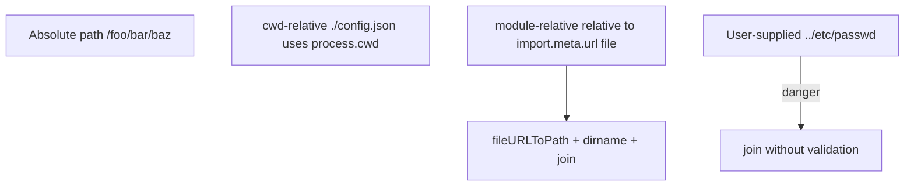
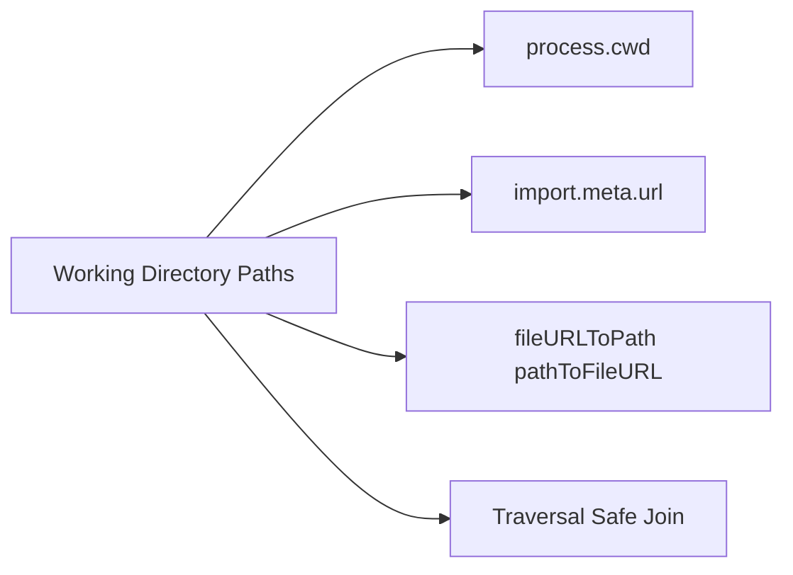
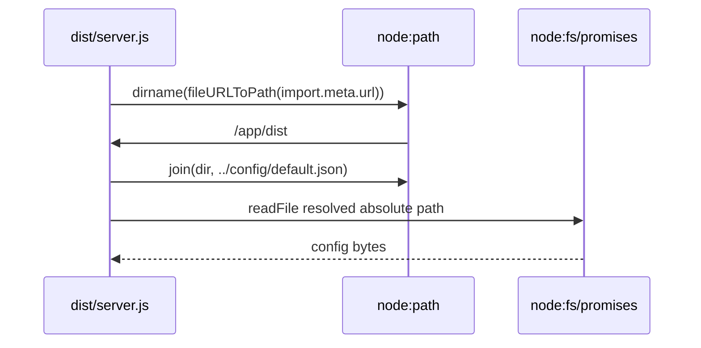

# Working Directory Paths and fileURLToPath

## Overview

Node programs interact with the filesystem through **paths**—but "a path string" is ambiguous without context. **`process.cwd()`** is the process working directory (mutable, shell-dependent). **`import.meta.url`** is the current module's file URL (immutable per module). **`__dirname`/`__filename`** exist in CommonJS but not in native ESM. **`fileURLToPath`** bridges `file://` URLs to OS paths.

Getting this wrong causes **broken asset loading**, **path traversal vulnerabilities**, and **tests that pass only when run from repo root**. This note establishes first-principles path hygiene for Node hosts.

## Learning Objectives

- Distinguish cwd-relative vs. module-relative vs. absolute paths
- Derive `__dirname` equivalent in ESM with `import.meta.url`
- Use `node:path` helpers (`join`, `resolve`, `normalize`) correctly on Windows and POSIX
- Avoid path traversal when serving files or reading user-supplied paths
- Predict how bundlers and test runners alter cwd and module URLs

## Prerequisites

- [[06-NodeJS/01-Process-and-Runtime/Process argv env and stdio|Process argv env and stdio]]
- [[02-JavaScript/06-Modules-and-Tooling/ES Modules|ES Modules]]
- [[06-NodeJS/09-Security-and-Supply-Chain/Path Traversal and Safe Filesystem Access|Path Traversal and Safe Filesystem Access]]

## Difficulty

`intermediate`

## Estimated Time

- Reading: 1.5 hours
- Exercises: 2 hours
- Mini project: 3 hours

## History

CommonJS wrapped modules with `__dirname` automatically. ESM removed that implicit helper—explicit `import.meta.url` became the standard. Windows `file:///` URLs required **`fileURLToPath`** and **`pathToFileURL`** (Node 10+) for correct drive letter and slash handling. Container and monorepo workflows exposed cwd assumptions when `npm test` ran from package subdirs.

## Problem It Solves

- **"Config not found"** when cwd differs between IDE, CI, and Docker WORKDIR
- **Path traversal** when joining user input with static directory ([[06-NodeJS/09-Security-and-Supply-Chain/Path Traversal and Safe Filesystem Access|Path Traversal and Safe Filesystem Access]])
- **Cross-platform bugs** from hard-coded `\` vs. `/`
- **Bundled ESM** where `import.meta.url` points at bundle location, not source tree

## Internal Implementation

### Three reference frames



| Reference | API | Mutability |
| --- | --- | --- |
| Working directory | `process.cwd()` | Changes with `process.chdir()` |
| Module file location | `import.meta.url` | Fixed for module instance |
| CJS legacy | `__dirname` | Fixed per module wrapper |

## Mermaid Diagrams

### Structure



### Sequence / Lifecycle — load config relative to module



## Examples

### Minimal Example — ESM dirname pattern

```typescript
// Node 20+ / ESM / TypeScript 5+
// Portability: Node `node:` modules; Deno has URL.pathname differences.
import { fileURLToPath } from "node:url";
import { dirname, join } from "node:path";

const __filename = fileURLToPath(import.meta.url);
const __dirname = dirname(__filename);

console.log({ cwd: process.cwd(), moduleDir: __dirname });
console.log("config at", join(__dirname, "config.json"));
```

### Production-Shaped Example — safe static file resolver

```typescript
// Node 20+ / TypeScript 5+
import { fileURLToPath } from "node:url";
import { dirname, join, normalize } from "node:path";
import { open } from "node:fs/promises";

const PUBLIC_ROOT = join(dirname(fileURLToPath(import.meta.url)), "public");

export async function readPublicAsset(userPath: string): Promise<Buffer> {
  // Reject absolute paths and normalize segments
  const normalized = normalize(userPath).replace(/^(\.\.(\/|\\|$))+/, "");
  const absolute = join(PUBLIC_ROOT, normalized);

  // Ensure result stays under PUBLIC_ROOT (prefix check after resolve)
  if (!absolute.startsWith(PUBLIC_ROOT)) {
    throw new Error("path traversal blocked");
  }

  const fh = await open(absolute, "r");
  try {
    return fh.readFile();
  } finally {
    await fh.close();
  }
}
```

Use `path.resolve` + explicit root check; on Windows consider `path.relative` for robust containment.

## Trade-offs

| Dimension | Upside | Downside | When it matters |
| --- | --- | --- | --- |
| cwd-relative | Simple CLI ergonomics | Breaks when cwd changes | scripts |
| module-relative | Stable asset paths | Harder after bundling | servers |
| file URLs | Standard for ESM | Ugly on Windows without helpers | tooling |
| absolute everywhere | Clearest | Verbose config | security-sensitive FS |

### When to Use

- Module-relative for packaged assets (`public/`, templates next to build output)
- cwd-relative only for explicit CLI file arguments validated by user
- `fileURLToPath` whenever converting `import.meta.url`

### When Not to Use

- Do not use cwd-relative paths in library code silently
- Do not trust user strings in `join(PUBLIC_ROOT, userPath)` without containment check

## Exercises

1. Log cwd and module dir when running from repo root vs. package subdirectory.
2. Implement `getConfigPath()` using both cwd-relative and module-relative; compare failure modes.
3. Attempt `readPublicAsset('../../../etc/passwd')` — verify block.
4. Convert Windows path to file URL with `pathToFileURL` and back.
5. Explain how `tsx`/`vitest` affect `import.meta.url` vs. compiled `dist/`.

## Mini Project

**Path-safe static server.** Serve files only from module-relative `public/` with traversal tests in CI on Linux and Windows runners.

## Portfolio Project

Add path-safe asset loading to [[06-NodeJS/projects/HTTP Server From Scratch/README|HTTP Server From Scratch]].

## Interview Questions

1. Difference between `path.resolve()` and `path.join()`?
2. How do you get `__dirname` in ESM?
3. Why is cwd-relative config loading fragile in monorepos?
4. What is path traversal and how do you prevent it?
5. What does `import.meta.url` contain for `file://` modules?

### Stretch / Staff-Level

1. Compare path containment strategies on Windows (drive letters, UNC paths).
2. How do custom ESM loaders affect `import.meta.url`?

## Common Mistakes

- Using `./data.json` relative to cwd in library imported from many locations
- Forgetting `fileURLToPath` and passing URL string to `fs.readFile`
- Prefix checks without `normalize` (`.//../` bypass)
- Assuming test runner cwd equals project root

## Best Practices

- Prefer module-relative or explicit config path env vars
- Centralize path resolution utilities; unit test traversal cases
- Use `node:path` never manual string concat for cross-platform
- Document required cwd in CLI tools only when intentional
- Deep security: [[06-NodeJS/09-Security-and-Supply-Chain/Path Traversal and Safe Filesystem Access|Path Traversal and Safe Filesystem Access]]

## Summary

Node path correctness requires knowing which anchor you use: mutable cwd or fixed module URL. ESM modules derive directory context from `import.meta.url` via `fileURLToPath`; user and cwd-relative paths demand validation before filesystem access. Production code resolves to absolute paths, verifies containment, and never trusts unnormalized user segments.

## Further Reading

- [[00-References/NodeJS/README|Node.js References]]
- Node.js `url.fileURLToPath` documentation
- [[02-JavaScript/06-Modules-and-Tooling/ES Modules|ES Modules]]

## Related Notes

- [[06-NodeJS/09-Security-and-Supply-Chain/Path Traversal and Safe Filesystem Access|Path Traversal and Safe Filesystem Access]]
- [[06-NodeJS/03-Modules-and-Loading/CJS and ESM Execution in Node|CJS and ESM Execution in Node]]
- [[02-JavaScript/06-Modules-and-Tooling/ES Modules|ES Modules]]
- [[07-Backend/README|Backend]]

## Progress Checklist

- [ ] Explained from first principles
- [ ] Drew at least one Mermaid diagram
- [ ] Implemented a minimal version
- [ ] Documented trade-offs and non-goals
- [ ] Completed exercises
- [ ] Practiced interview questions aloud
- [ ] Linked prerequisites and dependents
