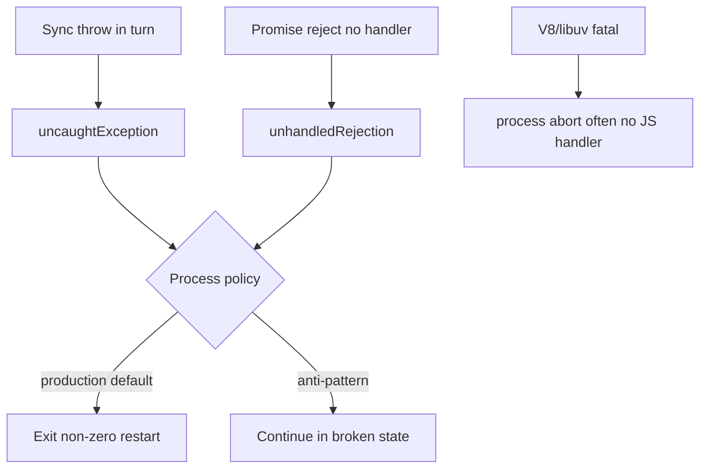
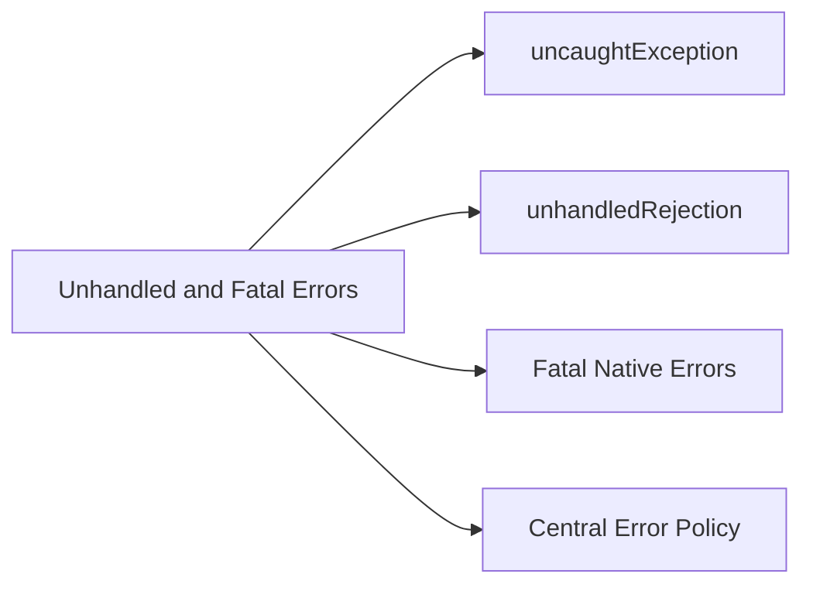
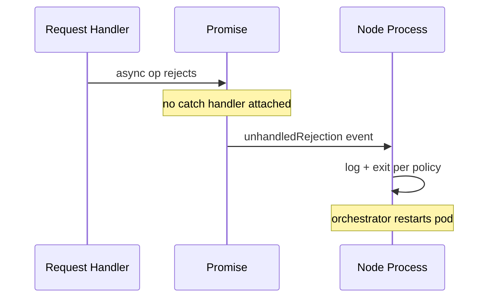

# unhandledRejection uncaughtException and Fatal Errors

## Overview

Node distinguishes **synchronous throws**, **unhandled promise rejections**, and **fatal internal errors**—each with different default outcomes and operational implications. Modern Node defaults toward **fail-fast**: an unhandled rejection can terminate the process, mirroring uncaught exceptions, because a rejected promise with no handler often indicates latent bugs that leave the system in an undefined state.

This note covers host error events, why "log and continue" is dangerous for servers, how to centralize error policies, and where ECMAScript promise semantics end and Node process policy begins ([[02-JavaScript/05-Async-and-Concurrency/Promises Internals|Promises Internals]]).

## Learning Objectives

- Differentiate `uncaughtException`, `unhandledRejection`, and `uncaughtExceptionMonitor`
- Explain Node's default termination behavior across LTS versions
- Design a process-level error policy suitable for production APIs
- Recover safely (rarely) vs. exit and restart (usually)
- Instrument errors without swallowing failures

## Prerequisites

- [[06-NodeJS/01-Process-and-Runtime/Signals Exit Codes and Lifecycle Hooks|Signals Exit Codes and Lifecycle Hooks]]
- [[02-JavaScript/05-Async-and-Concurrency/Errors Across Async Boundaries|Errors Across Async Boundaries]]
- [[02-JavaScript/07-Production-JavaScript/Error Design and Exception Safety|Error Design and Exception Safety]]

## Difficulty

`intermediate`

## Estimated Time

- Reading: 2 hours
- Exercises: 2 hours
- Mini project: 3 hours

## History

Early Node allowed unhandled rejections to linger with merely a console warning—processes stayed "healthy" while internal state corrupted. Community pressure and framework defaults aligned with **terminating on unhandled rejection** (similar to uncaught sync exceptions). `--unhandled-rejections=strict` became default on newer lines. `uncaughtExceptionMonitor` (Node 13+) enables logging without attempting unsafe recovery.

## Problem It Solves

- **Silent data corruption** when async errors are logged but ignored
- **Mystery 502s** when event loop continues after partial failure
- **Alert fatigue** without distinguishing fatal vs. handled domain errors
- **PM2/K8s restart loops** when crash policy misconfigured

## Internal Implementation

### Error taxonomy in Node



| Event | When emitted | Default modern behavior |
| --- | --- | --- |
| `uncaughtException` | Sync throw reaches top of call stack | Print stack; exit 1 |
| `unhandledRejection` | Promise rejected with no rejection handler | Warn/throw mode; often exit |
| `uncaughtExceptionMonitor` | Same as UCE but non-interfering | Observability only |
| Fatal error | OOM, assertion in native code | Immediate abort |

Promise **language** rules: [[02-JavaScript/05-Async-and-Concurrency/Promises Internals|Promises Internals]]. Node adds **process survival policy**.

## Mermaid Diagrams

### Structure



### Sequence / Lifecycle — unhandled rejection path



## Examples

### Minimal Example — trigger and observe

```typescript
// Node 20+ / TypeScript 5+
// Portability: Node-only. Run in isolated process for experiments.
process.on("unhandledRejection", (reason) => {
  console.error("unhandledRejection", reason);
});

process.on("uncaughtException", (err) => {
  console.error("uncaughtException", err);
});

// Unhandled rejection (bad):
void Promise.reject(new Error("boom"));

// Uncaught sync (bad):
// throw new Error("sync boom");
```

### Production-Shaped Example — centralized fatal policy

```typescript
// Node 20+ / TypeScript 5+
// Portability: Node-only. Prefer exit + supervisor restart over continue.
let fatalLogged = false;

function fatal(kind: string, err: unknown): void {
  if (fatalLogged) return;
  fatalLogged = true;
  console.error(
    JSON.stringify({
      level: "fatal",
      kind,
      message: err instanceof Error ? err.message : String(err),
      stack: err instanceof Error ? err.stack : undefined,
    }),
  );
  // Allow log flush; then exit — do NOT resume serving.
  setImmediate(() => process.exit(1));
}

process.on("unhandledRejection", (reason) => fatal("unhandledRejection", reason));
process.on("uncaughtException", (err) => fatal("uncaughtException", err));

// Domain errors inside requests should be caught and mapped to 4xx/5xx — see Backend track.
export async function handleRequest(): Promise<void> {
  try {
    await businessLogic();
  } catch (err) {
    // handled — does NOT trigger unhandledRejection
    throw toHttpError(err);
  }
}

function businessLogic(): Promise<void> {
  return Promise.resolve();
}

function toHttpError(err: unknown): Error {
  return err instanceof Error ? err : new Error(String(err));
}
```

HTTP error mapping belongs to [[07-Backend/README|Backend]]; runtime policy belongs here.

## Trade-offs

| Dimension | Upside | Downside | When it matters |
| --- | --- | --- | --- |
| Fail-fast | Clean restarts | More pod churn if noisy bugs | APIs |
| Log-and-continue | Higher uptime metric | Corrupted state | Strongly discouraged |
| strict rejections | Surfaces bugs early | Legacy code breaks on upgrade | Migrations |
| Global handlers | Central observability | Hides per-route handling gaps | SRE |

### When to Use

- Global handlers that log structured fatal events and **exit**
- Per-request try/catch for expected failures (validation, 404)
- `--unhandled-rejections=strict` in CI and production

### When Not to Use

- Do not "recover" from `uncaughtException` and keep serving HTTP
- Do not attach empty `.catch(() => {})` to hide rejections

## Exercises

1. Compare behavior with `node --unhandled-rejections=warn` vs. `strict`.
2. Create rejection in `setTimeout` callback vs. async route—same event?
3. Explain why `domain` module is deprecated; what replaced it?
4. Wire `uncaughtExceptionMonitor` to telemetry without changing exit behavior.
5. List three errors that should be handled locally vs. three that should crash process.

## Mini Project

**Crash policy lab.** Small HTTP server with toggle env `CRASH_ON_UNHANDLED=true`; integration test expects process exit and supervisor restart count increment.

## Portfolio Project

Document error policy for [[06-NodeJS/projects/Node Runtime Toolkit/README|Node Runtime Toolkit]]—table of error classes, HTTP mapping (Backend), and fatal process events.

## Interview Questions

1. What is the difference between uncaughtException and unhandledRejection?
2. Why is "log uncaughtException and continue" considered unsafe?
3. What changed in Node's default unhandled rejection behavior over time?
4. How should an HTTP server handle errors inside async handlers?
5. What is `uncaughtExceptionMonitor` for?

### Stretch / Staff-Level

1. Design error policy for worker threads + main thread—where do rejections propagate?
2. Relate fatal OOM to V8 heap limits and `--max-old-space-size`.

## Common Mistakes

- `void someAsync()` without catch in fire-and-forget code
- Express 4 without async wrapper → unhandled rejections
- Catching all errors and returning 200 with broken side effects
- Empty unhandledRejection handler that prevents exit without fixing root cause

## Best Practices

- Treat unhandled rejections as bugs; fix or catch at boundary
- Use centralized fatal handler → structured log → exit
- Map expected errors to responses in framework layer ([[07-Backend/README|Backend]])
- Test crash behavior under load tests, not only unit tests
- Enable strict rejection mode in CI when upgrading Node majors

## Summary

Node's process error policy treats unhandled async failures as seriously as uncaught synchronous exceptions because both leave application invariants undefined. Production services catch expected errors at request boundaries, centralize fatal logging, and exit for supervisor restart rather than continuing in a corrupted state—while leaving promise mechanics to the JavaScript track.

## Further Reading

- [[00-References/NodeJS/README|Node.js References]]
- Node.js — Process warning and unhandled rejection documentation
- [[02-JavaScript/05-Async-and-Concurrency/Errors Across Async Boundaries|Errors Across Async Boundaries]]

## Related Notes

- [[06-NodeJS/01-Process-and-Runtime/Signals Exit Codes and Lifecycle Hooks|Signals Exit Codes and Lifecycle Hooks]]
- [[02-JavaScript/05-Async-and-Concurrency/Promises Internals|Promises Internals]]
- [[02-JavaScript/07-Production-JavaScript/Error Design and Exception Safety|Error Design and Exception Safety]]
- [[06-NodeJS/10-Production-Node/Operational Readiness Checklist for Node Processes|Operational Readiness Checklist for Node Processes]]
- [[07-Backend/README|Backend]]

## Progress Checklist

- [ ] Explained from first principles
- [ ] Drew at least one Mermaid diagram
- [ ] Implemented a minimal version
- [ ] Documented trade-offs and non-goals
- [ ] Completed exercises
- [ ] Practiced interview questions aloud
- [ ] Linked prerequisites and dependents
