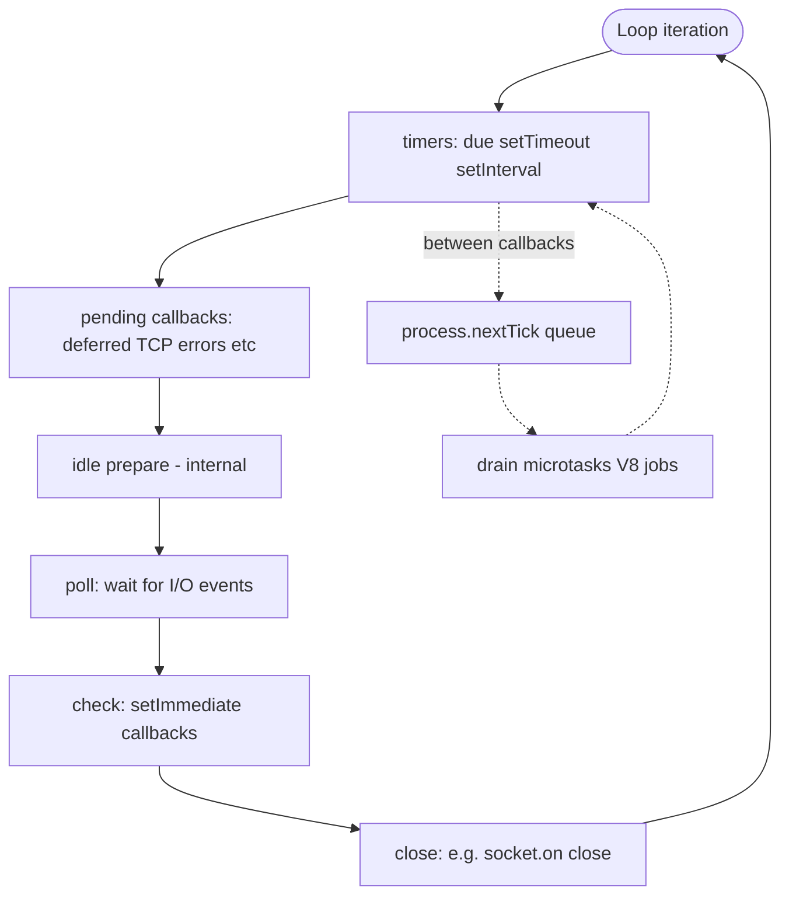
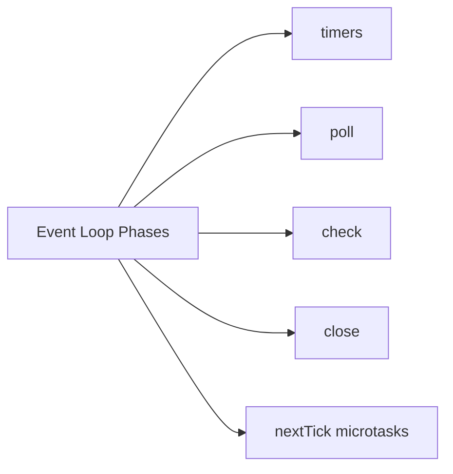
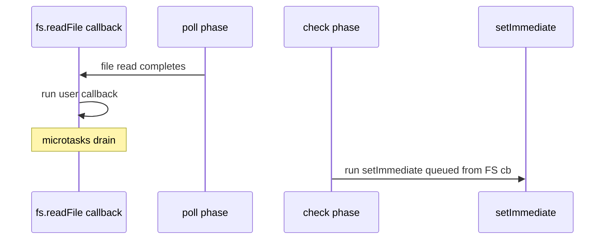

# Event Loop Phases

## Overview

Node's main thread runs a **libuv event loop** cycling through ordered **phases**: **timers**, **pending callbacks**, **idle/prepare** (internal), **poll**, **check**, **close callbacks**. Between phases and after many callbacks, Node drains **`process.nextTick` queue** and **microtasks** (V8 job queue).

Predicting when your callback runs requires both libuv phase knowledge and JavaScript job semantics—the latter defined in [[02-JavaScript/05-Async-and-Concurrency/Tasks Microtasks and Rendering|Tasks Microtasks and Rendering]] and Node-specific `nextTick` in [[06-NodeJS/02-Event-Loop-and-libuv/process.nextTick vs Microtasks vs Timers|process.nextTick vs Microtasks vs Timers]].

## Learning Objectives

- Name libuv phases in execution order and what each drains
- Explain poll-phase blocking and its effect on timers
- Relate `setTimeout`, `setImmediate`, and I/O callbacks to phases
- Predict callback ordering in mixed timer/I/O/immediate scenarios
- Connect phase delays to production latency and health metrics

## Prerequisites

- [[06-NodeJS/02-Event-Loop-and-libuv/libuv Architecture Overview|libuv Architecture Overview]]
- [[02-JavaScript/05-Async-and-Concurrency/Run to Completion and Event Loop|Run to Completion and Event Loop]]

## Difficulty

`advanced`

## Estimated Time

- Reading: 2.5 hours
- Exercises: 3 hours
- Mini project: 4 hours

## History

Node's loop documentation evolved from simplified diagrams to phase-accurate models as `setImmediate` and `process.nextTick` edge cases surfaced in production libraries (e.g., `async` module patterns). Misconceptions like "`setImmediate` always before `setTimeout`" led to official ordering guides and extensive community benchmarks.

## Problem It Solves

- **Heisenbugs in tests** that depend on timer ordering
- **Delayed timers** when poll phase blocked on long I/O callback
- **Starvation** when `nextTick` recursively schedules work
- **Mis-tuned servers** that never reach check phase for `setImmediate` batching

## Internal Implementation

### Phase cycle



**Poll phase** may block waiting for events with a computed timeout derived from nearest timer. If a timer is due during poll wait, loop wakes early.

### Callback placement cheat sheet

| API / event | Typical phase |
| --- | --- |
| `setTimeout` / `setInterval` | timers |
| TCP `connection`, `data` (completed poll) | poll callbacks |
| `setImmediate` | check |
| `socket.on('close')` | close callbacks |
| `process.nextTick` | after current op, before next phase step |
| Promise `.then` | microtasks after current callback |

Exact ordering nuances: [[06-NodeJS/02-Event-Loop-and-libuv/process.nextTick vs Microtasks vs Timers|process.nextTick vs Microtasks vs Timers]].

## Mermaid Diagrams

### Structure



### Sequence / Lifecycle — I/O vs setImmediate



Classic pattern: inside I/O callback, `setImmediate` runs before next timers phase; `setTimeout(0)` may wait until timers phase of **next** iteration.

## Examples

### Minimal Example — phase ordering experiment

```typescript
// Node 20+ / TypeScript 5+
// Portability: Node-only. Output varies — run multiple times; understand why.
import { readFile } from "node:fs";
import { setImmediate, setTimeout as setTimeoutCb } from "node:timers";

setTimeoutCb(() => console.log("timeout"), 0);
setImmediate(() => console.log("immediate"));

readFile(import.meta.url, () => {
  console.log("io callback");
  setTimeoutCb(() => console.log("timeout in io"), 0);
  setImmediate(() => console.log("immediate in io"));
});

// Often: timeout vs immediate race at top level; inside io cb immediate before timeout
```

### Production-Shaped Example — defer work to check phase

```typescript
// Node 20+ / TypeScript 5+
// Batch secondary work after current I/O burst completes — avoid lengthening poll callback.
import { createServer } from "node:http";
import { setImmediate } from "node:timers";

const batch: Array<() => void> = [];

function scheduleBatch(fn: () => void): void {
  batch.push(fn);
  if (batch.length === 1) {
    setImmediate(flushBatch);
  }
}

function flushBatch(): void {
  const work = batch.splice(0, batch.length);
  for (const fn of work) fn();
}

createServer((req, res) => {
  // fast response
  res.writeHead(200).end("ok");
  scheduleBatch(() => {
    // metrics, audit log — runs check phase, not blocking client response path
    console.log(JSON.stringify({ event: "audit", url: req.url }));
  });
}).listen(3000);
```

## Trade-offs

| Dimension | Upside | Downside | When it matters |
| --- | --- | --- | --- |
| Phased loop | Predictable I/O batching | Hard mental model | library authors |
| Long poll callbacks | Simple code | Delays timers | SLA monitoring |
| setImmediate batching | Yields after I/O | Overuse obscures flow | metrics pipelines |
| nextTick priority | Fast invariants | Starvation risk | legacy APIs |

### When to Use

- `setImmediate` to defer after current I/O callback completes
- Short poll callbacks; offload heavy work to workers/queues
- Loop delay metrics (`perf_hooks`) tied to phase blocking

### When Not to Use

- Do not micro-optimize timer ordering in application code—prefer clarity
- Do not recursive `nextTick` for "async"—use `queueMicrotask` or promises per JS track

## Exercises

1. Reproduce top-level `setTimeout` vs `setImmediate` ordering; explain race.
2. Inside `readFile` callback, compare `setTimeout(0)` vs `setImmediate` ordering.
3. Block poll with 2s sync loop in `server.on('connection')`; observe timer slip.
4. Draw full diagram including nextTick/microtask drains between phases.
5. Map browser macrotask model to Node phases—similarities and differences.

## Mini Project

**Phase tracer.** Monkey-patch or use async_hooks/diagnostics to log phase transitions and callback labels for a scripted sequence.

## Portfolio Project

Event-loop section of [[06-NodeJS/projects/Node Runtime Toolkit/README|Node Runtime Toolkit]] with recorded ordering traces.

## Interview Questions

1. List libuv event loop phases in order.
2. Which phase runs `setImmediate` callbacks?
3. Why can timers fire late under load?
4. Where do promise `.then` callbacks run relative to phases?
5. What keeps the loop in poll phase vs. spinning?

### Stretch / Staff-Level

1. Explain `uv_run` modes (`UV_RUN_DEFAULT`, etc.) and embedding implications.
2. How does `setImmediate` differ from `process.nextTick` in starvation behavior?

## Common Mistakes

- Teaching "`setImmediate` always before `setTimeout`" without context
- Long synchronous work inside I/O callbacks (blocks phase progression)
- Using `nextTick` instead of `setImmediate` for deferral in libraries
- Ignoring microtask drain between back-to-back libuv callbacks

## Best Practices

- Keep I/O callbacks small; defer secondary effects with `setImmediate` or queues
- Monitor event loop delay, not only CPU
- Test timer logic under load, not idle machines
- Defer promise language details to [[02-JavaScript/05-Async-and-Concurrency/Promises Internals|Promises Internals]]

## Summary

Node's event loop advances through timer, pending, poll, check, and close phases on each iteration, with `process.nextTick` and microtasks interleaved between operations. I/O completions run from poll; `setImmediate` runs in check; timers run when due—unless long callbacks delay them. Production health depends on short phase work and measuring loop lag, not memorizing toy examples alone.

## Further Reading

- [[00-References/NodeJS/README|Node.js References]]
- Node.js event loop documentation
- libuv — The Event Loop

## Related Notes

- [[06-NodeJS/02-Event-Loop-and-libuv/process.nextTick vs Microtasks vs Timers|process.nextTick vs Microtasks vs Timers]]
- [[06-NodeJS/02-Event-Loop-and-libuv/Starvation Backpressure and Loop Health|Starvation Backpressure and Loop Health]]
- [[02-JavaScript/05-Async-and-Concurrency/Tasks Microtasks and Rendering|Tasks Microtasks and Rendering]]
- [[06-NodeJS/08-Diagnostics-and-Performance/perf_hooks and Event Loop Delay|perf_hooks and Event Loop Delay]]

## Progress Checklist

- [ ] Explained from first principles
- [ ] Drew at least one Mermaid diagram
- [ ] Implemented a minimal version
- [ ] Documented trade-offs and non-goals
- [ ] Completed exercises
- [ ] Practiced interview questions aloud
- [ ] Linked prerequisites and dependents
