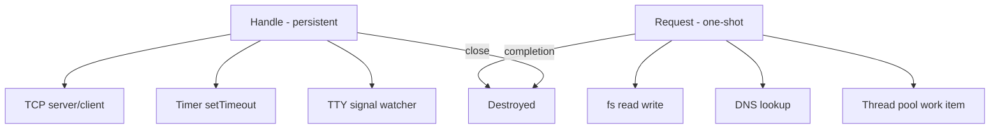
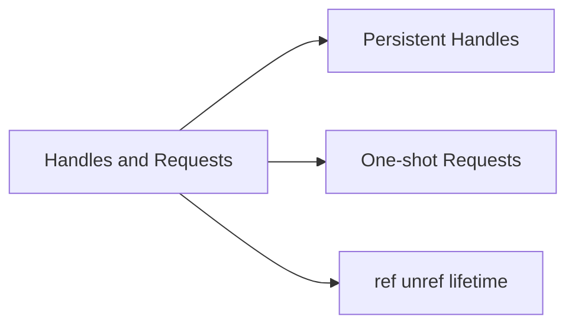

# Handles and Requests

## Overview

libuv manages asynchronous resources through **handles** (long-lived watchers like TCP sockets and timers) and **requests** (short-lived operations like `fs.read` or `getaddrinfo`). Node surfaces ref/unref semantics so handles control **process lifetime**—a ref'd open server prevents natural exit ([[06-NodeJS/00-Orientation/Node Program Lifecycle|Node Program Lifecycle]]).

Understanding handles vs. requests clarifies memory leaks (forgotten timers), why `server.close()` is required, and how libuv backs JavaScript objects like `Timeout` and `Socket`.

## Learning Objectives

- Define libuv handle vs. request with examples
- Explain ref/unref and impact on event loop idling
- Map Node API objects to underlying handle types
- Diagnose "process won't exit" via active handles
- Close resources in correct order during shutdown

## Prerequisites

- [[06-NodeJS/02-Event-Loop-and-libuv/libuv Architecture Overview|libuv Architecture Overview]]
- [[06-NodeJS/00-Orientation/Node Program Lifecycle|Node Program Lifecycle]]

## Difficulty

`intermediate`

## Estimated Time

- Reading: 1.5 hours
- Exercises: 2 hours
- Mini project: 3 hours

## History

Early Node leaked handles when developers created timers or sockets without closing them—`process.on('beforeExit')` fired unexpectedly or not at all. Node exposed **`timer.unref()`** (0.9+) so keep-alive intervals wouldn't block CLI tools. Internal APIs like `_getActiveHandles` (undocumented) became folklore for debugging until `why-is-node-running` and test runners improved handle tracking.

## Problem It Solves

- **Hung CI** after tests: open servers/timers
- **Memory leaks** from orphaned TCP connections
- **Shutdown failures** when handles stay ref'd
- **Confusion** why Promises alone don't keep process alive

## Internal Implementation

### Handle vs. request



| Kind | Lifetime | Examples |
| --- | --- | --- |
| Handle | Until explicitly closed | `net.Socket`, `Timer`, `process.stdin` |
| Request | Single operation | `uv_fs_t`, `uv_work_t` for thread pool |

### ref / unref

- **ref**: handle counts as active; keeps event loop alive (default for most handles)
- **unref**: handle still fires but **does not** prevent process exit when alone

```typescript
const t = setInterval(() => {}, 1000);
t.unref(); // process can exit if no other ref'd handles
```

## Mermaid Diagrams

### Structure



### Sequence / Lifecycle — server close

```mermaid
sequenceDiagram
    participant App
    participant Server as http.Server
    participant UV as libuv TCP handle
    participant Loop as Event Loop
    App->>Server: listen 3000 ref active
    Loop->>Loop: process stays alive
    App->>Server: close()
    Server->>UV: uv_close handle
    UV-->>Loop: close callback phase
    Loop->>Loop: no ref handles exit possible
```

## Examples

### Minimal Example — unref timer

```typescript
// Node 20+ / TypeScript 5+
// Portability: Node-only.
import { setTimeout } from "node:timers";

const t = setTimeout(() => console.log("never if exit early"), 60_000);
t.unref();

console.log("exiting soon");
// Process may exit before timer fires if no other work
```

### Production-Shaped Example — track handles in tests

```typescript
// Node 20+ / TypeScript 5+
import { createServer, type Server } from "node:http";
import { setInterval, type Timeout } from "node:timers";

export class Service {
  private server?: Server;
  private heartbeat?: Timeout;

  async start(port: number): Promise<void> {
    this.server = createServer((_req, res) => res.end("ok"));
    await new Promise<void>((r) => this.server!.listen(port, r));

    this.heartbeat = setInterval(() => {
      /* metrics ping */
    }, 30_000);
    this.heartbeat.unref(); // do not block test/process exit solely for metrics
  }

  async stop(): Promise<void> {
    await new Promise<void>((resolve, reject) => {
      if (!this.server) return resolve();
      this.server.close((err) => (err ? reject(err) : resolve()));
    });
    if (this.heartbeat) clearInterval(this.heartbeat);
    this.server = undefined;
  }
}
```

Use `why-is-node-running` npm package in dev to debug stray handles.

## Trade-offs

| Dimension | Upside | Downside | When it matters |
| --- | --- | --- | --- |
| ref default | Servers stay up | Tests hang | CI |
| unref timers | Background metrics | Silent if only unref work left | sidecars |
| Explicit close | Clean resource release | Must code defensively | shutdown |
| Requests implicit | Simple async API | Harder to introspect | profiling |

### When to Use

- `unref` for housekeeping timers that shouldn't block CLI exit
- Explicit `server.close()` / `socket.destroy()` in shutdown paths
- Handle tracking in integration test teardown

### When Not to Use

- Do not `unref` server listen handle—you want process alive
- Do not rely on GC to close sockets—always close

## Exercises

1. Create server without close—observe hanging process; fix with `close()`.
2. Compare ref vs. unref interval with `node -e` scripts.
3. List five Node APIs that map to libuv handles vs. requests.
4. Explain why unresolved Promises don't keep process alive but open socket does.
5. Write Jest `afterAll` that closes all servers even on test failure.

## Mini Project

**Handle leak detector wrapper.** Wrap `createServer` and timers to register instances; assert zero at process end in tests.

## Portfolio Project

Integrate handle audit into [[06-NodeJS/projects/Graceful Shutdown Harness/README|Graceful Shutdown Harness]].

## Interview Questions

1. Difference between libuv handle and request?
2. What does `timer.unref()` do?
3. Why doesn't a pending Promise keep Node alive?
4. What happens in close callbacks phase?
5. How would you debug "Jest won't exit"?

### Stretch / Staff-Level

1. Explain `uv_ref`/`uv_unref` interaction with multiple loops in worker threads.
2. How do HTTP keep-alive connections appear as active handles?

## Common Mistakes

- Forgetting `clearInterval` in long-running tests
- Calling `server.close()` without draining in-flight connections
- Assuming `unref` stops timer entirely (it still runs while process alive)
- Leaking `fs.watch` handles in dev reload tools

## Best Practices

- Every `listen` has paired `close` in shutdown coordinator
- unref only for optional background work
- Track resources in classes with explicit `stop()` methods
- Use test runner `--detectOpenHandles` where available

## Summary

Handles are persistent libuv watchers (sockets, timers) that keep the event loop ref'd until closed; requests are one-shot async operations destroyed on completion. Node's ref/unref toggles whether a handle prevents process exit—critical for servers, tests, and shutdown. Production code closes handles explicitly rather than relying on garbage collection.

## Further Reading

- [[00-References/NodeJS/README|Node.js References]]
- libuv — handles and requests documentation
- [[06-NodeJS/00-Orientation/Node Program Lifecycle|Node Program Lifecycle]]

## Related Notes

- [[06-NodeJS/02-Event-Loop-and-libuv/Event Loop Phases|Event Loop Phases]]
- [[06-NodeJS/01-Process-and-Runtime/Signals Exit Codes and Lifecycle Hooks|Signals Exit Codes and Lifecycle Hooks]]
- [[06-NodeJS/05-Networking/Keep-Alive Timeouts and Connection Limits|Keep-Alive Timeouts and Connection Limits]]
- [[01-Computer-Science/06-IO-and-Persistence/File Descriptors and Handles|File Descriptors and Handles]]

## Progress Checklist

- [ ] Explained from first principles
- [ ] Drew at least one Mermaid diagram
- [ ] Implemented a minimal version
- [ ] Documented trade-offs and non-goals
- [ ] Completed exercises
- [ ] Practiced interview questions aloud
- [ ] Linked prerequisites and dependents
