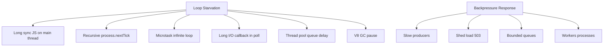
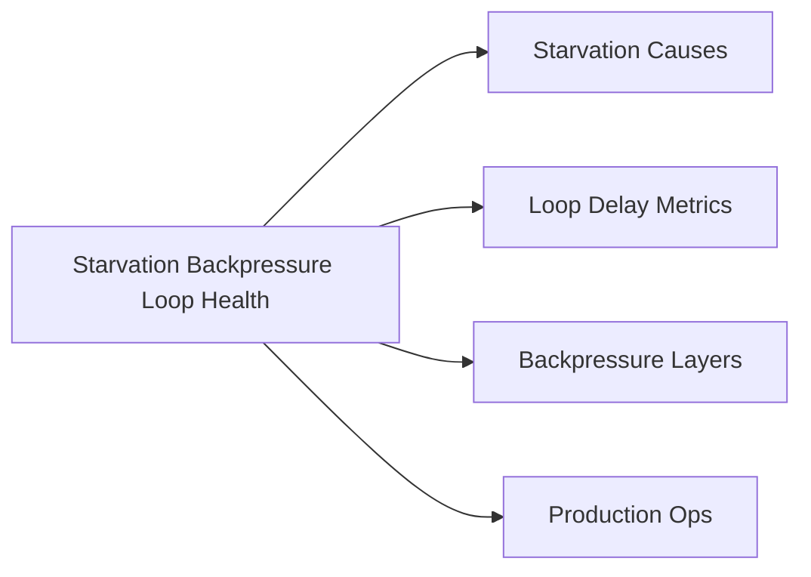

# Starvation Backpressure and Loop Health

## Overview

A healthy Node process keeps the **event loop turning**: timers fire on schedule, sockets read and write, and callbacks stay short. **Starvation** occurs when work—synchronous CPU, recursive `nextTick`, microtask floods, or saturated thread pools—prevents the loop from advancing phases promptly. **Backpressure** is the cooperative signaling that producers must slow down when consumers cannot keep up—a pattern essential for streams ([[06-NodeJS/04-Buffers-Streams-and-IO/Backpressure and HighWaterMark|Backpressure and HighWaterMark]]) and equally critical at the **loop health** layer.

This note connects libuv scheduling, resource contention, observability (`perf_hooks`), and production SLOs. Language-level backpressure patterns also appear in [[02-JavaScript/05-Async-and-Concurrency/Concurrency Control and Backpressure|Concurrency Control and Backpressure]].

## Learning Objectives

- Define event-loop starvation and identify common causes in Node
- Measure loop delay/lag with `perf_hooks.monitorEventLoopDelay`
- Relate thread-pool queueing and long poll callbacks to tail latency
- Apply backpressure at HTTP/stream and application concurrency layers
- Design health checks that detect "alive but unhealthy" processes

## Prerequisites

- [[06-NodeJS/02-Event-Loop-and-libuv/process.nextTick vs Microtasks vs Timers|process.nextTick vs Microtasks vs Timers]]
- [[06-NodeJS/02-Event-Loop-and-libuv/Thread Pool and Blocking Work|Thread Pool and Blocking Work]]
- [[01-Computer-Science/05-Concurrency-Fundamentals/Backpressure and Resource Contention|Backpressure and Resource Contention]]

## Difficulty

`advanced`

## Estimated Time

- Reading: 2.5 hours
- Exercises: 3 hours
- Mini project: 5 hours

## History

Early Node metrics focused on CPU and memory while "event loop lag" remained invisible until `event-loop-lag` npm modules and later **`perf_hooks.EventLoopMonitor`** (Node 14+). Microservice outages taught that processes answering `/health` could still be **600ms behind** on I/O—dropped websockets, delayed heartbeats, and cascading retries. Backpressure became a first-class streams concept (Node 0.10+ streams2) and a broader design pattern for any producer-consumer system.

## Problem It Solves

- **Silent degradation** — process up, p99 unusable
- **Retry storms** — slow servers amplify load
- **Timer slip** — sessions expire late, watchdogs misfire
- **Memory pressure** — unbounded queues when consumers stall
- **False capacity plans** — CPU low while loop is blocked

## Internal Implementation

### Starvation sources



### Loop health signals

| Signal | Tool | Interpretation |
| --- | --- | --- |
| Event loop delay p99 | `monitorEventLoopDelay` | Time loop start delayed |
| Timer slip | compare scheduled vs. actual | Phase blocked |
| Active handles growth | handle leaks | memory + slower poll |
| Request queue depth | app metrics | need backpressure |
| Pool wait time | custom timestamps around fs/crypto | tune pool/limiters |

Deep diagnostics: [[06-NodeJS/08-Diagnostics-and-Performance/perf_hooks and Event Loop Delay|perf_hooks and Event Loop Delay]].

### Backpressure layers

1. **Socket/stream**: `write()` returns false; pause readable ([[06-NodeJS/04-Buffers-Streams-and-IO/Backpressure and HighWaterMark|Backpressure and HighWaterMark]])
2. **HTTP**: stop accepting (`server.close`), 503, rate limits ([[07-Backend/06-Reliability-and-Abuse-Resistance/Rate Limiting and Quotas|Rate Limiting and Quotas]])
3. **Application**: semaphores, limiters ([[02-JavaScript/05-Async-and-Concurrency/Concurrency Control and Backpressure|Concurrency Control and Backpressure]])
4. **Process**: scale out workers/cluster when loop delay sustained

## Mermaid Diagrams

### Structure



### Sequence / Lifecycle — backpressure under slow consumer

```mermaid
sequenceDiagram
    participant Producer as Fast HTTP ingress
    participant Loop as Event Loop
    participant Handler as Slow handler sync work
    participant Consumer as Downstream
    Producer->>Loop: many requests arrive
    Loop->>Handler: run sync 200ms each
    Note over Loop: delayed timers socket reads
    Consumer-->>Producer: timeouts retry
    Note over Producer: retry storm worsens lag
    Handler->>Handler: apply concurrency limit + 503
```

## Examples

### Minimal Example — measure loop delay

```typescript
// Node 20+ / TypeScript 5+
// Portability: Node-only (`node:perf_hooks`).
import { monitorEventLoopDelay } from "node:perf_hooks";

const h = monitorEventLoopDelay({ resolution: 20 });
h.enable();

setInterval(() => {
  console.log(JSON.stringify({
    event: "loop_delay",
    p50_ms: h.percentile(50) / 1e6,
    p99_ms: h.percentile(99) / 1e6,
    max_ms: h.max / 1e6,
  }));
  h.reset();
}, 5000);
```

### Production-Shaped Example — concurrency gate with shedding

```typescript
// Node 20+ / TypeScript 5+
import { createServer } from "node:http";
import { monitorEventLoopDelay } from "node:perf_hooks";
import { setImmediate } from "node:timers";

const MAX_INFLIGHT = 100;
let inflight = 0;

const loopMonitor = monitorEventLoopDelay({ resolution: 20 });
loopMonitor.enable();

const LOOP_P99_BUDGET_MS = 100;

createServer((req, res) => {
  const loopP99 = loopMonitor.percentile(99) / 1e6;

  if (inflight >= MAX_INFLIGHT || loopP99 > LOOP_P99_BUDGET_MS) {
    res.writeHead(503, { "retry-after": "1" }).end("overloaded");
    return;
  }

  inflight++;
  setImmediate(() => {
    try {
      // simulate bounded work — real code awaits I/O, never long sync
      res.writeHead(200).end("ok");
    } finally {
      inflight--;
    }
  });
}).listen(3000);
```

Stream-level backpressure belongs in [[06-NodeJS/04-Buffers-Streams-and-IO/pipeline and Finished|pipeline and Finished]]; HTTP product limits in [[07-Backend/README|Backend]].

## Trade-offs

| Dimension | Upside | Downside | When it matters |
| --- | --- | --- | --- |
| 503 shedding | Protects loop | Error budget noise | overload |
| Concurrency caps | Predictable latency | Lower peak throughput | APIs |
| Chunk + setImmediate | Simple yielding | Not true parallelism | moderate CPU |
| Workers | Isolates CPU | Complexity | heavy jobs |
| Aggressive monitoring | Early detection | Cardinality/cost | SRE |

### When to Use

- Loop delay metrics on all production Node services
- Bounded inflight + retry-after when over budget
- Stream `pipeline` with pause/resume for data paths

### When Not to Use

- Do not use 503 shedding without alerting—it's a symptom
- Do not chunk infinite CPU without eventual worker offload

## Exercises

1. Induce loop lag with sync loop; watch p99 from monitorEventLoopDelay.
2. Create microtask infinite loop—observe timers never firing.
3. Implement concurrency limiter; load test before/after p99.
4. Connect slow consumer not reading socket to memory growth—fix with pause.
5. Draft alert thresholds for loop p99 and thread pool wait.

## Mini Project

**Loop health dashboard.** Export loop delay histogram + inflight count as Prometheus-style metrics; load test and capture pre/post backpressure.

## Portfolio Project

Operational readiness for [[06-NodeJS/projects/Node Runtime Toolkit/README|Node Runtime Toolkit]] — SLO table linking loop delay to user-facing latency.

## Interview Questions

1. What is event loop starvation in Node?
2. How do you measure loop health in production?
3. Difference between backpressure in streams vs. concurrency limiting?
4. How can nextTick cause I/O starvation?
5. Why is low CPU usage compatible with unhealthy Node?

### Stretch / Staff-Level

1. Design autoscaling on custom loop delay metric vs. CPU—trade-offs.
2. Relate [[01-Computer-Science/05-Concurrency-Fundamentals/Deadlocks Livelocks and Starvation|Starvation]] theory to nextTick/microtask floods.

## Common Mistakes

- Health check only verifies event loop tick, not delay magnitude
- Unbounded in-memory request queues during downstream outage
- Fixing lag only by scaling replicas without fixing sync hot path
- Ignoring retry storms after 503 without jittered backoff (client + server)

## Best Practices

- SLO on loop delay p99; page before user-visible collapse
- Bound concurrency at ingress; propagate backpressure through streams
- Eliminate sync fs/crypto and long JS turns on hot path
- Load test with realistic downstream latency and retries
- Coordinate with [[06-NodeJS/10-Production-Node/Health Readiness and Liveness Hooks|Health Readiness and Liveness Hooks]]

## Summary

Loop health means the event loop advances phases on time: starvation from sync CPU, abusive nextTick/microtasks, long I/O callbacks, or pool saturation shows up as delayed timers, socket stalls, and rising p99 latency—often while CPU looks fine. Backpressure—pausing producers, shedding load, bounding queues, offloading work—is the operational response. Measure loop delay continuously, not only liveness, and apply backpressure at every layer from streams to HTTP to process scaling.

## Further Reading

- [[00-References/NodeJS/README|Node.js References]]
- Node.js `perf_hooks` documentation
- [[01-Computer-Science/05-Concurrency-Fundamentals/Backpressure and Resource Contention|Backpressure and Resource Contention]]
- [[06-NodeJS/08-Diagnostics-and-Performance/perf_hooks and Event Loop Delay|perf_hooks and Event Loop Delay]]

## Related Notes

- [[06-NodeJS/02-Event-Loop-and-libuv/Event Loop Phases|Event Loop Phases]]
- [[06-NodeJS/04-Buffers-Streams-and-IO/Backpressure and HighWaterMark|Backpressure and HighWaterMark]]
- [[02-JavaScript/05-Async-and-Concurrency/Concurrency Control and Backpressure|Concurrency Control and Backpressure]]
- [[06-NodeJS/10-Production-Node/Operational Readiness Checklist for Node Processes|Operational Readiness Checklist for Node Processes]]
- [[07-Backend/README|Backend]]

## Progress Checklist

- [ ] Explained from first principles
- [ ] Drew at least one Mermaid diagram
- [ ] Implemented a minimal version
- [ ] Documented trade-offs and non-goals
- [ ] Completed exercises
- [ ] Practiced interview questions aloud
- [ ] Linked prerequisites and dependents
