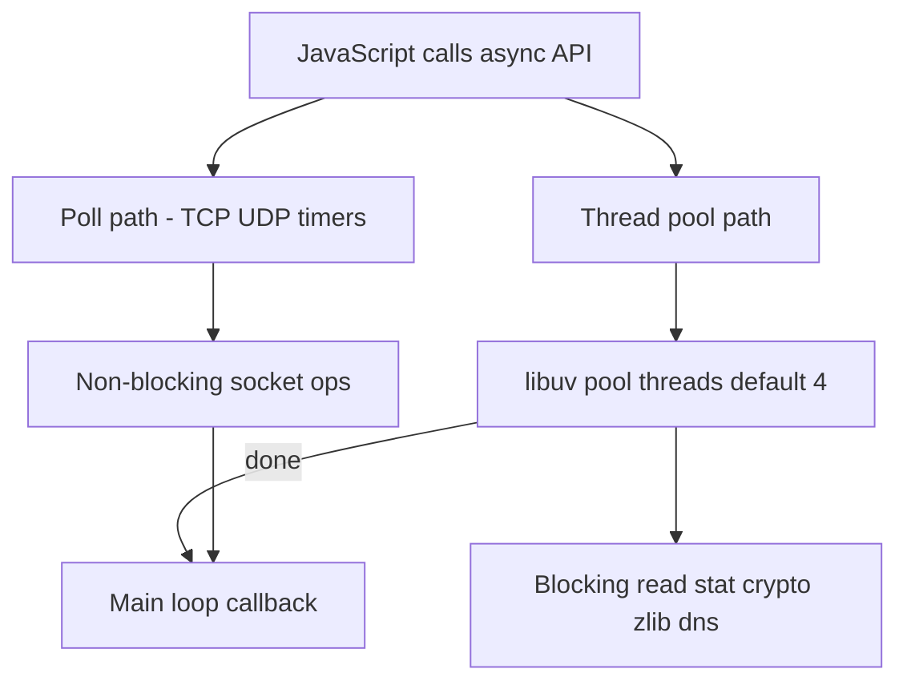
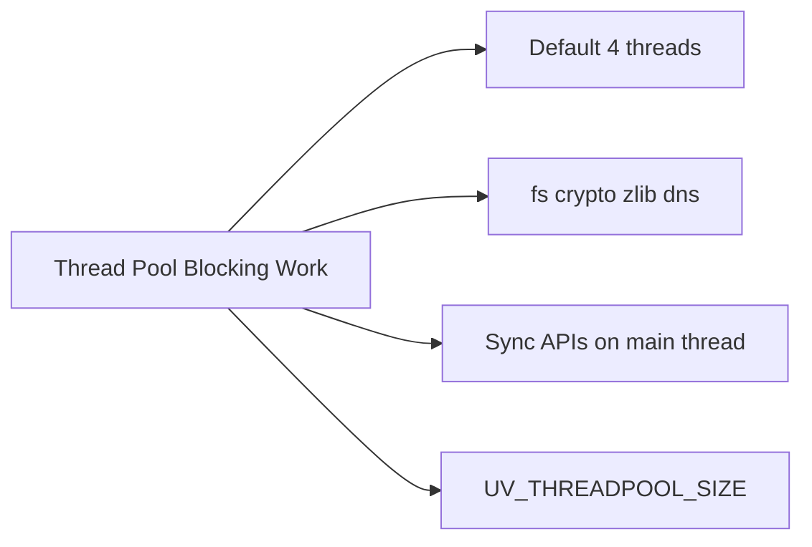
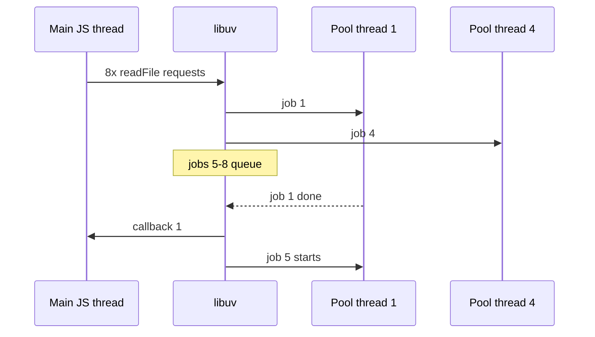

# Thread Pool and Blocking Work

## Overview

Not all "async" Node APIs use the event loop's **poll phase**. Many delegate **blocking OS work** to libuv's **thread pool**—default **4 threads**—including most **`fs`** operations, **`crypto.pbkdf2`**, **`zlib`**, and some **DNS** lookups. While pool threads run blocking syscalls, the main JavaScript thread stays free—until pool saturation queues your callbacks behind other work.

This note explains what runs on the pool, how `UV_THREADPOOL_SIZE` affects throughput, why sync APIs are catastrophic on the main thread, and when to prefer workers or external processes instead.

## Learning Objectives

- List major Node APIs that use libuv thread pool vs. true async poll I/O
- Explain pool queueing under concurrent load and sizing trade-offs
- Contrast `fs.readFile` (pool) with non-blocking TCP reads (poll)
- Detect pool exhaustion via latency and instrumentation
- Choose mitigation: pool tuning, streaming, workers, or offload

## Prerequisites

- [[06-NodeJS/02-Event-Loop-and-libuv/libuv Architecture Overview|libuv Architecture Overview]]
- [[06-NodeJS/02-Event-Loop-and-libuv/Event Loop Phases|Event Loop Phases]]
- [[01-Computer-Science/06-IO-and-Persistence/Blocking Nonblocking and Multiplexed IO|Blocking Nonblocking and Multiplexed IO]]

## Difficulty

`advanced`

## Estimated Time

- Reading: 2 hours
- Exercises: 3 hours
- Mini project: 4 hours

## History

Node's early documentation emphasized "non-blocking" broadly—developers assumed all async APIs were equivalent. Production incidents under concurrent `bcrypt` or `readFile` load revealed **shared pool bottlenecks**. `UV_THREADPOOL_SIZE` became operational folklore; Node docs now clarify pool-backed APIs. Newer APIs (some `fs` on Linux with `io_uring`, worker-based crypto) partially shift the landscape by version—always verify for your Node LTS ([[06-NodeJS/00-Orientation/Node Versioning LTS and Compatibility Policies|Node Versioning LTS and Compatibility Policies]]).

## Problem It Solves

- **Mystery latency** when network is idle but p99 spikes (pool queue)
- **Throughput collapse** when 4 concurrent disk jobs block 100 pending ones
- **False confidence** from async API names while work is blocking in thread pool
- **Main-thread freezes** from `*Sync` variants bypassing pool entirely on caller thread

## Internal Implementation

### Two async paths



### Common pool-backed work (representative, version-sensitive)

| API area | Often pool-backed | Notes |
| --- | --- | --- |
| `fs.*` (async) | Yes | sync `*Sync` runs on **main thread** — worse |
| `crypto.pbkdf2`, `scrypt` | Yes | CPU-heavy; contends with fs |
| `zlib` compression | Often | Large payloads queue |
| `dns.lookup` | Often | `dns.promises.resolve` may differ |
| TCP/network | No (poll) | except some DNS/connect edge cases |

### Sizing

`UV_THREADPOOL_SIZE=n` env var sets pool size at process start (must be before libuv init—set before spawning node). Increasing **raises parallel blocking ops** but also **CPU/RAM** and can increase context switching without helping poll-bound workloads.

## Mermaid Diagrams

### Structure



### Sequence / Lifecycle — queued fs reads



## Examples

### Minimal Example — sync vs async fs

```typescript
// Node 20+ / TypeScript 5+
// Portability: Node-only.
import { readFileSync, readFile } from "node:fs";

// BLOCKS main thread — stalls all HTTP clients:
// const data = readFileSync("/large.bin");

// Pool-backed — main thread free, but contends with other pool work:
readFile("/large.bin", (err, buf) => {
  if (err) throw err;
  console.log(buf.length);
});
```

### Production-Shaped Example — cap concurrent pool-heavy work

```typescript
// Node 20+ / TypeScript 5+
import { readFile } from "node:fs/promises";

class PoolLimiter {
  private active = 0;
  private queue: Array<() => void> = [];

  constructor(private readonly concurrency: number) {}

  run<T>(fn: () => Promise<T>): Promise<T> {
    return new Promise((resolve, reject) => {
      const exec = () => {
        this.active++;
        fn()
          .then(resolve, reject)
          .finally(() => {
            this.active--;
            const next = this.queue.shift();
            if (next) next();
          });
      };
      if (this.active < this.concurrency) exec();
      else this.queue.push(exec);
    });
  }
}

// Align with UV_THREADPOOL_SIZE — e.g. 4 pool threads, limit app-level fs burst to 4
const fsLimit = new PoolLimiter(Number(process.env.FS_CONCURRENCY ?? 4));

export async function readConfig(path: string): Promise<string> {
  return fsLimit.run(() => readFile(path, "utf8"));
}
```

Cross-link JS concurrency patterns: [[02-JavaScript/05-Async-and-Concurrency/Concurrency Control and Backpressure|Concurrency Control and Backpressure]].

## Trade-offs

| Dimension | Upside | Downside | When it matters |
| --- | --- | --- | --- |
| Thread pool | Universal blocking offload | Small default | file-heavy APIs |
| Larger UV_THREADPOOL_SIZE | Higher parallel fs/crypto | CPU/memory contention | batch ETL |
| App-level limiter | Protects tail latency | Extra code | mixed workloads |
| worker_threads | Isolated CPU | Higher overhead | heavy crypto |

### When to Use

- Increase pool size after benchmarks show queue wait dominates
- Application limiters aligned with pool size for fs/crypto bursts
- Workers for CPU-heavy JS/crypto not bound to 4 threads

### When Not to Use

- Do not raise pool size for network-only services without evidence
- Do not use `*Sync` APIs on request path "because it's simpler"

## Exercises

1. Benchmark 100 concurrent `readFile` with pool size 4 vs. 32—chart total time.
2. Run `pbkdf2` concurrently with fs reads—observe mutual interference.
3. Freeze server with `readFileSync` in handler—measure event loop delay.
4. Document which APIs in your codebase are poll vs. pool vs. sync.
5. Set `UV_THREADPOOL_SIZE` in Docker env and verify via startup log + benchmark.

## Mini Project

**Pool saturation lab.** HTTP endpoint triggers N concurrent fs ops; expose metric `pool_wait_ms` estimated from timestamps; tune pool and app limiter.

## Portfolio Project

Capacity section for [[06-NodeJS/projects/Stream Pipeline Toolkit/README|Stream Pipeline Toolkit]] — pool vs. streaming reads.

## Interview Questions

1. Why does Node have a thread pool if it's event-driven?
2. Default `UV_THREADPOOL_SIZE` and when to change it?
3. Difference between `readFile` and reading a TCP socket in libuv terms?
4. What happens with `fs.readFileSync` under load?
5. How would you isolate bcrypt from file I/O contention?

### Stretch / Staff-Level

1. Discuss io_uring impact on Linux fs async path in recent Node versions—verify on your LTS.
2. Compare pool model to Go runtime network poller + goroutine blocking.

## Common Mistakes

- 100 concurrent `readFile` without limit on 4-thread pool
- Using sync fs in middleware "just once per request"
- Setting huge pool size on CPU-bound containers with throttled cores
- Ignoring DNS as hidden pool consumer

## Best Practices

- Stream large files; avoid loading entire file in memory and pool slot for long periods
- Never use sync fs/net/crypto on hot path
- Align app concurrency limiters with pool sizing
- Offload heavy crypto to workers or dedicated service
- Measure before tuning; document env in runbooks

## Summary

libuv's thread pool runs blocking work that cannot use poll-phase async I/O—chiefly filesystem, crypto, compression, and DNS—while the main thread continues. Default four threads serialize bursts; sync APIs block the main thread directly and are worse. Production tuning combines appropriate `UV_THREADPOOL_SIZE`, application-level concurrency caps, streaming, and worker/process offload for CPU-heavy tasks.

## Further Reading

- [[00-References/NodeJS/README|Node.js References]]
- libuv thread pool documentation
- Node.js blocking vs. non-blocking docs
- [[06-NodeJS/06-Concurrency-and-Scaling/worker_threads Model|worker_threads Model]]

## Related Notes

- [[06-NodeJS/02-Event-Loop-and-libuv/libuv Architecture Overview|libuv Architecture Overview]]
- [[06-NodeJS/02-Event-Loop-and-libuv/Starvation Backpressure and Loop Health|Starvation Backpressure and Loop Health]]
- [[06-NodeJS/04-Buffers-Streams-and-IO/fs Promises Sync and Streaming|fs Promises Sync and Streaming]]
- [[01-Computer-Science/05-Concurrency-Fundamentals/Backpressure and Resource Contention|Backpressure and Resource Contention]]
- [[02-JavaScript/05-Async-and-Concurrency/Concurrency Control and Backpressure|Concurrency Control and Backpressure]]

## Progress Checklist

- [ ] Explained from first principles
- [ ] Drew at least one Mermaid diagram
- [ ] Implemented a minimal version
- [ ] Documented trade-offs and non-goals
- [ ] Completed exercises
- [ ] Practiced interview questions aloud
- [ ] Linked prerequisites and dependents
