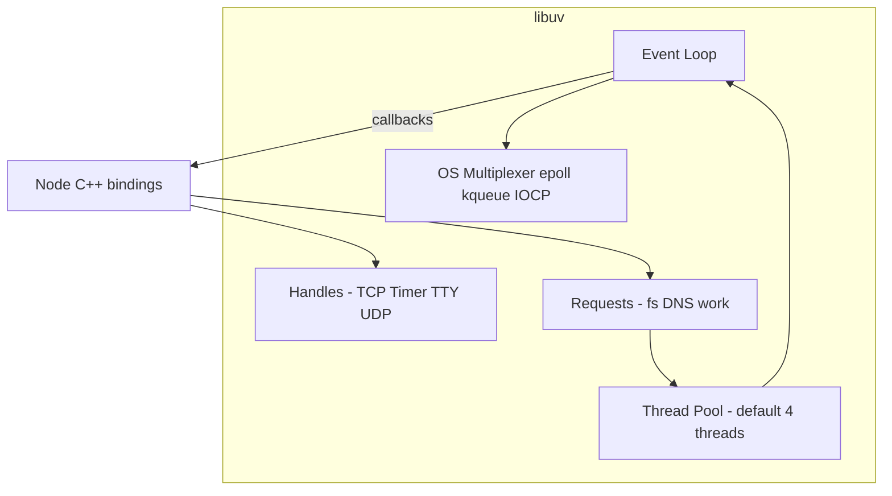
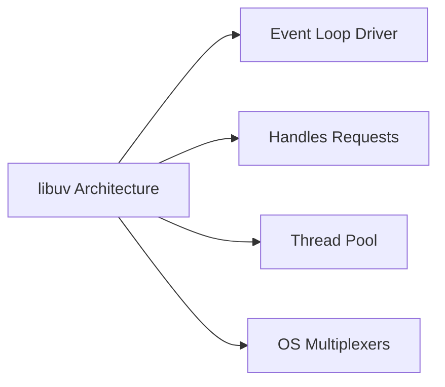
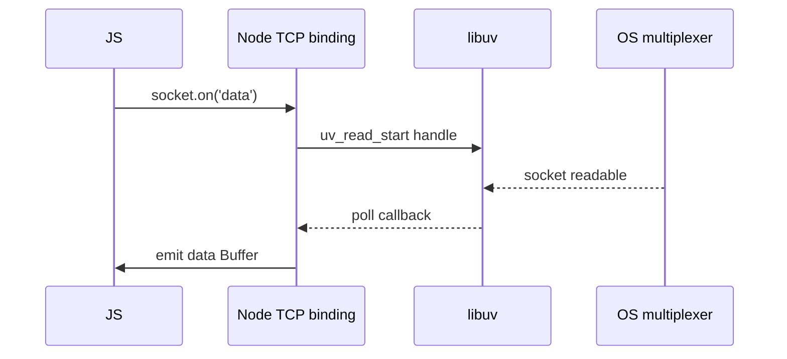

# libuv Architecture Overview

## Overview

**libuv** is the C library Node uses for cross-platform asynchronous I/O. It implements the **event loop**, **handle/request abstractions**, OS polling mechanisms (`epoll`, `kqueue`, `IOCP`), and a **thread pool** for operations that cannot be truly non-blocking on all platforms (most `fs`, DNS, crypto).

Understanding libuv architecture explains why Node scales for I/O, why disk-heavy workloads behave differently from network-heavy ones, and where the main JavaScript thread can still stall. ECMAScript job queues are separate—see [[02-JavaScript/05-Async-and-Concurrency/Run to Completion and Event Loop|Run to Completion and Event Loop]].

## Learning Objectives

- Describe libuv's role relative to V8 and Node bindings
- Map OS multiplexing primitives to libuv's unified API
- Differentiate handles (persistent) from requests (one-shot)
- Explain why a thread pool exists inside an "async" runtime
- Diagnose symptoms of poll-phase blocking vs. pool saturation

## Prerequisites

- [[06-NodeJS/00-Orientation/V8 libuv and the Node Host|V8 libuv and the Node Host]]
- [[01-Computer-Science/06-IO-and-Persistence/Blocking Nonblocking and Multiplexed IO|Blocking Nonblocking and Multiplexed IO]]
- [[01-Computer-Science/05-Concurrency-Fundamentals/Asynchronous Event-Driven Models|Asynchronous Event-Driven Models]]

## Difficulty

`intermediate`

## Estimated Time

- Reading: 2 hours
- Exercises: 2 hours
- Mini project: 4 hours

## History

Ryan Dahl created libuv for Node when Windows IOCP and Unix `epoll` needed one abstraction. libuv later became independent, used by Julia, uvloop (Python), and others. Node added multi-loop support internally (worker threads, some subsystems) but the **main thread loop** remains the default mental model for server developers.

## Problem It Solves

- **Portable async I/O** without `#ifdef` in application code
- **Unified timer and socket readiness** in one poll wake-up
- **Offload blocking syscalls** that would freeze poll if run synchronously
- **Reference counting** for active handles keeping process alive

## Internal Implementation

### Component diagram



### Platform backends

| OS family | Mechanism | libuv role |
| --- | --- | --- |
| Linux | `epoll` | edge/level triggered readiness |
| macOS/BSD | `kqueue` | filters for sockets, timers, files |
| Windows | IOCP | completion ports for sockets/pipes |

Network sockets are generally **non-blocking** on the main loop's poll phase. Many **file operations** run on thread pool because POSIX async file API lacks universality.

### Thread pool vs. poll

- **Poll phase**: wait for network/socket/timer readiness; cheap at scale
- **Thread pool**: run blocking work; queue depth limited by `UV_THREADPOOL_SIZE` (default 4)

Details: [[06-NodeJS/02-Event-Loop-and-libuv/Thread Pool and Blocking Work|Thread Pool and Blocking Work]].

## Mermaid Diagrams

### Structure



### Sequence / Lifecycle — TCP read through libuv



## Examples

### Minimal Example — observe libuv version

```typescript
// Node 20+ / TypeScript 5+
// Portability: Node-only.
import { versions } from "node:process";

console.log({ libuv: versions.uv });
```

### Production-Shaped Example — mixed I/O workload awareness

```typescript
// Node 20+ / TypeScript 5+
// Demonstrates network (poll) + fs (pool) interleaving — do not run sync fs on hot path.
import { createServer } from "node:http";
import { readFile } from "node:fs/promises";
import { performance } from "node:perf_hooks";

createServer(async (_req, res) => {
  const t0 = performance.now();
  // Pool-backed async read — competes with other fs/crypto work (default pool size 4)
  const config = await readFile("/app/config.json", "utf8");
  res.writeHead(200).end(JSON.stringify({ ms: performance.now() - t0, bytes: config.length }));
}).listen(3000);
```

Tune pool and measure loop delay: [[06-NodeJS/02-Event-Loop-and-libuv/Starvation Backpressure and Loop Health|Starvation Backpressure and Loop Health]].

## Trade-offs

| Dimension | Upside | Downside | When it matters |
| --- | --- | --- | --- |
| Unified API | Cross-platform servers | Hides OS tuning knobs | edge performance |
| Thread pool | Works everywhere for fs | Small default pool | file-heavy APIs |
| Single main loop | Simple programming model | One slow callback stalls all | latency SLOs |
| Handles/ref | Automatic process lifetime | Leaks keep process up | tests/CLI |

### When to Use

- Reason about server scalability in I/O terms (poll vs. pool)
- Set `UV_THREADPOOL_SIZE` when profiling shows pool queueing
- Choose streaming fs APIs to reduce peak memory

### When Not to Use

- Do not blame libuv for pure JS CPU loops—that is V8 on main thread
- Do not assume all "async" Node APIs use poll (most fs uses pool)

## Exercises

1. Read libuv design doc "handles and requests" summary; list three handle types.
2. Concurrently read 20 large files with `readFile`; observe throughput vs. pool size 4 and 32.
3. Sketch data path for UDP vs. TCP accept in libuv terms.
4. Explain why DNS lookup often uses thread pool on some platforms.
5. Correlate `process._getActiveHandles` conceptually to libuv ref counts.

## Mini Project

**I/O class benchmark.** HTTP handler doing only network vs. only async fs vs. mixed; chart p99 latency under load.

## Portfolio Project

Architecture section for [[06-NodeJS/projects/Node Runtime Toolkit/README|Node Runtime Toolkit]] — label subsystems poll vs. pool.

## Interview Questions

1. What is libuv and why isn't V8 enough for network servers?
2. Difference between libuv handle and request?
3. Why does Node use a thread pool if it's "non-blocking"?
4. Name OS mechanisms libuv uses on Linux vs. Windows.
5. What symptom suggests thread pool exhaustion?

### Stretch / Staff-Level

1. How does `uv_loop_t` relate to worker threads each having their own loop?
2. Compare libuv poll model to Java NIO selectors conceptually.

## Common Mistakes

- Calling `fs.readFileSync` in request handlers
- Setting huge `UV_THREADPOOL_SIZE` without measuring (CPU thrash)
- Confusing libuv timers with `setTimeout` implementation details at JS layer
- Ignoring that crypto (`pbkdf2`) may consume pool threads

## Best Practices

- Profile before tuning pool; measure event-loop delay
- Stream large files; avoid sync fs on main thread entirely
- Separate CPU work to workers ([[06-NodeJS/06-Concurrency-and-Scaling/worker_threads Model|worker_threads Model]])
- Cross-link JS microtask docs instead of duplicating promise ordering

## Summary

libuv is Node's portable async I/O core: an event loop around OS multiplexers plus a thread pool for unavoidably blocking work. Network readiness runs in poll; typical disk and DNS operations queue to the pool. Production performance requires knowing which path your APIs use and sizing concurrency accordingly.

## Further Reading

- [[00-References/NodeJS/README|Node.js References]]
- libuv official documentation — design overview
- [[01-Computer-Science/06-IO-and-Persistence/Blocking Nonblocking and Multiplexed IO|Blocking Nonblocking and Multiplexed IO]]

## Related Notes

- [[06-NodeJS/02-Event-Loop-and-libuv/Event Loop Phases|Event Loop Phases]]
- [[06-NodeJS/02-Event-Loop-and-libuv/Handles and Requests|Handles and Requests]]
- [[06-NodeJS/02-Event-Loop-and-libuv/Thread Pool and Blocking Work|Thread Pool and Blocking Work]]
- [[02-JavaScript/05-Async-and-Concurrency/Run to Completion and Event Loop|Run to Completion and Event Loop]]
- [[01-Computer-Science/05-Concurrency-Fundamentals/Asynchronous Event-Driven Models|Asynchronous Event-Driven Models]]

## Progress Checklist

- [ ] Explained from first principles
- [ ] Drew at least one Mermaid diagram
- [ ] Implemented a minimal version
- [ ] Documented trade-offs and non-goals
- [ ] Completed exercises
- [ ] Practiced interview questions aloud
- [ ] Linked prerequisites and dependents
